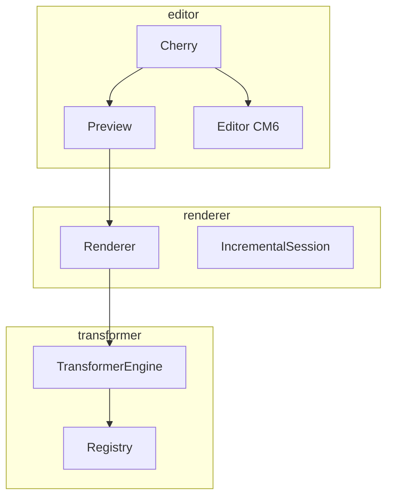
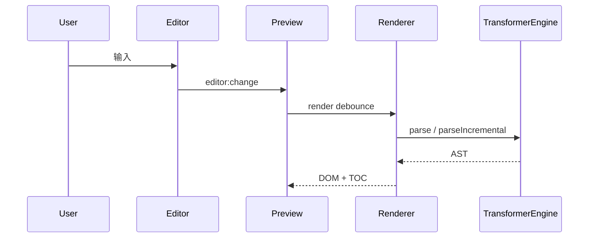

# [[title]]

> [[subtitle]] — 面向维护者与二次开发；集成请先看 [快速开始](getting-started.md)。

---

## 三层

| 层          | 路径               | 职责                                    |
| ----------- | ------------------ | --------------------------------------- |
| Editor      | `src/editor/`      | UI 编排、命令、工具栏、CM6 防腐         |
| Renderer    | `src/renderer/`    | AST → DOM、增量 reconcile、TOC、代码/图 |
| Transformer | `src/transformer/` | 解析注册表、GFM + 扩展、AST             |

> [!IMPORTANT]
> **Never break userspace**：三入口可单独打包；编辑器复用下层，但对外分包独立。

---

## 设计原则

::: steps

1. **数据结构优先** — 围绕 `MarkdownNode` 与块索引，而不是整段 HTML diff
2. **事件总线解耦** — Toolbar / Preview / SideBar 不互相硬引用
3. **CM 防腐** — `@codemirror/*` 限制在 `editor/editor`、`commands`、`ai`
4. **增量优先、全量兜底** — 失败自动降级，正确性 > 性能
5. **注册表扩展** — 新语法 = 新 parser + priority，不改核心循环

:::

---

## 端到端（编辑）

---

## 源码目录

| 路径               | 说明                                   |
| ------------------ | -------------------------------------- |
| `src/editor/`      | Cherry、命令、工具栏、对话框、滚动同步 |
| `src/renderer/`    | 渲染、增量、TOC、code/image listener   |
| `src/transformer/` | GFM / extends、Engine、Registry        |
| `src/theme/`       | Theme、样式、主题注册                  |
| `src/core/`        | EventBus、Log、StorageAPI、debounce    |
| `demo/`            | 演示站                                 |
| `test/`            | Vitest                                 |
| `docs/`            | 本文档（Cherry 语法编写）              |

---

## 相关

- [API](api.md) · [扩展语法](extend.md) · [编辑器](editor.md)
