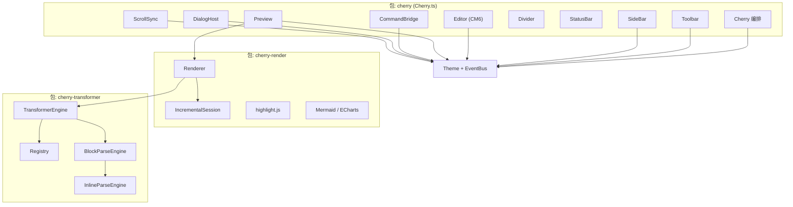

# [[title]]

> **[[subtitle]]** — 本文档描述 `cherry-markdown-next` 的内部设计与实现思路，面向维护者与二次开发者。

版本 **[[version]]** · 仓库 [[repo]]

---

## 文档导航

::: tabs
@tab 总览
**当前页** — 项目定位、设计原则、模块地图。

@tab 架构
[`architecture.md`](./architecture.md) — 三层拆分、DOM 骨架、端到端数据流。

@tab 解析引擎
[`transformer.md`](./transformer.md) — Registry、AST、块/行内解析、增量 parse。

@tab 渲染器
[`renderer.md`](./renderer.md) — 全量/增量渲染、DOM reconcile、BlockIndex。

@tab 编辑器
[`editor.md`](./editor.md) — Cherry 编排、CodeMirror 防腐层、预览与滚动同步。

@tab 主题与事件
[`theme-and-events.md`](./theme-and-events.md) — Theme 实例、EventBus、事件契约。

@tab 命令与 UI
[`commands-ui.md`](./commands-ui.md) — 命令注册、工具栏、对话框。

@tab 构建与分包
[`build-package.md`](./build-package.md) — esbuild 产物、npm exports、主题 CSS。

@tab API 参考
[`api-reference.md`](./api-reference.md) — Cherry / Theme / Renderer / TransformerEngine / 命令。

@tab 语法 Cookbook
[`syntax-extension-cookbook.md`](./syntax-extension-cookbook.md) — 自定义 parser 开发与测试。
:::

---

## 项目定位

Cherry Markdown Next 是一个 **浏览器端 Markdown 编辑与渲染套件**，由三个可独立引用的子系统组成：

| 包入口 | 全局名（IIFE） | 职责 |
| --- | --- | --- |
| `cherry-markdown-next` | `CherryNextEditor` | 完整编辑器 UI（工具栏、侧边栏、编辑区、预览区） |
| `cherry-markdown-next/renderer` | `CherryNextRenderer` | HTML 渲染 + 增量 DOM 更新 |
| `cherry-markdown-next/transformer` | `CherryNextTransformer` | Markdown → AST → HTML 字符串 |

> [!IMPORTANT]
> **Never break userspace**：三个入口可单独打包引用；编辑器内部复用 Renderer 与 Transformer，但对外 API 保持分包独立。

语法层面：**GFM 标准** + **Cherry 扩展**（Alert、容器、卡片、公式、图表等）。完整语法样例见 [`docs/simple.md`](../simple.md)。

---

## 核心设计原则

::: steps

1. **数据结构优先**

   解析与渲染围绕 `MarkdownNode` AST 与 `BlockIndex` 块索引展开；增量路径用 `data-hash` 对齐 AST 块与 DOM 子节点，而不是 diff 整段 HTML 字符串。

2. **事件总线解耦**

   `Theme` 实例同时承担皮肤状态与 `EventBus`。各 UI 子模块（Toolbar、Preview、SideBar…）不互相持有引用，只订阅/发射约定事件。

3. **防腐层隔离依赖**

   CodeMirror 6 仅出现在 `src/editor/editor/`；业务层通过 `Editor` 类与 `editor:change` 事件交互，避免 CM API 泄漏到全项目。

4. **增量优先、全量兜底**

   编辑时 Preview 走 debounce → 增量 parse/render；任一步失败自动降级全量，保证正确性高于性能。

5. **注册表扩展语法**

   块级/行内解析器通过 `Registry` 按 priority 排序匹配；用户可注入自定义 parser 覆盖或追加语法。

:::

---

## 模块地图

---

## 源码目录

| 路径 | 说明 |
| --- | --- |
| `src/editor/` | 编辑器 UI、命令、工具栏、对话框、滚动同步 |
| `src/renderer/` | HTML 渲染、增量会话、TOC 提取、代码/图表运行时 |
| `src/transformer/` | GFM + Cherry 语法解析器、`TransformerEngine` |
| `src/theme/` | 主题注册、明暗模式、EventBus |
| `demo/` | 各模块演示与 GFM/扩展语法测试页 |
| `test/` | Vitest 单元测试 |
| `scripts/build.ts` | esbuild + Vite 主题 CSS 构建 |

---

## 关键类型速查

:::: field-group
::: field MarkdownNode
@type interface
@required
AST 节点：`type`、`length`（块=行数，行内=字符跨度）、`children`、`value`、`props`。
:::

::: field BlockIndex
@type class
@required
可挂载块索引：`startLine` / `endLine` 映射源码行，与 `mount.children[i]` 一一对应。
:::

::: field CherryOptions
@type interface
@optional
`Cherry` 构造选项：layout、appearance、toolbar、sidebar、transformer 等。
:::

::: field TransformerEngineOptions
@type interface
@optional
自定义 parser、`syntaxOptions`、`renderOptions`、`isDark`。
:::
::::

---

## 延伸阅读

- **API 参考**：[`api-reference.md`](./api-reference.md)
- **自定义语法**：[`syntax-extension-cookbook.md`](./syntax-extension-cookbook.md)
- 语法演示：[`docs/simple.md`](../simple.md)（精简）、[`docs/test.md`](../test.md)（边界/压力）
- 在线 Demo：`pnpm demo` 启动 `demo/` 站点

*文档路径：`docs/design/` · 使用 Cherry 扩展 Markdown 编写*
