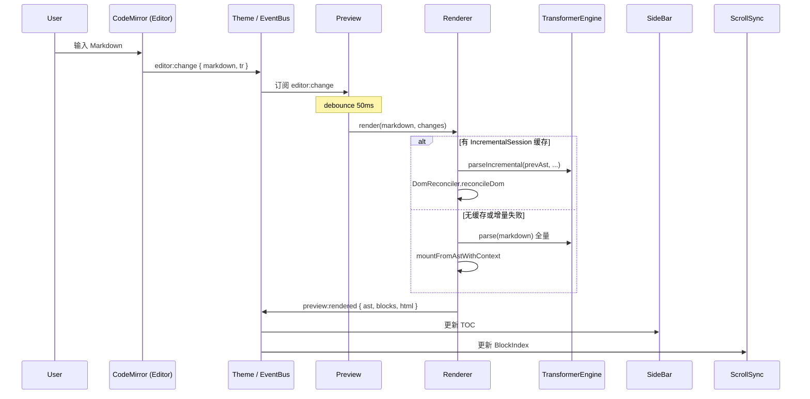

# [[title]]

[← 返回索引](./index.md)

---

## 三层拆分

项目 deliberately 拆成三个 esbuild 入口，而不是一个大 bundle：

| 层级            | 入口文件                               | 典型使用场景                       |
| --------------- | -------------------------------------- | ---------------------------------- |
| **Editor**      | `src/editor/Cherry.ts`                 | 需要完整 WYSIWYG-ish 编辑体验      |
| **Renderer**    | `src/renderer/Renderer.ts`             | 静态页、SSR hydration、只读预览    |
| **Transformer** | `src/transformer/TransformerEngine.ts` | 服务端/CLI 只要 AST 或 HTML 字符串 |

> [!TIP]
> Renderer 内部构造自己的 `TransformerEngine`；若 Editor 与 Renderer 需共享自定义 parser，通过 `CherryOptions.transformer` 与 `preview.inlineParsers` / `blockParsers` 传入同一配置。

---

## Cherry 编辑器 DOM 骨架

`Cherry` 在 `rootEl` 内构建固定骨架，各子组件只负责自己的 mount 点：

```
.cherry
├── .cherry-toolbar          ← Toolbar
├── .cherry-body
│   ├── .cherry-sidebar-mask
│   ├── .cherry-sidebar      ← SideBar（大纲 / 文件树）
│   ├── .cherry-editor       ← Editor (CodeMirror)
│   ├── .cherry-divider      ← Divider（布局 / 分栏拖拽）
│   └── .cherry-preview      ← Preview → Renderer.mount
├── .cherry-statusbar-wrap   ← StatusBar（可选）
└── .cherry-dialog-host      ← DialogHost（挂载在 cherry 根上）
```

布局模式（`EditorLayoutMode`）：

- `split` — 编辑 + 预览并排，Divider 可调比例
- `edit` — 仅编辑区
- `preview` — 仅预览区

---

## 端到端数据流



### 设计要点

1. **单一数据源**：Markdown 字符串只存在于 CodeMirror `EditorState`；Preview 不维护可编辑副本，只缓存 `lastMarkdown` 用于主题切换重渲染。
2. **变更粒度**：`editor:change` 携带 CodeMirror `Transaction`，Preview 将其转为 `CherryChangeLineSet[]` 供增量路径使用。
3. **渲染结果回传**：`preview:rendered` 的 `blocks` 是滚动同步与 TOC 的共享依据，避免重复 parse。

---

## Theme 作为协调中心

`Theme` 不是 CSS 主题的别名，而是 **运行时协调器**：

- 皮肤 id（`default` / `github` / `notion` …）与明暗模式
- 轻量 `EventBus`（`on` / `emit` / `once` / `off`）
- 调试日志门控（`debug: true` 时 `logD` 才输出）

各模块 **禁止** 互相 import 并调用实例方法；跨模块协作一律走事件。例外：`Cherry` 作为 facade 对外暴露 `getMarkdown()`、`runCommand()` 等 API。

---

## 增量系统的边界

增量渲染不是魔法，有明确的失效条件（见 [`renderer.md`](./renderer.md)）：

- 首次渲染（无 session cache）
- DOM 块数与 `BlockIndex` 不一致
- hash 边界 parse 失败
- 结构性大改导致 hash 锚点丢失

失败时 **静默降级全量**，用户无感知，代价是一次完整 parse + DOM replace。

> [!WARNING]
> 增量路径假设「块级 DOM 子元素顺序与 AST 可挂载块顺序一致」。自定义 block parser 若产出不可独立挂载的 HTML 结构，可能触发更频繁的全量 fallback。

---

## 与旧版 Cherry Markdown 的关系

本项目为 **下一代重写**（CodeMirror 6 + 自研 Transformer），非 drop-in 替换：

- API 面：`Cherry` 类 + 分包 exports，非旧版全局 `Cherry` 配置对象
- 语法：GFM 超集，扩展语法与旧版部分兼容，细节以 parser 实现为准
- 主题：SCSS 编译为 `cherry-theme-*-{editor,render}.min.css`

集成前请对照 [`build-package.md`](./build-package.md) 确认 import 路径与 CSS 加载方式。

---

[← 返回索引](./index.md) · [解析引擎 →](./transformer.md)
