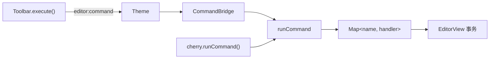

# [[title]]

[← 返回索引](./index.md)

---

## 命令系统概览

编辑命令采用 **注册表 + 统一入口** 模式，避免 Toolbar 与快捷键各写一套逻辑。



---

## 注册与执行

模块加载时 side-effect 注册（`src/editor/commands/index.ts`）：

```typescript
registerBasicCommands(registerCommand);
registerHeadingCommands(registerCommand);
registerTableCommand(registerCommand);
registerLinkCommand(registerCommand);
registerBadgeCommand(registerCommand);
```

统一入口：

```typescript
runCommand(view, command, payload?, ctx?: { theme? })
```

- `command` 为字符串名，如 `"bold"`、`"heading2"`、`"insertTable"`
- handler 签名：`(view, payload, ctx) => boolean | Promise<boolean>`
- 执行前自动 `view.focus()`

### 内置命令

| 命令 | 行为 |
| --- | --- |
| `bold` / `italic` / `strikethrough` / `code` | 选区包裹标记 |
| `heading1` … `heading6` | 行首 ATX 前缀 |
| `blockquote` / `unorderedList` / `orderedList` / `taskList` | 行首前缀 |
| `horizontalRule` / `codeBlock` / `image` | 插入模板 |
| `insertText` | 通用插入，payload `{ text, selectFrom?, selectTo? }` |
| `insertTable` | 打开表格对话框 |
| `insertLink` | 打开链接对话框 |
| `insertBadge` | 打开徽章对话框 |

扩展命令：调用 `registerCommand(name, handler)` 注册到同一 Map。

---

## CommandBridge

`CommandBridge` 订阅 `editor:command`，将 Toolbar 点击转为 `runCommand`：

```typescript
theme.on("editor:command", ({ command, payload }) => {
  void runCommand(getView(), command, payload, { theme });
});
```

Cherry 构造时创建，`destroy` 时取消订阅。

---

## 对话框：request / result

需要用户输入的命令（表格、链接、徽章）走 **异步对话框协议**：

::: steps

1. Command handler 调用 `requestDialog(theme, type, props?)`，返回 `Promise<result>`
2. `requestDialog` 生成唯一 `id`，发射 `editor:dialog:open`
3. `DialogHost` 渲染对应表单（Table / Link / Badge）
4. 用户提交或取消 → `editor:dialog:result { id, cancelled, data? }`
5. `requestDialog` 的 Promise resolve/reject，handler 写入 CM

:::

`DialogHost` 特性：

- 挂载在 `.cherry` 根下，独立层
- Escape / 点击 backdrop 取消
- 关闭动画 200ms 后 teardown

---

## Toolbar

### 配置结构

`ToolbarOptions` 支持：

- `items` — 覆盖默认按钮列表
- `groups` — 分组渲染，组间分隔线
- `mobileBreakpoint` — 默认 640px，溢出项收入「更多」菜单

默认项定义在 `toolbar/defaults.ts`（加粗、标题菜单、插入菜单等）。

### 渲染流程

```
resolveToolbarGroups(options) → renderToolbar(mount, { groups, ctx, ... })
```

`ToolbarContext` 提供：

| 方法 | 作用 |
| --- | --- |
| `execute(command, payload?)` | 发射 `editor:command` |
| `setLayout(mode)` | 发射 `cherry:layout` |
| `getLayout()` | 当前布局模式 |
| `focus()` | 聚焦编辑区 |

Toolbar **不** 直接持有 `EditorView`；这是刻意解耦，便于测试与自定义 UI。

### 项类型 ToolbarItem

- 普通按钮 — `command` + `icon`
- `type: "menu"` — 下拉子项
- `type: "layout"` — 布局切换按钮组（通常单独成最后一组）

---

## 对外 API

```typescript
// 程序化执行命令
await cherry.runCommand("bold");
await cherry.runCommand("insertText", { text: "hello" });

// 获取 CM view（高级集成）
const view = cherry.getEditorView();
```

> [!WARNING]
> 直接操作 `EditorView` 会绕过 `editor:change` 事件链的某些假设；优先使用 `runCommand` 或 `setMarkdown`。

---

## 测试

| 文件 | 覆盖 |
| --- | --- |
| `test/editor/commands.test.ts` | 命令 handler |
| `test/editor/toolbar.test.ts` | 配置解析 |
| `test/editor/toolbar.render.test.ts` | DOM 渲染 |
| `test/editor/dialog.test.ts` | 对话框 open/result |

---

[← 主题与事件](./theme-and-events.md) · [索引](./index.md) · [构建与分包 →](./build-package.md)
