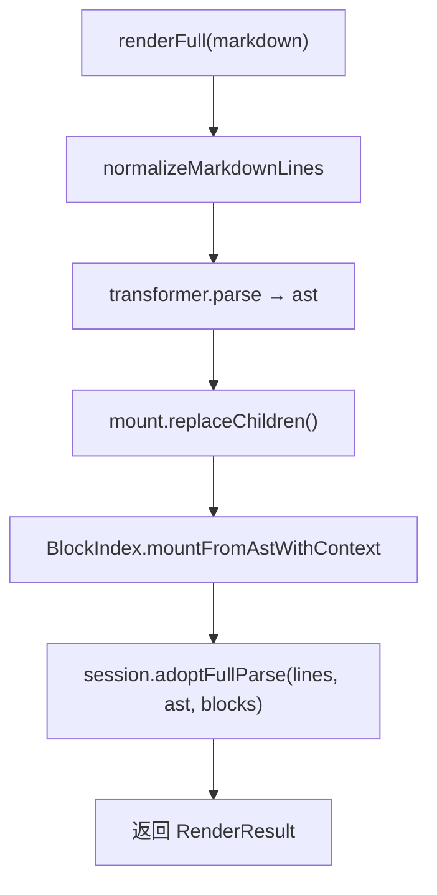

# [[title]]

[← 返回索引](./index.md)

---

## 职责

`Renderer` 将 Markdown 渲染为 **挂载在 DOM 上的 HTML 块序列**，并维护增量会话状态：

| 能力 | 说明 |
| --- | --- |
| 全量渲染 | `renderFull` — parse + 清空 mount + 逐块挂载 |
| 增量渲染 | `render` — 有 cache 时尝试 `IncrementalSession.tryUpdate` |
| TOC | `getToc` / `getTocFlat` 从 `lastAst` 提取 |
| 代码高亮 | highlight.js，在 Transformer `code` parser 回调中调用 |
| 图表 | Mermaid / ECharts 在 mount 后由 `replaceGraph` 初始化 |
| 主题响应 | 订阅 `theme:ld`，更新 `transformer.isDark` 并重绘图表 |

---

## 渲染结果 RenderResult

```typescript
interface RenderResult {
  html: string;              // 拼接的 outerHTML
  ast: MarkdownNode;
  blocks: BlockIndex[];      // 与 mount.children 一一对应
  partial?: boolean;         // true = 增量成功
  changedStartLines?: number[];
}
```

Preview 在每次渲染完成后发射 `preview:rendered`，载荷与上述字段对齐。

---

## 全量渲染路径



`mountFromAstWithContext` 对每个 **可挂载块**：

1. 调用 `transformer.renderBlockWithContext(node, ctx)` 得到 HTML 字符串
2. 创建 DOM 元素，写入 `data-hash`（hash 边界锚点）
3. 追加为 `mount` 的子元素
4. 记录 `BlockIndex { startLine, endLine, hash, ... }`

---

## 增量渲染路径

`IncrementalSession` 持有三态快照：

```
lines[]  +  ast  +  blocks[]
   ↑                    ↑
 源码行            mount.children[i] 对齐
```

### 协作模块

```
CherryChangeLineSet (来自 CM Transaction)
       ↓
HashBoundaryResolver.parseWithHashBoundary  →  局部更新 AST
       ↓
DomReconciler.reconcileDom                 →  hash 对齐 DOM + 刷新 BlockIndex
```

### tryUpdate 失败原因

| failReason | 含义 |
| --- | --- |
| `no-cache` | 首次渲染，无 session |
| `no-changes` | 变更集为空 |
| `dom-cache-mismatch` | DOM 子元素数与 blocks 不一致 |
| `no-dirty-range` | 无法定位 dirty 区间 |
| `parse-incremental-failed` | 引擎增量 parse 失败 |
| `dom-sync-failed` | DOM reconcile 失败 |
| `dom-blocks-mismatch` | reconcile 后块索引仍不一致 |

任一失败 → `Renderer.render` 调用 `renderFull` **静默降级**。

> [!TIP]
> 开启 `CherryOptions.debug` 可在控制台看到 `render:incremental` / `render:full` 的 `theme.logD` 日志，用于诊断 fallback 频率。

---

## BlockIndex 与滚动同步

`BlockIndex` 建立 **源码行号 ↔ 预览 DOM 元素** 映射：

- `ScrollSync` 订阅 `preview:rendered`，缓存 `blocks`
- 编辑器滚动时二分查找 `startLine <= targetLine` 的最大块，取对应 `mount.children[i].offsetTop`
- 预览滚动反向映射到 approximate 行号

Sidebar TOC 点击发射 `sidebar:toc-click`，ScrollSync 滚动到 `#id` 或 `[data-hash="..."]`。

---

## 代码块运行时

`CodeListener` 监听 mount 内代码块：

- 复制按钮交互（`renderer/code/copy.ts`）
- 与 highlight.js 输出的 DOM 结构配合

增强代码块（行号高亮、折叠行）由 `enhancedCode` block parser 在 render 阶段输出结构，CSS 在主题 SCSS 中定义。

---

## 图表与明暗模式

`specialCode` parser 识别 ` ```mermaid ` / ` ```echarts `：

- render 阶段输出占位容器
- `replaceGraph(mount, isDark)` 在 DOM 就绪后异步加载/刷新
- `theme:ld` 切换时 Preview 重跑 `onEditorChange`，Renderer 更新 `isDark` 并重绘

---

## 使用 Renderer 独立渲染

```typescript
import { Renderer, Theme } from "cherry-markdown-next/renderer";
import "cherry-markdown-next/cherry-theme-github-render.min.css";

const theme = new Theme();
const mount = document.getElementById("preview")!;
theme.setTheme("github", mount);

const renderer = new Renderer({ mount, theme });
const { html, ast, blocks } = renderer.render(markdown);
```

自定义 parser 通过构造选项传入，与 Transformer 一致。

---

[← Transformer](./transformer.md) · [索引](./index.md) · [编辑器 →](./editor.md)
