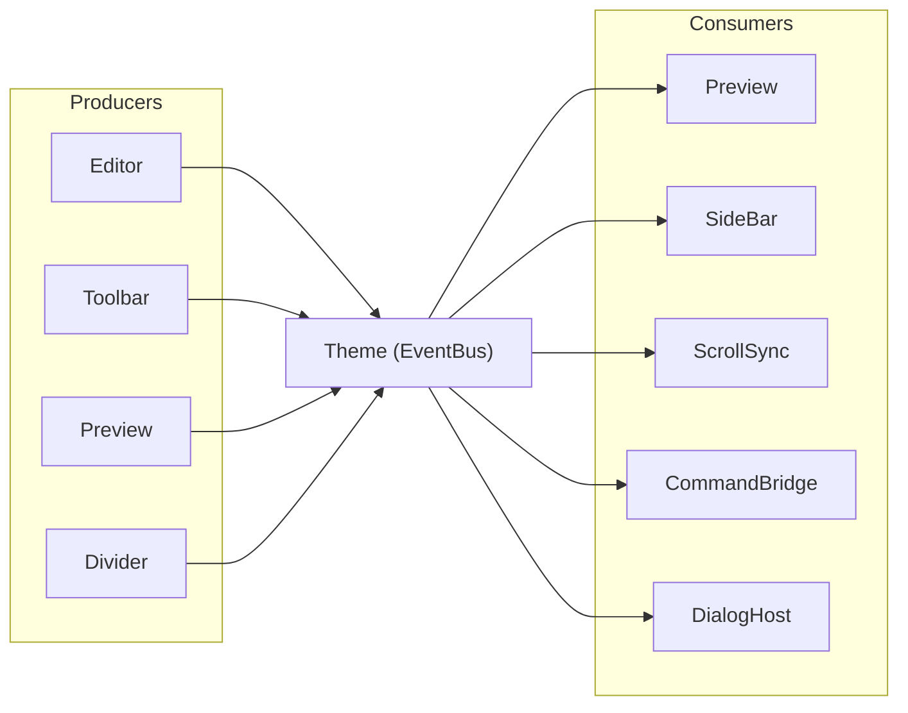

# [[title]]

[← 返回索引](./index.md)

---

## Theme 双重角色

`Theme` 类（`src/theme/Theme.ts`）同时是：

1. **皮肤运行时** — `setTheme(id, renderEl, rootEl?)`、`setLightDark(mode)`
2. **全局 EventBus** — 所有跨模块事件的唯一 hub

每个 `Cherry` 实例拥有 **独立** `Theme`；独立使用 `Renderer` 时也需自行 `new Theme()`。

---

## 注册主题

`ThemeRegister.ts` 当前内置：

```
default · claude · github · morandi · latex · vue · notion
```

每套主题编译为两份 CSS：

- `cherry-theme-{id}-editor.min.css` — 编辑器 chrome + CodeMirror
- `cherry-theme-{id}-render.min.css` — 预览/纯渲染内容区

另有一份 `cherry-editor-base.min.css` 与 `cherry-render.min.css` 作为基础样式。

---

## 主题事件

| 事件 | 载荷 | 触发时机 |
| --- | --- | --- |
| `theme:skin` | `{ prev, id, render }` | `setTheme` 且 id 变化 |
| `theme:ld` | `{ mode, isDark }` | `setLightDark` |

Renderer / Preview 订阅二者以重渲染；`transformer.isDark` 同步更新。

---

## 编辑器事件契约

### 内容与编辑

| 事件 | 方向 | 载荷 | 说明 |
| --- | --- | --- | --- |
| `editor:change` | Editor → | `{ markdown, tr? }` | 文档变更 |
| `editor:ready` | Cherry → | `{ id? }` | 初始化完成 |
| `editor:destroy` | Cherry → | `{ id? }` | 实例销毁 |
| `editor:command` | Toolbar → | `{ command, payload? }` | 请求执行命令 |
| `editor:layout` | Divider → | `{ mode, prev }` | 布局变化（内部） |
| `editor:split` | Divider → | `{ split }` | 分栏比例变化 |

### 预览

| 事件 | 方向 | 载荷 |
| --- | --- | --- |
| `preview:rendered` | Preview → | `{ markdown, html, ast, blocks, partial?, changedStartLines? }` |
| `preview:dom-updating` | IncrementalSession → | `{}` |
| `preview:force-refresh` | StatusBar → | `{}` |

### UI chrome

| 事件 | 方向 | 载荷 |
| --- | --- | --- |
| `cherry:layout` | Toolbar / StatusBar / Cherry → | `{ mode }` |
| `cherry:sidebar` | Toolbar / StatusBar / Cherry → | `{ show: boolean }` |
| `sidebar:toc-click` | SideBar → | `{ id }` |

### 对话框

| 事件 | 方向 | 载荷 |
| --- | --- | --- |
| `editor:dialog:open` | command → | `{ id, type: table\|link\|badge, props? }` |
| `editor:dialog:result` | DialogHost → | `{ id, cancelled, data? }` |

---

## EventBus API

```typescript
const off = theme.on("editor:change", (payload) => { ... });
theme.once("editor:ready", (payload) => { ... });
theme.off("editor:change", handler);
theme.emit("cherry:layout", { mode: "edit" });
```

- 处理器同步调用；`emit` 内 `[...set]` 拷贝避免 reentrant 修改
- `destroy` 时各模块应调用构造时返回的 `off()`，避免泄漏

---

## 调试日志

```typescript
new Cherry(el, { debug: true });
```

| 方法 | 条件 | 用途 |
| --- | --- | --- |
| `theme.logD` | debug=true | 增量渲染、事件订阅等诊断 |
| `theme.logW` | 始终 | 警告 |
| `theme.logE` | 始终 | 错误 |

Renderer 在 debug 模式下会记录 `render:incremental` / `render:full` 及 failReason。

---

## 设计约束

> [!IMPORTANT]
> **新增跨模块能力时，优先新增事件，而非新增 Cherry 上的方法。** Facade 方法仅面向外部集成者，内部仍走 EventBus。



---

[← Editor](./editor.md) · [索引](./index.md) · [命令与 UI →](./commands-ui.md)
