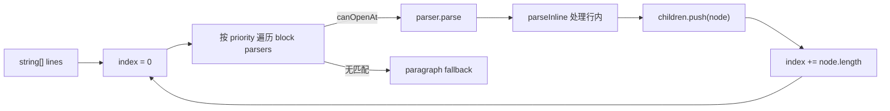

# [[title]]

[← 返回索引](./index.md)

---

## 职责

`TransformerEngine` 负责：

1. **全量 parse** — Markdown 字符串 → `MarkdownNode` AST 根
2. **增量 parse** — 在 hash 边界锚定的区间内局部 re-parse，原地更新 `prevAst`
3. **render** — AST 节点 → HTML 字符串（块级/行内递归）

引擎 **不做 DOM 操作**；DOM 挂载由 Renderer 的 `BlockIndex` 完成。

---

## AST：MarkdownNode

```typescript
interface MarkdownNode {
  type: string; // paragraph | text | code | heading | ...
  length: number; // 块级：吞掉的源码行数；行内：字符跨度
  value?: string; // 叶子文本
  children?: MarkdownNode[];
  props?: Record<string, unknown>; // href, lang, ordered, noMerge, ...
}
```

根节点 `props.store` 挂载 `ParserStore`（链接引用表、脚注、行号映射等跨块状态）。

> [!NOTE]
> `length` 语义随层级变化是 deliberate 的：块级引擎按行推进 cursor，行内引擎按字符推进。增量 hash 边界依赖块级 `length` 与源码行对齐。

---

## Registry：语法注册表

构造 `TransformerEngine` 时创建 `Registry`，自动注册：

| 来源        | 模块                           | 内容                                  |
| ----------- | ------------------------------ | ------------------------------------- |
| GFM         | `transformer/gfm/index.ts`     | 标题、列表、表格、强调、链接、代码块… |
| Cherry 扩展 | `transformer/extends/index.ts` | Alert、容器、卡片、公式、媒体…        |

### Priority 规则

- 键为 **priority 数字**，**越大越先匹配**
- 同类型 parser 重复注册会 **覆盖** 而非追加
- 用户可通过 `TransformerEngineOptions.inlineParsers` / `blockParsers` 注入

```typescript
// 示例：注册 priority 1000 的自定义行内 parser
new TransformerEngine({
  inlineParsers: {
    1000: myCustomInlineParser,
  },
});
```

---

## 解析器基类

### BaseInlineParser

| 方法                         | 作用                                                 |
| ---------------------------- | ---------------------------------------------------- |
| `canOpenAt(src, index, ctx)` | 当前位置是否可由此 parser 打开                       |
| `parse(src, index, ctx)`     | 返回 `{ node, nextIndex }` 或 `null`                 |
| `render(node, ctx, html)`    | AST → HTML                                           |
| `strongBreak`                | 是否打断 emphasis 预扫描（如 code span 默认为 true） |

### BaseBlockParser

| 方法                           | 作用                                   |
| ------------------------------ | -------------------------------------- |
| `canOpenAt(lines, index, ctx)` | 当前行是否匹配块语法                   |
| `parse(lines, index, ctx)`     | 返回 `{ node?, nextIndex }`            |
| `render(node, ctx)`            | 块 AST → HTML                          |
| `strongBreak`                  | 是否参与「强打断」扫描（容器边界检测） |

`BlockParseContext` 提供 `parseBlocks` / `parseInline` / 容器深度 `enterContainer` / `exitContainer`，供嵌套块（引用、列表、容器）递归解析。

---

## 块级调度：BlockParseEngine



**Paragraph 兜底**：priority `0` 的 paragraph parser 永远可匹配，保证 cursor 永远前进，不会死循环。

---

## 行内调度：InlineParseEngine

行内解析是 **字符扫描 + priority 匹配**：

1. emphasis/strong 有预扫描逻辑，尊重各 parser 的 `strongBreak`
2. 未匹配时 text parser（priority 0）吞掉普通字符
3. 结果为一棵行内 AST 子树，挂到块级节点的 `children`

---

## 渲染上下文 RenderContext

`TransformerEngine.createRenderContext(store)` 提供：

- `renderInline(nodes?)` / `renderBlock(nodes?)`
- `store` — 共享 ParserStore
- `isDark` — 影响公式、Mermaid、ECharts 等远程图主题

块级 parser 的 `render` 内应通过 `ctx.renderInline` 渲染子节点，避免直接拼字符串破坏嵌套结构。

---

## 增量 parse

```typescript
parseIncremental(
  prevAst: MarkdownNode,      // 原地更新
  markdown: string | string[],
  range: IncrementalParseRange // prevHash / nextHash 锚点
): IncrementalParseResult
```

`IncrementalParser` 流程：

1. 用 hash 在未变块边界定位 `[startLine, endLine)`
2. 仅对该区间 re-run `BlockParseEngine`
3. splice 回 `prevAst.children`，更新受影响节点

与 Renderer 侧 `HashBoundaryResolver` 配合：CM 变更行 → 计算 dirty range → 引擎增量 parse → DOM reconcile。

---

## 内置语法清单

::: collapse accordion

- GFM 块级

  `hr` · `table` · `blockquote` · `html` · `code` · `indented-code` · `link-ref` · `atx-heading` · `list` · `setext-heading` · `paragraph`

- GFM 行内

  `strikethrough` · `code` · `break` · `entity` · `strong` · `emphasis` · `image` · `link-ref-value` · `link` · `html` · `autolink` · `text`

- Cherry 块级扩展

  `frontmatter` · `math-block` · `footnote-def` · `footnotes-section` · `iframe` · `media` · `alert` · `task-list` · `enhanced-code` · `special-code`（mermaid/echarts）· `container` · `tabs` · `steps` · `timeline` · `collapse` · `card` · `link-card` · `image-card` · `repo-card` · `card-grid` · `card-masonry` · `field` · `field-group`

- Cherry 行内扩展

  `frontmatter-var` · `math` · `sub` · `sup` · `highlight` · `html-attrs` · `badge` · `emoji` · `spoiler` · `comment` · `footnote-ref` · `media`
  :::

语法写法见 [`docs/simple.md`](../simple.md)。

---

## 扩展自定义语法

::: steps

1. 实现 `BaseBlockParser` 或 `BaseInlineParser` 子类，声明唯一 `type`
2. 在 `canOpenAt` 做 **廉价** 预判，在 `parse` 做完整消费
3. 在 `render` 输出带 `data-hash` 友好结构的 HTML（块级需可独立挂载）
4. 注册到 `TransformerEngineOptions`，选择合适的 priority
5. 在 `demo/syntax/extends` 添加样例与测试

:::

> [!CAUTION]
> priority 设错会导致语法被「抢匹配」或永远轮不到。参考 `gfm/index.ts` 百位分层约定。

---

[← 架构](./architecture.md) · [索引](./index.md) · [渲染器 →](./renderer.md)
