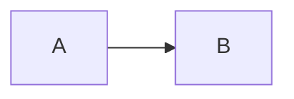

# Penna Markdown 语法手册

本文列出 Penna 支持的 **正确写法**。写文档或让 AI 生成 Markdown 时，直接按下列形式输出即可。

约定：

- 围栏关闭标记 `:::` / `::::` 前最多 **3 个空格**
- 外层网格、瀑布、字段组用 **四个冒号** `::::`，内部卡片/字段用三个冒号 `:::`
- `::: tabs` / `::: steps` 的开标记行**只能写类型**，后面跟标题会退化成普通容器
- 卡片、网格、瀑布、时间轴的 `key=value` 属性，**值必须用双引号**（`cols="2"`），例外是 `::: cols` 与围栏代码块的 `max-width`，它们允许裸值

---

## Frontmatter 与变量

文档开头写 YAML：

```markdown
---
title: 文档标题
author:
  name: 张三
version: 1.0.0
tags: [指南, 语法]
repo: https://example.com
---
```

正文引用：

```markdown
标题：[[title]]
作者：[[author.name]]
版本：[[version]]
```

---

## GFM 基础

### 标题

```markdown
# 一级标题

## 二级标题 {#自定义-id}

Setext 二级
------------

Setext 一级
===========
```

### 强调

```markdown
_斜体_ _斜体_ **粗体** **粗体** ~~删除线~~
```

### 链接与图片

```markdown
[文字](https://example.com)
[文字](https://example.com "悬停标题")
<https://example.com>
<mail@example.com>


[引用链接][id]
[id]: https://example.com "标题"

![引用图][img]
[img]: https://example.com/a.png
```

### 列表、引用、分隔线、表格、代码

````markdown
- 无序
  - 嵌套

* 也可用星号

- 也可用加号

1. 有序
2. 第二项

> 引用
>
> > 嵌套引用

---

| 列 A | 列 B |
| ---- | ---- |
| 1    | 2    |

`行内代码`

```js
围栏代码;
```

    缩进代码（行首四个空格）
````

硬换行：行末写 `\`，或行末两个空格后再换行。

---

## 行内扩展

### 高亮

```markdown
==高亮文字==
==高亮=={.tip}
==高亮=={.warning}
```

### 徽章

必须带 `{…}` 属性；位置可选 `top` / `bottom`（默认居中）。

```markdown
[新]{.tip}
[Beta]{.warning .top}
[完成]{.success .bottom}
[说明]{class="tip top"}
```

常用类名：`tip` `note` `important` `warning` `caution` `danger` `success` `info`

### HTML 属性（紧跟在行内元素后）

```markdown
**粗体**{.cls}
**粗体**{#my-id}
**粗体**{.a .b}
**粗体**{class="x" data-k="v"}
**粗体**{class='y'}
**粗体**{class=z}
**粗体**{hidden}
[链接](https://example.com){.button target="_blank"}
{.rounded}
```

### Emoji

短码表用 GitHub 的英文名（`smile` / `rocket` / `+1` / `100` …）。未命中的短码原样输出，不要自造中文短码。

```markdown
:smile: :rocket: :heart: :warning: :bulb: :+1: :100:
```

### 剧透

```markdown
!! 悬停显示 !!
!! 点击显示 !! {click}
!! 点击显示 !! {.click}
```

### 数学与上下标

下标是**单个**波浪线，双波浪线 `~~文字~~` 是删除线。

```markdown
$E=mc^2$
H~2~O
2^10^
```

### 注释

```markdown
%% 行内注释，读者不可见 %%

%%%
块级注释
%%%
```

### 脚注

```markdown
正文引用[^1]，可重复[^1]。

[^1]: 脚注正文，可含 **加粗** 与 [链接](https://example.com)。
```

---

## 警报 Alert

标记行独占一行，仅五种类型：

```markdown
> [!NOTE]
> 说明信息

> [!TIP]
> 实用建议

> [!IMPORTANT]
> 重要信息

> [!WARNING]
> 警告

> [!CAUTION]
> 危险提示
```

多段正文用空行分隔：

```markdown
> [!TIP]
> 第一段
>
> 第二段
```

---

## 扩展任务列表

```markdown
- [ ] 待办
- [x] 完成
- [x] 完成（大写）
- [/] 进行中
- [>] 已迁移
- [<] 已排期
- [-] 已取消
- [!] 紧急

* [ ] 星号列表也可以

- [/] 加号列表也可以
```

---

## 容器

```markdown
::: tip 可选标题
正文，支持 **Markdown**、列表与代码。
:::
```

语义类型：`note` `tip` `important` `warning` `caution` `danger` `info`  
缩写：`n` `t` `im` `w` `d` `i`

对齐：

```markdown
::: left
左对齐
:::

::: center 居中标题
居中
:::

::: right
右对齐
:::

::: justify
两端对齐
:::
```

对齐缩写：`l` `c` `r` `j`

无标题、嵌套：

```markdown
::: tip
无标题容器
:::

::: tip 外层
::: info 内层
嵌套内容
:::
:::
```

---

## 折叠面板

单面板：标题写在开标记上，正文是任意 Markdown，不用缩进。

```markdown
::: collapse 常见问题排查

- **误删了文件但没提交？**

  执行 `git restore <file>` 恢复。

- **Rebase 与 Merge 的区别？**
  1. `merge` 保留分支结构。
  2. `rebase` 保持线性历史。

:::
```

多面板：用 `@item` 分隔，正文同样是任意 Markdown。`@item:open` 强制展开，`@item:closed` 强制折叠。

```markdown
::: collapse
@item 默认折叠
正文 A
@item:open 强制展开
正文 B
:::
```

全部默认展开：

```markdown
::: collapse expand
@item 面板一
内容
@item:closed 此项强制折叠
内容
:::
```

手风琴（同时只展开一个）。`accordion` 优先于 `expand`，两个一起写时 `expand` 无效：

```markdown
::: collapse accordion
@item:open 默认打开的一项
内容 A
@item 另一项
内容 B
:::
```

标志必须写在标题前面：`::: collapse expand 标题`。有 `@item` 时开标记上的标题无效。

旧写法仍可用：`- 标题` / `- :+ 标题` / `- :- 标题`，标题与正文之间空一行，正文缩进两格。它把顶格的 `-` 当面板分隔，正文含顶层列表时会被切碎，复杂内容用上面两种写法。

```markdown
::: collapse

- 主标题
  副标题（仍属标题）

  正文从空行后开始
  :::
```

---

## 选项卡

开标记只能是 `::: tabs`，标题写在 `@tab` 上。

```markdown
::: tabs
@tab:active 标签一
内容一
@tab 标签二
内容二
:::
```

```markdown
::: tabs
@tab 无 active 时默认第一项
…
@tab
无标题标签
…
:::
```

标题可含行内格式：

```markdown
::: tabs
@tab **API** `v1`
接口说明
:::
```

---

## 步骤条

开标记只能是 `::: steps`，以 `1.` `2.` … 划分步骤：

```markdown
::: steps

1. 安装

   执行 `pnpm add penna-markdown`。

2. 初始化

   ::: tip
   可嵌套容器
   :::

3. 完成

:::
```

---

## 时间轴

节点格式：`- [时间] 标题` 或 `- [时间:类型] 标题`。**标题不能省**，`- [2025-04-01]` 这种光秃秃的节点会被直接丢弃。

时间轴还必须写闭合的 `:::`，否则整块会退化成普通容器。

类型：`info` `tip` `success` `warning` `danger` `caution` `important`（省略则默认为 `info`）

```markdown
::: timeline

- [2025-03-20:success] 发布

  说明正文。

- [2025-04-01] 只有标题没有正文

- [2025-05-01:caution] 注意项
  续行仍属标题

  空行后是正文。
  :::
```

容器属性（只写在开标签上）：

```markdown
::: timeline line="solid"
::: timeline line="dotted"
::: timeline line="dashed"
::: timeline placement="left"
::: timeline placement="right"
::: timeline placement="between"
::: timeline line=dotted placement=right
```

---

## 列布局

`@col` 分列，未写宽度的列自动均分剩余空间。属性写裸值即可，不需要引号。

```markdown
::: cols gap=24px
@col max-width=200px
左列固定最大宽度
@col
右列自动均分
:::
```

容器属性只认 `gap` `align-items` `justify-content` `flex-wrap`；列属性只认 `width` `min-width` `max-width` `flex` `flex-basis` `flex-grow` `flex-shrink` `align-self` `order`。其余键会被丢弃。

列内可以再嵌 `::: cols`，`---` 在列内仍是普通分隔线：

```markdown
::: cols
@col
::: cols
@col
内左
@col
内右
:::
@col
右列
:::
```

---

## 增强代码块

````markdown
```js title="app.js"
代码;
```

```js title='app.js'
单引号标题;
```

```js title=app.js
无引号标题;
```

```js{1,3-5}
按行号高亮
```

```js title="a.js" {2}
标题与高亮同时使用;
```

```js :collapsed-lines
默认折叠，超过 10 行的部分收起
```

```js :collapsed-lines=5
折叠后可见 5 行
```

```js{1,3} :collapsed-lines=3
高亮与折叠组合
```

```ts
波浪线围栏也可以;
```
````

折叠位置也可以自己指定：在代码里单起一行写 `...`，折叠边界就落在那一行，`:collapsed-lines=N` 的行数限制随之失效。该标记行渲染成空行，不影响行号与行高亮。

````markdown
```py :collapsed-lines
import os
print(os.getcwd())

...
这些默认收起
```
````

### 图表

````markdown


```graph
flowchart LR
  A --> B
```

```echarts
{
  "title": { "text": "示例" },
  "series": [{ "type": "bar", "data": [1, 2, 3] }]
}
```


```echarts max-width="80%"
{ "series": [{ "type": "pie", "data": [{ "value": 1, "name": "A" }] }] }
```
````

`max-width` 只对 `mermaid` / `graph` / `echarts` 生效，纯数字按 px 处理，也可写 `640px` / `80%`。

公式请用 `$…$` / `$$…$$`，不要用 ` ```math ` 当作公式语法。

---

## 块级公式

```markdown
$$
\int_0^1 x\,dx = \tfrac{1}{2}
$$
```

---

## 媒体

地址须为 `http://` 或 `https://`。

```markdown
!video[说明](https://example.com/a.mp4)
!video[说明](https://example.com/a.mp4 "标题")
!video[说明](https://example.com/a.mp4){poster=https://example.com/cover.jpg}

!audio[说明](https://example.com/a.mp3)
!audio[说明](https://example.com/a.mp3){poster=https://example.com/cover.jpg}

!iframe[说明](https://example.com)
!iframe[说明](https://example.com "标题")
```

行内嵌入（夹在段落中也会渲染播放器）：

```markdown
段落开始 !video[演示](https://example.com/a.mp4) 段落继续。
段落开始 !audio[音效](https://example.com/a.mp3){poster=https://example.com/p.jpg} 继续。
```

`!iframe` 请单独成行。

---

## 卡片

### 基础卡片

```markdown
::: card **标题**
正文、列表、代码均可。
:::

::: card
无标题卡片
:::
```

### 链接卡片

使用 `link=` 或 `href=`；`image=` 等同 `icon=`。属性值必须加双引号，否则整段会被当成标题文字。

```markdown
::: link-card 文档标题 link="https://example.com" icon="https://example.com/icon.png"
可选正文
:::

::: link-card 文档标题 href="https://example.com" image="https://example.com/icon.png"
:::
```

### 图片卡片

`desc=` 是 `description=` 的别名；写了正文时正文优先，属性描述被忽略。

```markdown
::: image-card image="https://example.com/a.jpg" title="标题" href="https://example.com" author="作者" date="2024/08/16" description="摘要"
正文也可作为描述
:::

::: image-card image="https://example.com/a.jpg" title="标题" link="https://example.com" desc="短描述"
:::
```

### 仓库卡片

```markdown
::: repo-card org/name
仓库简介
:::

::: repo-card org/name.git link="https://git.example/x" visibility="Public"
自定义链接
:::
```

### 网格与瀑布流

`cols` 上限是 3，超出按 3 处理；不写时按 `{ sm: 1, md: 2, lg: 2 }`。瀑布流的 `gap` 只接受纯数字（单位 px），写 `16px` 会被忽略并回落到默认 16。

```markdown
:::: card-grid
::: card A
:::
::: card B
:::
::::

:::: card-grid cols="2"
::: card 一
:::
::: card 二
:::
::::

:::: card-grid cols="{ sm: 1, md: 2, lg: 3 }"
::: card 响应式
:::
::::

:::: card-masonry cols="3" gap="16"
::: card 瀑布一项
:::
::::
```

---

## 字段文档

可用指令（独占一行）：`@type` `@default` `@required` `@optional` `@deprecated`  
字段名是单个单词；函数签名写在 `@type` 里。

独立字段：

```markdown
::: field themeId
@type string
@required
@default default
初始主题 id。
:::
```

字段组：

```markdown
:::: field-group

::: field enabled
@type boolean
@optional
@default true
是否启用。
:::

::: field onClick
@type (id: string) => void
@optional
点击回调。
:::

::: field legacy
@type boolean
@deprecated
即将移除。
:::

::::
```

仅类型、或纯描述也可以：

```markdown
::: field name
@type string
:::

::: field note
补充说明，无指令。
:::
```

---

## 按用途速查

| 用途           | 写法                                  |
| -------------- | ------------------------------------- |
| 提示框         | `> [!NOTE]` 等                        |
| 彩色面板       | `::: tip 标题`                        |
| 对齐           | `::: center`                          |
| 折叠 / FAQ     | `::: collapse 标题` · 多面板 `@item`  |
| 手风琴         | `::: collapse accordion` + `@item`    |
| 选项卡         | `::: tabs` + `@tab`                   |
| 步骤           | `::: steps`                           |
| 时间线         | `::: timeline` + `- [日期:类型] 标题` |
| 并排分栏       | `::: cols` + `@col`                   |
| API 字段       | `::: field` / `:::: field-group`      |
| 流程图         | ` ```mermaid `                        |
| 图表           | ` ```echarts `                        |
| 音视频         | `!video` / `!audio` / `!iframe`       |
| 读者不可见备注 | `%% … %%` 或 `%%% … %%%`              |
