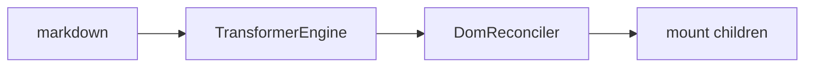

# [[title]]

> [[subtitle]] — 只要预览、不要编辑器 chrome 时用这一层。

---

## 何时用 Renderer

::: tabs
@tab:active 文档站 / 文章页
Markdown → 带主题的 DOM，需要 TOC、代码复制、图片放大。
@tab 自定义外壳
自建布局，只把内容区交给 Renderer。
@tab 不要用
需要工具栏与实时编辑 → 用 [`editor.md`](editor.md)（内部已嵌 Preview → Renderer）。
:::

---

## 最小示例

独立渲染需要自行组装 **Theme + EventBus + Log**，再交给 `Renderer`：

```typescript
import { Renderer, Theme, EventBus, Log } from "penna-markdown/renderer";

const mount = document.getElementById("preview")!;
const root = mount.parentElement!;
mount.classList.add("penna-render");

const log = new Log(false);
const eventBus = new EventBus(false, "[penna]", log);
const theme = new Theme(eventBus, log, root);

const renderer = new Renderer({
  mount,
  theme,
  eventBus,
  logger: log,
});

theme.setTheme("github");
renderer.render("# Hello\n\n**world**");
```

开发本仓库时可直接抄 `demo/modules/renderer/main.ts` / `demo/_common/theme.ts`（`createDemoTheme` 封装了同上组装）。

样式：

```html
<link
  rel="stylesheet"
  href="penna-markdown/penna-theme-github-render.min.css"
/>
```

> [!NOTE]
> `createDemoTheme` 会把皮肤 class 挂到传入的 root 上，并提供顶栏主题控件绑定逻辑。

---

## 构造选项

:::: field-group

::: field mount
@type HTMLElement
@required
预览挂载点（建议带 `penna-render` class）。
:::

::: field theme
@type Theme
@required
主题与事件总线载体。
:::

::: field eventBus
@type EventBus
@required
与 Theme 共用同一总线。
:::

::: field logger
@type Log
@required
日志门面。
:::

::: field inlineParsers
@type Record\<number, BaseInlineParser\>
@optional
按 priority 注入行内 parser。
:::

::: field blockParsers
@type Record\<number, BaseBlockParser\>
@optional
按 priority 注入块级 parser。
:::

::::

---

## 常用 API

| 方法                         | 说明                         |
| ---------------------------- | ---------------------------- |
| `render(markdown, changes?)` | 增量优先，失败降级全量       |
| `renderFull(markdown)`       | 强制全量                     |
| `getToc()` / `getTocFlat()`  | 目录                         |
| `getMountedBlocks()`         | 块索引                       |
| `getStore()`                 | 最近一次解析的 `ParserStore` |
| `getMount()`                 | 挂载点                       |
| `destroy()`                  | 释放监听与 lightbox 等       |

---

## 增量渲染

编辑场景下 Preview 会 debounce 后调用 `render`，并尽量只更新脏块：



正确性优先：块索引与 DOM 对不齐、脚注牵连等会自动全量重绘。

---

## 相关

- [转换器](transformer.md) · [主题](themes.md) · [扩展语法](extend.md) · [API](api.md)
