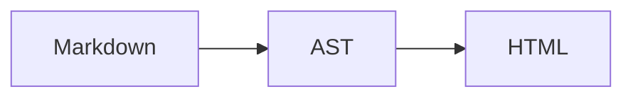
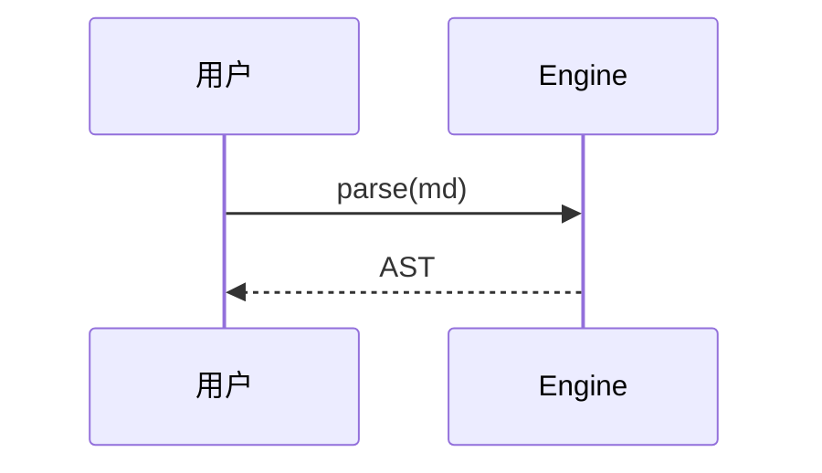
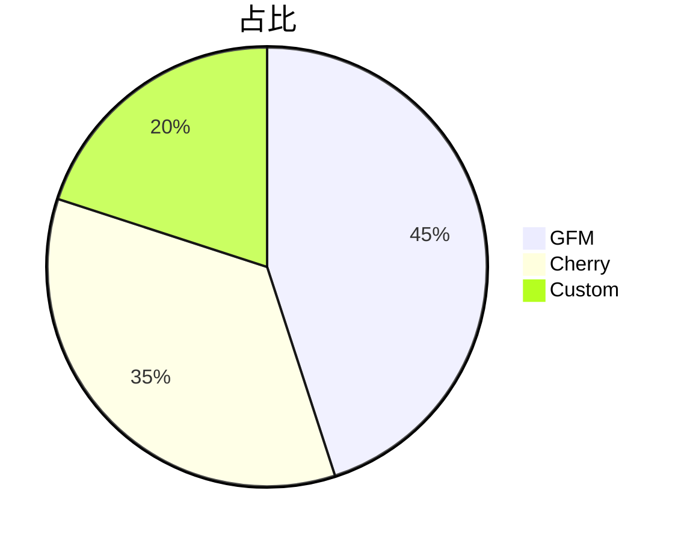

# [[title]]

> **[[subtitle]]** — 每种语法各一条样例；边界/压力/回归见 `docs/test.md`。

作者 [[author.name]]（[[author.url]]）· v[[version]] · 标签 [[tags]] · 仓库 [[repo]]

## 语法清单

| 类别 | 覆盖 |
| --- | --- |
| **GFM** | ATX/Setext 标题、强调、链接/图片、列表、引用、表格、分隔线、围栏/缩进代码、基础任务 |
| **Cherry 行内** | Frontmatter 变量 `[[key]]`、高亮、Emoji、HTML 属性、剧透、数学、徽章、上下标、注释、脚注引用 |
| **Cherry 块级** | YAML Frontmatter、Alert×5、扩展任务列表、块级公式、脚注定义、媒体/iframe、增强代码、Mermaid/ECharts |
| **布局** | 容器（note/tip/warning/对齐/嵌套）、Tabs、Steps、Timeline、Collapse |
| **卡片/文档** | card / link-card / image-card / repo-card / card-grid / card-masonry / field / field-group |

---

## Frontmatter 与变量

文首 `---` 围栏解析为 YAML；正文用 `[[key]]` 引用（嵌套键用 `.` 分隔）。

未定义变量保留字面量：[[undefined.key]] · 行内 code 内不替换：`[[version]]`

---

## GFM 标准语法

### 标题

# 一级 ATX {#atx-h1}

## 二级 ATX {#atx-h2}

### 三级 ATX

Setext 二级
------------

Setext 一级
===========

### 强调与删除

*斜体* **粗体** ***粗斜体*** ~~删除线~~ · 嵌套 **粗 *斜* 粗**

H~2~O 与 ~~删除~~ 不冲突 · 转义 \*literal\*

行末硬换行：第一行\
仍属同段

### 链接与图片

[内联链接](https://example.com) · [带标题](https://example.com "hover title")

<https://example.com/autolink> · 引用式 [ref][demo-ref]

[demo-ref]: https://example.com/ref "引用定义"

 · 引用式 ![ref图][img-ref]

[img-ref]: https://api.ankio.net/picsum/120/60

### 列表

- 无序 A
  - 嵌套 A.1
- 无序 B

1. 有序一
2. 有序二
   1. 嵌套 2.1

- 松散项

  项下段落（仍属上一项）

- [ ] GFM 基础待办
- [x] GFM 基础完成

### 引用

> 单行引用
>
> > 嵌套引用
>
> 引用内列表：
>
> - 要点
> - `code`

### 表格与分隔线

| 左 | 中 | 右 |
| :--- | :---: | ---: |
| A | B | C |
| `code` | **bold** | :smile: |

---

***

### 代码

行内 `` `const x = 1` ``

```js
// 围栏代码
export const sum = (a, b) => a + b;
```

    // 缩进代码块（4 空格）
    function hello() {
      return 'world';
    }

---

## Cherry 行内扩展

### 高亮

==默认== ==重要=={.important} ==注意=={.note} ==提示=={.tip} ==警告=={.warning} ==谨慎=={.caution} ==危险=={.danger}

### Emoji

:smile: :rocket: :heart: :warning: :bulb: :+1: :赞:

### HTML 属性

**加粗**{.highlight} · **加粗**{#special} · **加粗**{#id .class} · **加粗**{class="x" data-a="1"}

[链接](https://example.com){.button target="_blank"} · {.rounded}

### 剧透 · 数学 · 徽章 · 上下标

!! 悬浮剧透 !! · !! 点击 !! {click} · !! 另一种写法 !! {.click}

Euler $e^{i\pi}+1=0$ · $\mathbb{R}^2$ · 同行块级 $$E=mc^2$$

$$
\begin{bmatrix} 1 & 0 \\ 0 & 1 \end{bmatrix}
$$

[New]{.tip .top} [note]{.note} [important]{.important} [warning]{.warning} [caution]{.caution} [danger]{.danger .bottom}

H~2~O · E=mc^2^ · x^*n*^

### 注释 · 脚注引用

可见 %% 编辑备注（读者不可见） %% 继续。空注释：前%%%%后 → `前后`

块级注释：
%%%
多行备注
不渲染
%%%

正文引用[^note]与[^ref-link]。

---

## Cherry 块级扩展

### Alert（GFM Admonition）

> [!NOTE]
> 应当了解的信息。

> [!TIP]
> 有用建议。

> [!IMPORTANT]
> 关键信息。

> [!WARNING]
> 需要立即注意。

> [!CAUTION]
> 可能有负面后果。

### 扩展任务列表

- [ ] 待办
- [x] 完成
- [/] 进行中
- [>] 延期
- [<] 提前
- [-] 取消
- [!] 紧急

### 块级公式

$$
\frac{\partial f}{\partial x} = \lim_{h \to 0} \frac{f(x+h)-f(x)}{h}
$$

### 自定义容器

::: note 📘 说明
默认 note 容器。
:::

::: tip 💡 提示
容器内支持 **Markdown**、列表与嵌套 `code`。
:::

::: important ⭐ 重要
关键信息。
:::

::: warning ⚠️ 警告
与 Alert 共用主题色体系。
:::

::: caution 🛑 谨慎
可能有负面后果。
:::

::: danger 🚨 危险
删除前请备份。
:::

::: center
居中文本（别名 `::: c`）
:::

::: right
右对齐（别名 `::: r`）
:::

::: tip 外层
外层正文。

::: info 内层
嵌套容器示例。
:::

:::

### 折叠面板

::: collapse
- 默认折叠

  普通折叠面板。
:::

::: collapse expand
- 默认展开

  expand 模式。
:::

::: collapse accordion
- 面板 A

  内容 A

- :+ 面板 B

  强制展开（`:+`）

- :- 面板 C

  accordion 下强制折叠（`:-`）
:::

### Tabs · Steps · Timeline

::: tabs
@tab 标签 A
Tab A 内容
@tab:active 标签 B
Tab B（默认激活）
:::

::: steps

1. 安装

```bash
pnpm install
```

2. 编写 Markdown
3. 预览渲染

:::

::: timeline
- 成功节点
  time=2024-06 type=success

  基础时间线。

- 警告节点
  time=2024-09 type=warning color=#f59e0b

  单项 `color` 覆盖。
:::

::: timeline line="dotted" placement="between"
- 右侧
  time=2025-01 type=important placement=right

  容器 `placement="between"`。

- 左侧
  time=2025-06 type=success

  默认左侧。
:::

---

## 代码与图表

### 增强代码块

```json title="package.json"
{ "name": "cherry-markdown-next", "version": "0.1.0" }
```

```bash title='run.sh'
echo "单引号 title"
```

```js{2,4}
export default {
  name: "demo",      // 高亮
  data: () => ({}),
  mounted() {},      // 高亮
};
```

```json title="package.json" {2-3}
{
  "name": "demo",
  "private": true
}
```

```css :collapsed-lines
html { margin: 0; }
/* ... 折叠的冗长代码 ... */
body { color: inherit; }
```

```css :collapsed-lines=5
.line { color: red; }
.line { color: orange; }
.line { color: yellow; }
.line { color: green; }
.line { color: blue; }
.line { color: indigo; }
```

### Mermaid

`mermaid` / `graph` / `echarts` 围栏支持 `max-width`（纯数字默认 px，也可写 `640px` / `80%`）。







```graph
flowchart TD
  输入 --> 解析 --> 渲染
```

### ECharts

```echarts max-width=80%
{
  "title": { "text": "柱状图" },
  "xAxis": { "type": "category", "data": ["A", "B", "C"] },
  "yAxis": { "type": "value" },
  "series": [{ "type": "bar", "data": [12, 20, 15] }]
}
```

```echarts
{
  "title": { "text": "折线图", "left": "center" },
  "xAxis": { "type": "category", "data": ["Q1", "Q2", "Q3"] },
  "yAxis": { "type": "value" },
  "series": [{ "type": "line", "smooth": true, "data": [12, 18, 9] }]
}
```

```echarts
{
  "title": { "text": "饼图", "left": "center" },
  "series": [{ "type": "pie", "radius": "55%", "data": [{ "value": 40, "name": "A" }, { "value": 32, "name": "B" }] }]
}
```

---

## 媒体嵌入

> [api.ankio.net](https://api.ankio.net/?help=1) · 任意接口加 `?help=1` 查看帮助

!iframe[API 帮助总览](https://api.ankio.net/?help=1)

!video[随机视频 /video](https://api.ankio.net/video)

!audio[随机音乐 /music](https://api.ankio.net/music)

!video[带封面](https://api.ankio.net/video){poster=https://api.ankio.net/picsum/640/360}

!audio[带封面](https://api.ankio.net/music){poster=https://api.ankio.net/picsum/320/180}

---

## 卡片体系

::: card 基础卡片

普通卡片，支持 **Markdown** 正文。

:::

::: link-card 文档 link="https://api.ankio.net/?help=1" icon="https://api.ankio.net/favicon?url=https://github.com"

整卡可点击跳转；`image=` 可作 `icon=` 别名。
:::

::: link-card https://github.com

仅 URL 简写。
:::

::: image-card image="https://api.ankio.net/picsum/640/360" title="随机图片" href="https://api.ankio.net/picsum?help=1" author="Demo" date="2025/01/01"

[`/picsum/640/360`](https://api.ankio.net/picsum?help=1) 图片卡片。
:::

::: repo-card vuepress/core
VuePress 2 核心库
:::

::: repo-card tencent/cherry-markdown visibility="Public"
带 `visibility` 属性的仓库卡。
:::

:::: card-grid cols="{ sm: 1, md: 2 }"

::: link-card 指南 link="https://api.ankio.net/?help=1"

网格中的链接卡。
:::

::: card 说明

网格中的普通卡。
:::

::::

:::: card-masonry cols="3" gap="12"


::::

---

## 字段文档

::: field theme
@type ThemeConfig
@required
@default { base: '/' }
单个字段块。
:::

:::: field-group
::: field theme
@type ThemeConfig
@required
@default { base: '/' }
主题配置对象
:::

::: field enabled
@type boolean
@optional
@default true
是否启用功能
:::
::::

---

## 脚注

人生自古谁无死[^note]，留取丹心照汗青。

详见 [文档](https://example.com)[^ref-link]。

[^note]: 出自 **《过零丁洋》** · 支持 *富文本* 脚注正文。

[^ref-link]: 脚注定义可含 [链接](https://example.com) 与 `code`。

---

*文档路径：`docs/simple.md` · 编辑器页头可切换 `test.md` / `simple.md`（选择会记住）*
