==默认== ==重要=={.important} ==注意=={.note} ==提示=={.tip} ==警告=={.warning} ==谨慎=={.caution} ==危险=={.danger}

# [[title]] [Demo]{.tip .top}

## [[subtitle]]

作者：[[author.name]] · 版本 [[version]] · 标签 [[tags]]

行内 code 内变量**不**替换，例如版本 `` `[[version]]` `` 保持字面量。

> 本文档 `demo/test.md` 是项目的**活文档**：AST 调试台、编辑器、转换器 Demo 默认加载它。目标是用**一份文件**讲清整个项目的语法能力，并刻意埋入**极端/边界**输入供回归。

---

## 目录

- [快速开始](#快速开始)
- [架构与数据流](#架构与数据流)
- [扩展语法一览](#扩展语法一览)
- [GFM 标准语法](#gfm-标准语法)
- [Penna 行内扩展](#penna-行内扩展)
- [行内语法混搭](#行内语法混搭)
- [Penna 块级扩展](#penna-块级扩展)
- [容器与布局](#容器与布局)
- [卡片体系](#卡片体系)
- [代码与图表](#代码与图表)
- [媒体嵌入](#媒体嵌入)
- [脚注](#脚注)
- [综合排版示例](#综合排版示例)
- [Renderer 渲染增强](#renderer-渲染增强)
- [极端与边界情况](#极端与边界情况)
- [多语言代码高亮矩阵](#多语言代码高亮矩阵)
- [API 参考手册](#api-参考手册)
- [实战：自定义 Parser 教程](#实战自定义-parser-教程)
- [数学与科学排版大全](#数学与科学排版大全)
- [复杂布局实验室](#复杂布局实验室)
- [GFM Spec 回归集（扩展）](#gfm-spec-回归集扩展)
- [国际化与 Unicode 压力](#国际化与-unicode-压力)
- [Penna 与 GFM 对照表](#penna-与-gfm-对照表)
- [规模与性能压力段](#规模与性能压力段)
- [附录 A · 技术白皮书](#appendix-whitepaper)

---

## 快速开始

```ts
import { TransformerEngine } from "penna-markdown/transformer";

const engine = new TransformerEngine();
const { ast } = engine.parse("# Hello\n\n**world**");
const html = engine.render(ast);
// => "<h1>Hello</h1>\n<p><strong>world</strong></p>\n"
```

按需传入 `syntaxOptions` 可配置代码高亮（hljs / shiki）、Mermaid/ECharts 主题等。扩展 parser 通过 `Registry` 按 **priority 降序**匹配——数值越大越先尝试。

::: info ℹ️ Demo 入口

| Demo       | 路径              | 说明                                             |
| ---------- | ----------------- | ------------------------------------------------ |
| AST 调试台 | `demo/ast`        | 左侧 Markdown，右侧 AST + HTML，dev 下写回本文档 |
| 编辑器     | `demo/editor`     | WYSIWYG 体验                                     |
| 转换器     | `demo/converter`  | Markdown ↔ HTML                                  |
| GFM 语法   | `demo/gfm-syntax` | 标准语法分条演示                                 |
| 扩展语法   | `demo/extends`    | Penna 扩展分条演示                               |

:::

---

## 架构与数据流

**Penna Markdown** 借鉴 [Penna Markdown](https://github.com/Tencent/penna-markdown) 思路，核心是一条清晰的管线：


| 模块            | 路径              | 职责                                             |
| --------------- | ----------------- | ------------------------------------------------ |
| **Transformer** | `src/transformer` | 解析注册表、`gfm/` 内置语法、`extends/` 扩展语法 |
| **Renderer**    | `src/renderer`    | 代码高亮、复制按钮、主题切换、折叠展开交互       |
| **Penna**       | `src/editor`      | 编辑器封装（ProseMirror / CodeMirror 集成点）    |

块级与行内均采用**优先级注册表**：同层 parser 按 priority 从高到低 `canOpenAt` → `parse`，先匹配者胜出。这是消除「特殊情况 if-else 链」的数据结构——新语法只需注册 priority，不必改核心循环。

---

## 扩展语法一览

### 行内扩展（`extends/inline`）

| 语法             | 示例               | Parser                      |
| ---------------- | ------------------ | --------------------------- |
| Frontmatter 变量 | `[[title]]`        | `frontmatterVar`            |
| 数学公式         | `$E=mc^2$`         | `math`                      |
| 下标             | `H~2~O`            | `sub`                       |
| 上标             | `E=mc^2^`          | `sup`                       |
| 高亮             | `==text==`         | `highlight`                 |
| HTML 属性        | `**b**{.cls}`      | `html_attrs`                |
| 徽章             | `[新]{.tip}`       | `badge`                     |
| Emoji            | `:smile:`          | `emoji`                     |
| 剧透             | `!! text !!`       | `spoiler`                   |
| 行内注释         | `%% hidden %%`     | `comment`                   |
| 脚注引用         | `[^1]`             | `footnoteRef`               |
| 媒体行内         | `!video[...](url)` | `media`（仅块级独立行生效） |

### 块级扩展（`extends/block`）

| 语法                               | 示例                          | Parser             |
| ---------------------------------- | ----------------------------- | ------------------ |
| YAML Frontmatter                   | `---\ntitle: x\n---`          | `frontmatter`      |
| 块级注释                           | `%%%\nhidden\n%%%`            | `commentBlock`     |
| 块级公式                           | `$$...$$`                     | `mathBlock`        |
| 脚注定义                           | `[^1]: text`                  | `footnoteDef`      |
| iframe / 媒体块                    | `!iframe[...](url)`           | `iframe` / `media` |
| GFM Alert                          | `> [!NOTE]`                   | `alert`            |
| 任务列表                           | `- [ ] todo`                  | `taskList`         |
| 增强代码块                         | ` ```js title="..."`          | `enhancedCode`     |
| 特殊图表块                         | ` ```mermaid`                 | `specialCode`      |
| 容器                               | `::: tip`                     | `container`        |
| 卡片系列                           | `::: card` / `:::: card-grid` | `card/*`           |
| 字段文档                           | `::: field name`              | `field`            |
| Tabs / Steps / Timeline / Collapse | `::: tabs` 等                 | 同名 parser        |

---

## GFM 标准语法

### 标题（ATX + Setext）

# 一级 ATX {#h1-atx}

## 二级 ATX

### 三级 ATX

#### 四级 ATX

##### 五级 ATX

###### 六级 ATX

Setext 一级（下划线 `=`）
==========================

Setext 二级（下划线 `-`）
--------------------------

标题内可嵌套行内：**粗体标题**、_斜体_、`code`，以及属性 **重点**{.important}。

### 强调与删除线

_斜体_ 与 _另一种斜体_

**粗体** 与 **另一种粗体**

_**粗斜体**_ 与 _**另一种粗斜体**_

嵌套：**粗体 _内部斜体_ 继续粗体**

Intra-word：un*frigging*believable、**bold**ness

删除线：~~已删除~~（与下标 H~~2~~O 不冲突）

转义：\*不斜体\*、\*\*不粗体\*\*、\~不下标\~、\^不上标\^

### 硬换行

行末反斜杠硬换行：第一行\
第二行仍属同一段落

行末两空格硬换行：foo  
baz

强调内换行：_foo\
bar_

### 链接

[内联链接](https://example.com)

[带标题的链接](https://example.com "鼠标悬停标题")

[相对路径](./demo/test.md)

<https://example.com/path?q=1>

<user@example.com>

引用式链接 [示例][demo-ref] 与 [第二个][other-ref]

[demo-ref]: https://example.com/demo "引用定义标题"
[other-ref]: https://example.com/other

**嵌套链接**（GFM 内层优先）：[foo [bar](/uri)](/uri) → 仅 `bar` 成链。

**链接 vs 强调优先级**：*[foo*](/uri) → 链接包裹 `foo*`。

### 图片

> 随机图：[`/picsum/{宽}/{高}`](https://api.ankio.net/picsum?help=1)（302 跳转）


 与  并排

引用式图片：

![引用图][img-ref]

[img-ref]: https://api.ankio.net/picsum/240/160 "引用 title"

### 列表

**无序**

- 苹果
- 香蕉
  - 子项 A
  - 子项 B
    - 孙项
- 橙子

**有序**

1. 第一步
2. 第二步
3. 第三步
   1. 嵌套 3.1
   2. 嵌套 3.2

**松散列表**（项间空行，中间段落属于上一项）：

- 第一项

  这是第一项下的段落，不是新列表项。

- 第二项

  - 嵌套子项

### 引用块

> 单行引用

> 多行引用
> 第二行仍属同一块
>
> 空行后的新段落

> 嵌套引用
>
> > 第二层
> >
> > > 第三层

> 引用内含 **Markdown**、列表与代码：
>
> - 要点
> - `code`
>
> ```js
> console.log("in blockquote");
> ```

### 表格

| 左对齐         |     居中      |                      右对齐 |
| :------------- | :-----------: | --------------------------: |
| A              |       B       |                           C |
| `code`         |   **bold**    | [link](https://example.com) |
| 多行<br>单元格 | emoji :smile: |                         100 |

| 功能 | 语法       |
| ---- | ---------- |
| 粗体 | `**text**` |
| 高亮 | `==text==` |
| 脚注 | `[^1]`     |

### 分隔线

---

---

---

---

### 围栏代码与缩进代码

行内 `` `const x = 1` `` 与 ` ```三个反引号``` ` 转义

```
无语言标签 → 普通 <pre><code>，不走增强代码块
```

```javascript
function greet(name) {
  return `Hello, ${name}!`;
}
```

```bash
pnpm install penna-markdown
pnpm dev
```

缩进代码块（4 空格）：

    const indented = true;
    console.log(indented);

### 原始 HTML 与实体

<div class="note" style="padding:10px;border:1px solid #ccc;border-radius:6px">
  <p><strong>块级 HTML</strong> 直接透传。生产环境应对不可信输入做 sanitize。</p>
  <ul><li>列表</li></ul>
</div>

行内标签：<kbd>Ctrl</kbd> + <kbd>Shift</kbd> + <kbd>P</kbd>、<mark>mark</mark>、<sub>下</sub><sup>上</sup>

<!-- HTML 注释不出现在输出中 -->

&copy; 2026 &middot; &lt;tag&gt; &amp; &quot;quoted&quot; &nbsp; &hellip;

---

## Penna 行内扩展

### 高亮 ==text==

==默认高亮== ==重要=={.important} ==注意=={.note} ==提示=={.tip} ==警告=={.warning} ==谨慎=={.caution} ==危险=={.danger}

嵌套：==**加粗高亮**==、==_斜体_==、==`code`==、==[链接](https://example.com)==

与属性组合：==核心概念=={.important} ==实验性=={.warning .top}

### 徽章 [text]{.variant .position}

# 一级标题 [必须]{.important .top}

## 二级 [推荐]{.tip} [注意]{.warning .bottom}

变体：[note]{.note} [tip]{.tip} [important]{.important} [warning]{.warning} [caution]{.caution} [danger]{.danger}

位置：[置顶]{.top} [默认中间] [置底]{.bottom}

裸方括号 `[进行中]` **不会**变徽章（让位 GFM 链接引用语法）。

### HTML 属性注入

**加粗**{.highlight}

**加粗**{#special}

**加粗**{#id .class}

**加粗**{.a .b .c}

**加粗**{class="highlight" data-a="1" id="x"}

链接 [点我](https://example.com){.button target="_blank"}

图片 {.rounded}

### Emoji 短码

常用：:smile: :thumbsup: :+1: :heart: :rocket: :tada: :fire: :sparkles: :check: :warning: :bulb: :star:

中文：:赞: :微笑: :哭: :思考:

连续：:smile::heart:（无空格时按规则逐段匹配）

未知：`:not_a_real_emoji:` 保持原样

### 剧透 !! text !!

悬浮显示：!! 这是剧透内容 !!

点击显示：!! 点击揭晓 !! {click}

点击显示：!! 另一种写法 !! {.click}

组合：!! **加粗剧透** 与 ==高亮== !!

### 上下标

化学式 H~~2~~SO~~4~~，物理 E=mc^2^，数学 x^2^ + y^2^ = z^2^

嵌套：x^_important_^、a~`code`~

与删除线：~~删除~~ 不影响 H~~2~~O

### 行内注释与块级注释

可见 %% 这一段是写给自己的悄悄话，预览/导出时完全不可见 %% 继续书写。

空注释：前%%%%后 → `前后`

块级注释：
%%%
不渲染多行注释
%%%

### 行内公式

Euler's identity $e^{i\pi}+1=0$ is beautiful in $\mathbb{R}^2$.

分数 $\frac{a}{b}$、求和 $\sum_{i=1}^{n} i$、矩阵 $\begin{pmatrix} a & b \\ c & d \end{pmatrix}$

### 行内媒体

段落内 `!video[alt](url)` **不会**渲染播放器——须独立成行（见「媒体嵌入」）。

---

## 行内语法混搭

下面这一段**故意**堆叠多种行内语法，测试优先级与嵌套：

> 发布 **Penna Markdown** [v0.1.0]{.tip .top} ：支持 ==高亮==、!! 剧透 !! {click}、:rocket:、$E=mc^2$、H~~2~~O、[^ref] 脚注引用、%% 内部备注 %% 以及 [文档]([[repo]]){.important}。

[^ref]: 混搭段落中的脚注定义。

**标题 + 徽章 + 属性：**

### 三级标题 [Beta]{.warning .top} {#kitchen-sink}

列表项内混搭：

- [ ] 任务：阅读 ==AST== 文档，运行 `pnpm dev`，:thumbsup:
- [x] 已完成：渲染 `$x^2$` 与 ~~旧方案~~
- 普通项：**粗体** + _斜体_ + `code` + [link](https://example.com)

表格内混搭：

| 组合        | 示例                    |
| ----------- | ----------------------- |
| 高亮+徽章   | ==重要== [New]{.danger} |
| 剧透+emoji  | !! 秘密 !! :smile:      |
| 公式+上下标 | $a^2$ / H~~2~~O         |

---

## Penna 块级扩展

### GFM Alert（引用块语法）

> [!NOTE]
> 读者应当了解的信息，即使快速浏览也应看到。

> [!TIP]
> 有用建议，帮助更好地完成任务。

> [!IMPORTANT]
> 关键信息，达成目标必须知道。

> [!WARNING]
> 需要立即注意，避免问题。

> [!CAUTION]
> 风险提示，某些行为可能有负面后果。

Alert 可多段：

> [!TIP]
> 第一段
>
> 第二段，空行分隔。

Alert 与容器区别：Alert 用 `>` 引用语法；容器用 `:::` 围栏语法。渲染 CSS 类相似（`penna-alert`）。

### 任务列表

- [ ] 待办事项
- [x] 已完成
- [/] 进行中
- [>] 延期 / 迁移到未来
- [<] 提前排期
- [-] 已取消
- [!] 紧急 / 高优先级

嵌套任务：

- [x] 父任务完成
  - [ ] 子任务 A
  - [/] 子任务 B 进行中
- [ ] 父任务待办

与普通列表共存：

- plain unordered
- [ ] task item

### 块级公式

同行块级：$$E=mc^2$$

分行块级：

$$
\frac{\partial^r}{\partial \omega^r}
= \left(\frac{y^{\omega}}{\omega}\right)
\left\{(\log y)^r + \sum_{i=1}^{r}\frac{(-1)^i r \cdots (r-i+1)(\log y)^{r-i}}{\omega^i}\right\}
$$

多行矩阵：

$$
\begin{bmatrix}
1 & 0 & 0 \\
0 & 1 & 0 \\
0 & 0 & 1
\end{bmatrix}
$$

---

## 容器与布局

### 语义容器（与 Alert 同主题色）

::: note 📘 说明
默认 note 容器，支持 **Markdown**、列表、代码。
:::

::: tip 💡 提示
有用建议。
:::

::: important ⭐ 重要
关键信息。
:::

::: warning ⚠️ 警告
操作前请确认。
:::

::: caution 🛑 谨慎
可能有负面后果。
:::

::: danger 🚨 危险
删除数据库前请务必备份！
:::

::: info ℹ️ 信息
补充说明，品牌色。
:::

**类型缩写**：`::: n` note · `::: t` tip · `::: im` important · `::: w` warning · `::: d` danger · `::: i` info

### 对齐容器

::: left
左对齐文本。别名 `::: l`
:::

::: center 居中标题
居中文本。别名 `::: c`
:::

::: right
右对齐文本。别名 `::: r`
:::

::: justify
两端对齐：Lorem ipsum dolor sit amet, consectetur adipiscing elit. Sed do eiusmod tempor incididunt ut labore et dolore magna aliqua. alias `::: j`
:::

### 嵌套容器

::: tip 外层提示
外层正文。

::: info 内层信息
内层 **嵌套** 正文。
:::

::: warning 同级内层
与 info 同级。
:::
:::

### 选项卡（可多组）

::: tabs
@tab 概述
Penna Markdown 基于 **AST** 解析，扩展通过 Registry 注册。

@tab:active API

```ts
import { TransformerEngine } from "penna-markdown/transformer";
const engine = new TransformerEngine();
engine.render(engine.parse(markdown));
```

@tab 嵌套容器
::: danger 注意
Tab 面板内可嵌套任意块级语法。
:::

@tab 表格

| A   | B   |
| --- | --- |
| 1   | 2   |

:::

::: tabs
@tab 第二组 · X
第二组内容 X（无 `:active` 时默认第一个）
@tab 第二组 · Y
第二组内容 Y
:::

### 步骤条

::: steps

1. 克隆仓库

```bash
git clone [[repo]]
cd penna-markdown
```

2. 安装依赖

```bash
pnpm install
```

3. 启动 Demo

```bash
pnpm dev
```

4. 编写 Markdown

::: tip 提示
在 `demo/test.md` 修改并观察实时渲染。
:::

5. 完成 🎉

:::

### 折叠面板

**默认折叠：**

::: collapse

- 什么是 AST？

  抽象语法树——Markdown 的结构化中间表示，便于分析与变换。

- 如何调试？

  打开 `demo/ast`，左侧编辑右侧看树。

- 如何扩展？

  在 `extends/` 新增 parser 并注册 priority。
  :::

**默认全部展开 `expand`：**

::: collapse expand

- 展开项 1

  内容 1

- 展开项 2

  内容 2
  :::

**手风琴 `accordion`：**

::: collapse accordion

- 手风琴 A

  同时只展开一个。

- 手风琴 B

  内容 B

- 手风琴 C

  内容 C
  :::

**`:+` 标记展开 / `:-` 在 expand 下标记折叠：**

::: collapse

- 默认折叠

  正文

- :+ 强制展开

  即使默认折叠也展开。

- :+ 也展开

  同上
  :::

::: collapse expand

- 默认展开

  正文

- :- 强制折叠

  expand 模式下仍折叠。

- 仍展开

  无 `:-` 标记
  :::

**多行标题：**

::: collapse

- 主标题
  副标题（同属 summary）

  正文内容
  :::

### 时间线

**基础 · 节点类型：**

::: timeline

- [2025-03-20:success] 节点一

  成功类型，线条与圆点同色。

- [2025-04-20:warning] 节点二

  警告类型。

- [2025-01-22:danger] 节点三

  危险类型。

- [2025-06-01:important] 节点四

  重要类型。

- [2025-07-01:tip] 节点五

  提示类型。

:::

**多行标题：**

::: timeline

- [2025-03-20:success] 主标题
  副标题（同属标题）

  标题行后的续行仍属标题；空行之后为正文。

:::

**线条风格：**

::: timeline line="dotted"

- [2025-03-20] 继承 dotted

  容器级 `line="dotted"`，所有节点共用。

- [2025-04-20:success] 另一节点

  仍继承容器线条风格（不支持单项覆盖）。

:::

**右对齐：**

::: timeline placement="right"

- [2025-03-20:success] 右侧节点

  内容在时间轴右侧。

:::

**两端对齐：**

::: timeline placement="between"

- [2025-03-20:success] 右侧

  两端模式下奇数项在右。

- [2025-04-20:warning] 左侧

  偶数项在左。

- [2025-05-20:danger] 再次右侧

  继续交替。

:::

### 字段文档

:::: field-group
::: field theme
@type ThemeConfig
@required
@default { base: '/' }
主题配置对象，包含 base、lang 等。
:::

::: field enabled
@type boolean
@optional
@default true

是否启用该功能。
:::

::: field callback
@type (...args: any[]) => void
@optional
@default () => () => {}
[v1.0.0 新增]{.tip}

事件回调函数。
:::

::: field legacyMode
@type boolean
@deprecated
[v0.9.0 弃用]{.danger}

已弃用，将在下个大版本移除。
:::
::::

---

## 卡片体系

### 基础卡片

::: card **加粗**标题

普通卡片，支持 **Markdown** 与列表：

- 要点一
- 要点二

```js
// 卡片内代码块
console.log("card");
```

:::

### 链接卡片

::: link-card 官方文档 link="https://github.com/Tencent/penna-markdown" icon="https://api.ankio.net/favicon?url=https://github.com"

点击整卡跳转，左侧 icon。
:::

::: link-card 封面图 link="https://example.com" image="https://api.ankio.net/picsum/80/80"

`image=` 是 `icon=` 别名。
:::

### 图片卡片

::: image-card image="https://api.ankio.net/picsum/640/360" title="阿尔凡齐纳灯塔，阿尔加维，葡萄牙" href="/" author="Andreas Kunz" date="2024/08/16"

今天照片中的灯塔位于葡萄牙南部海岸。description 也可写在正文。
:::

::: image-card title="仅 title 属性"
正文作为 description 渲染。
:::

### 仓库卡片

::: repo-card vuepress/ecosystem
Official plugins and themes for VuePress2
:::

::: repo-card tencent/penna-markdown
Tencent 开源的 Penna Markdown 编辑器。
:::

### 卡片网格

:::: card-grid cols="{ sm: 1, md: 2, lg: 3 }"

::: card 卡片 A
内容 A
:::

::: link-card 卡片 B link="https://example.com"
内容 B
:::

::: image-card image="https://api.ankio.net/picsum/320/180" title="图片 C"
:::

::: card 卡片 D
内容 D
:::

::: card 卡片 E
内容 E
:::

::: card 卡片 F
内容 F
:::

::::

**均匀列数：**

:::: card-grid cols="3"

::: card 1
:::
::: card 2
:::
::: card 3
:::

::::

### 瀑布流

:::: card-masonry cols="3" gap="16"


::: card 嵌套卡片
Masonry 内可混排卡片块。
:::

::::

---

## 代码与图表

### 增强围栏代码块

**带标题：**

```json title="package.json"
{
  "name": "penna-markdown",
  "version": "0.1.0",
  "type": "module"
}
```

**单引号 / 无引号 title：**

```bash title='run.sh'
#!/bin/sh
echo "hello"
```

```makefile title=Makefile
all:
	@echo ok
```

**行高亮（围栏 info `lang{lines}`）：**

```js{1,4,6-8}
export default { // line 1
  data () {
    return {
      msg: 'Highlighted!', // line 4
      lorem: 'ipsum',
      extra: true // lines 6-8
    }
  }
}
```

**行高亮（title 后的 `{lines}`）：**

```json title="package.json" {2-3}
{
  "name": "demo",
  "private": true
}
```

**混合指定：**

```bash {2,4-5}
#!/bin/sh
echo "line 2 highlighted"
echo "line 3 normal"
echo "line 4 highlighted"
echo "line 5 highlighted"
```

**折叠代码（`... more code` 标记）：**

```css :collapsed-lines
html {
  margin: 0;
  background: #111;
  height: 100%;
}

... more code body {
  color: #eee;
}
```

**折叠 + 最大可见行数：**

```css :collapsed-lines=5
.line {
  color: red;
}
.line {
  color: orange;
}
.line {
  color: yellow;
}
.line {
  color: green;
}
.line {
  color: blue;
}
.line {
  color: indigo;
}
.line {
  color: violet;
}
.line {
  color: pink;
}
.line {
  color: gray;
}
.line {
  color: black;
}
```

**仅语言：**

```typescript
const engine = new TransformerEngine();
type Node = ReturnType<typeof engine.parse>;
```

### Mermaid

**流程图：**

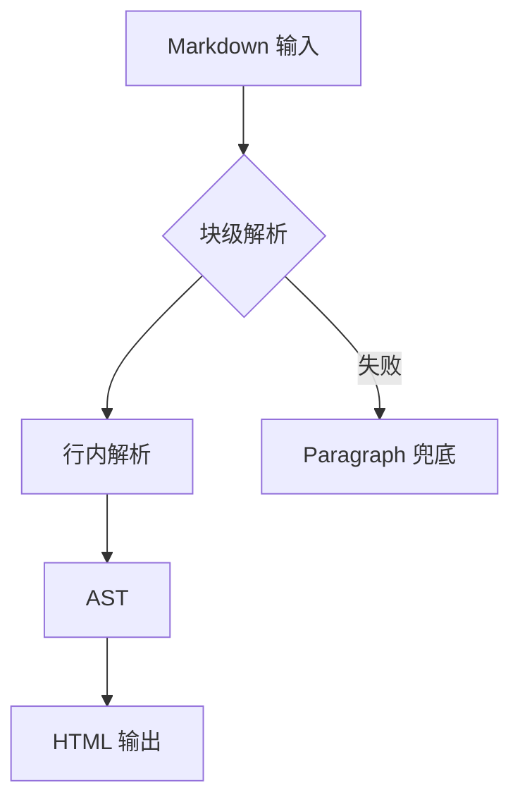

**时序图：**

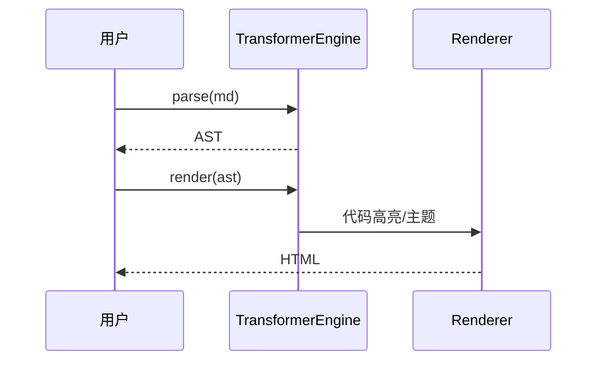

**状态图：**

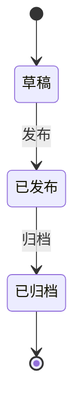

**别名 `graph`：**

```graph
flowchart LR
    输入 --> 解析 --> 渲染
```

### ECharts

**柱状图：**

```echarts
{
  "title": { "text": "月度访问" },
  "xAxis": { "type": "category", "data": ["Mon", "Tue", "Wed", "Thu", "Fri"] },
  "yAxis": { "type": "value" },
  "series": [{ "type": "bar", "data": [120, 200, 150, 80, 70] }]
}
```

**饼图：**

```echarts
{
  "title": { "text": "占比", "left": "center" },
  "series": [{
    "type": "pie",
    "radius": "55%",
    "data": [
      { "value": 40, "name": "GFM" },
      { "value": 35, "name": "Penna" },
      { "value": 25, "name": "Custom" }
    ]
  }]
}
```

**折线图：**

```echarts
{
  "title": { "text": "解析耗时趋势 (ms)" },
  "tooltip": { "trigger": "axis" },
  "xAxis": { "type": "category", "data": ["Q1", "Q2", "Q3", "Q4"] },
  "yAxis": { "type": "value" },
  "series": [{ "type": "line", "smooth": true, "data": [12, 18, 15, 9] }]
}
```

### 普通语言围栏（非特殊类型）

以下作为**普通代码块**渲染，不走公式/图表 API：

```math
\frac{a}{b}
```

```katex
x^2 + y^2
```

```latex
\documentclass{article}
```

---

## 媒体嵌入

> 演示 URL 使用 [api.ankio.net](https://api.ankio.net/?help=1)；**任意接口加 `?help=1`** 可查看该接口帮助（如 [`/video?help=1`](https://api.ankio.net/video?help=1)）。

### 视频

!video[演示视频](https://api.ankio.net/video)

!video[带 title](https://api.ankio.net/video "video 接口 · 302 跳转随机 MP4")

!video[带封面](https://api.ankio.net/video){poster=https://api.ankio.net/picsum/640/360}

### 音频

!audio[背景音乐](https://api.ankio.net/music)

!audio[带封面](https://api.ankio.net/music){poster=https://api.ankio.net/picsum/320/180}

### iframe

!iframe[API 总览帮助](https://api.ankio.net/?help=1)

!iframe[video 接口帮助](https://api.ankio.net/video?help=1 "iframe 说明")

!iframe[缩进也可](https://api.ankio.net/music?help=1)

!iframe[带 query](https://api.ankio.net/picsum?help=1)

---

## 脚注

### 基础引用

人生自古谁无死[^poem]，留取丹心照汗青。

[^poem]: 出自 宋·文天祥 **《过零丁洋》**

### 多个脚注

Penna Markdown[^penna] 支持 GFM 风格脚注[^gfm]，点击上标可跳转到文末。

[^penna]: Penna Markdown 扩展语法演示项目。

[^gfm]: GitHub Flavored Markdown 规范中的脚注扩展。

### 重复引用同一脚注

第一次提到 VuePress[^vp]，后文再次引用 VuePress[^vp]，两次上标编号相同。

[^vp]: VuePress 是 Vue 驱动的静态站点生成器。

重复引用时，文末 ↩︎ 始终回到**第一次**出现的位置（`footnote-ref-1`）。

### 引用顺序决定编号

先引用 B[^b]，再引用 A[^a]；编号按**首次引用**排序，而非定义顺序。

[^a]: 定义写在后面，但编号靠后。

[^b]: 定义写在后面，但编号靠前。

### 富文本脚注

详见 [官方文档](https://example.com/docs)[^doc] 与 `inline code`[^code] 示例。

[^doc]: 支持 **加粗**、_斜体_、[链接](https://example.com) 等 Markdown。

[^code]: 行内代码与列表也支持：

- 要点一
- 要点二

### 多行脚注正文

扩展语法[^ext] 可在定义后继续换行书写，直到空行或下一条定义。

[^ext]: 第一行说明。

第二行补充内容，属于同一条脚注。

第三行仍然属于 [^ext]。

---

## 综合排版示例

下面模拟一篇**Release Note**，组合多种块级语法：

::: timeline placement="between"

- [2026-01-15:success] v0.1.0 首次发布

  - [x] GFM 完整支持
  - [x] Penna 扩展语法
  - [ ] 编辑器完善

- [2026-06-01:tip] v0.2.0 计划中

  性能优化与插件 API。

:::

:::: card-grid cols="2"

::: link-card 查看源码 link="[[repo]]" icon="https://api.ankio.net/favicon?url=https://github.com"
GitHub 仓库地址来自 Frontmatter `[[repo]]`。
:::

::: card 参与贡献

1. Fork 仓库
2. 修改 `demo/test.md` 或 `src/transformer`
3. 提交 PR
   :::

::::

::: collapse

- :+ 破坏性变更（暂无）

  当前版本遵循 **Never break userspace**——扩展 opt-in，GFM 行为对齐官方 spec。

- 已知问题

  - 部分 sanitize 测试依赖浏览器 DOMPurify
  - 超长文档 AST 调试台可能卡顿
    :::

---

## Renderer 渲染增强

Transformer 输出 HTML 后，Renderer 层（`src/renderer`）负责：

| 能力              | 说明                                                                  |
| ----------------- | --------------------------------------------------------------------- |
| **代码高亮**      | 支持 highlight.js / Shiki，渲染时注入 `penna-code-block__highlighted` |
| **复制按钮**      | `penna-copy-code-button` + `data-penna-code`                          |
| **行号 / 行高亮** | `data-penna-highlight-lines`、`data-line`                             |
| **代码折叠**      | `data-penna-collapsed` + 展开按钮                                     |
| **主题**          | `pennaTheme` 深浅色切换，影响 Mermaid/ECharts/公式远程图              |
| **代码折叠面板**  | `codeCollapse` 客户端交互                                             |

样式入口：`penna-markdown/transformer.css`

---

## 极端与边界情况

本节**故意**编写容易踩坑的输入。注释说明**期望行为**，便于肉眼看 Demo 输出是否退化。

### 高亮 / 徽章 / 剧透

未闭合高亮：`==重要={.important}` → 应降级为普通文本 `==重要=`，**不能**挂死解析器。

空高亮：`====` → 不匹配（内容区不能为空）。

半开高亮：`==only one side`

剧透缺空格：`!!剧透!!` → 字面量；`!! 剧透!!` → 字面量；`!!  !!` → 空内容拒绝。

Badge 歧义：

- `[链接](https://example.com)` → 链接
- `[文本]{.tip}` → 徽章
- `[裸文本]` → 原样
- `[ref][x]` → 引用链接

### 强调 / 删除线 / 上下标 / 脚注

GFM 强调边界：

- `foo__bar__` → 字面（词中双下划线不开启强调）
- `**foo **bar****` → `<strong>foo bar</strong>`
- `***foo***` → em > strong 嵌套
- `*(*foo*)*` → 合法嵌套括号

~~删除~~ vs H~~2~~O vs text[^1] — 三种 `~` 语义互不干扰。

未定义脚注：`missing[^undefined]` → 字面 `[^undefined]`，**无**脚注区。

### 链接边界

- `[foo [bar](/uri)](/uri)` → 仅 inner link
- `](uri2)](uri3)` → img alt 为 `[foo](uri2)`
- `[foo`](/uri)` → code span 阻断链接
- `[foo <bar attr="](baz)">` → 原始 HTML 阻断

### Emoji / 注释 / 公式

- 代码内：`:smile:` → 不解析
- 转义：`\:smile:` → `:smile:`
- 围栏内：`%% secret %%` → 保留
- 未闭合注释：`hello %% still visible` → 保留
- 行内 `$` vs 块级 `$$`：`$x$` 与 `$$y$$` 同行 `$a$ $$b$$ $c$`

### 媒体 / iframe 安全

!iframe[恶意](<javascript:alert(1)>) → **拒绝**非 http(s)

!iframe[data](<data:text/html,%3Cscript%3Ealert(1)%3C/script%3E>) → 拒绝

行内 !iframe[演示](https://example.com) → **无** iframe 标签

### 容器 / 卡片 / Tabs

空容器：

::: note
:::

四冒号 vs 三冒号：`:::: card-grid` 内嵌 `::: card` — 注意闭合层级。

### 折叠 / 步骤 / 时间线

无有序列表的 steps：

::: steps
只有段落，没有 1. 2. 3.
:::

→ 不应渲染 `penna-steps`。

Timeline 无 time 配置：

::: timeline

- 仅标题

  正文
  :::

### 代码块

无语言：

```
plain pre
```

空围栏：

```

```

围栏内嵌套围栏：

````markdown
```js
nested;
```
````

超长单行：

```js
const s =
  "********************************************************************************************************************************************************************************************************************************************************************************************************************************************************************************************************************************************************************************************************************************";
```

### HTML / XSS / 特殊字符

<script>alert('xss')</script>


零宽字符：​U+200B​

混合书写方向：English · العربية · 中文 · 🎉 · :fire:

### 深度嵌套压力测试

> 引用 L1
>
> > 引用 L2
> >
> > > 引用 L3
> > >
> > > 1. 有序
> > >    - [ ] 任务
> > >      - ==高亮==
> > >        - `code`
> > >          - [badge]{.danger}

::: tip L1
::: info L2
::: warning L3
::: tabs
@tab 嵌套 Tab
!! 剧透 !! $x^2$ :rocket:
@tab 代码

```js
console.log("deep");
```

:::
:::
:::
:::

### Lazy continuation

[lazy-link][lazy]

[lazy]: https://example.com

这行是 lazy continuation，仍属上一段。

### Frontmatter 变量

数组变量格式化为**逗号分隔**文本；对象请用点分路径（如 `[[author.name]]`），不要直接引用 `[[author]]`。

| 变量                | 渲染结果                                                              |
| ------------------- | --------------------------------------------------------------------- |
| `[[title]]`         | Penna Markdown                                                        |
| `[[subtitle]]`      | 语法全景演示 · 活文档                                                 |
| `[[author.name]]`   | Ankio                                                                 |
| `[[author.url]]`    | https://github.com/AutoAccountingOrg                                  |
| `[[version]]`       | 0.1.0                                                                 |
| `[[tags]]`          | markdown, gfm, penna, demo, ast                                       |
| `[[features]]`      | GFM 标准语法, Penna 扩展语法, AST 可视化, 代码高亮与主题              |
| `[[description]]`   | 基于 AST 语法树的 Markdown 解析引擎，完整演示 GFM 与 Penna 扩展语法。 |
| `[[repo]]`          | https://github.com/AutoAccountingOrg/penna-markdown                   |
| `[[missing]]`       | 原样 `[[missing]]`                                                    |
| `` `[[title]]` ``   | 不替换（行内 code）                                                   |
| `` `[[version]]` `` | 不替换（行内 code）                                                   |

### 空行与空白

多个连续空行不应产生多余 block。

行首 Tab：`	Tab 开头`（若支持则渲染，否则字面）

全角标点：，。！？；：

### 组合压力段

`***~~==!! **[$x$](u)**==!!~~***` — 极端嵌套，观察谁吃掉谁；解析器应终止于合法最长匹配，**不**无限循环。

---

## 多语言代码高亮矩阵

本节用于 **Renderer 高亮路径** 回归：每种语言至少一个围栏块，部分带 `title`、行高亮、折叠。

### 系统与脚本

```bash title="deploy.sh" {1,3,5}
#!/usr/bin/env bash
set -euo pipefail
pnpm install
pnpm build
pnpm test
echo "deploy ok"
```

```powershell title="build.ps1"
Write-Host "Building penna-markdown..."
pnpm run build
if ($LASTEXITCODE -ne 0) { exit $LASTEXITCODE }
```

```dockerfile title="Dockerfile"
FROM node:22-alpine AS builder
WORKDIR /app
COPY package.json pnpm-lock.yaml ./
RUN corepack enable && pnpm install --frozen-lockfile
COPY . .
RUN pnpm build
FROM nginx:alpine
COPY --from=builder /app/dist /usr/share/nginx/html
```

```makefile title=Makefile
.PHONY: dev build test lint
dev:
	pnpm dev
build:
	pnpm build
test:
	pnpm test
lint:
	pnpm lint
```

```nginx title="nginx.conf"
server {
    listen 80;
    root /usr/share/nginx/html;
    location / {
        try_files $uri $uri/ /index.html;
    }
}
```

```sql title="schema.sql"
CREATE TABLE documents (
    id          BIGINT PRIMARY KEY,
    title       TEXT NOT NULL,
    body        TEXT NOT NULL,
    created_at  TIMESTAMPTZ DEFAULT NOW()
);
CREATE INDEX idx_documents_created ON documents(created_at DESC);
```

### 前端与标记

```html title="snippet.html"
<!DOCTYPE html>
<html lang="zh-CN">
  <head>
    <meta charset="UTF-8" />
    <title>Penna Demo</title>
    <link rel="stylesheet" href="/penna.css" />
  </head>
  <body>
    <div id="app" class="penna-markdown"></div>
    <script type="module" src="/main.ts"></script>
  </body>
</html>
```

```css title="theme.css" {2,8-10}
:root {
  --penna-bg: #0f172a;
  --penna-fg: #e2e8f0;
  --penna-accent: #6366f1;
}
.penna-markdown pre {
  border-radius: 8px;
  overflow: auto;
}
.penna-markdown code {
  font-family: ui-monospace, monospace;
}
```

```scss title="_variables.scss"
$breakpoints: (
  sm: 640px,
  md: 768px,
  lg: 1024px,
  xl: 1280px,
);
@mixin respond($bp) {
  @media (min-width: map-get($breakpoints, $bp)) {
    @content;
  }
}
```

```javascript title="legacy-plugin.js"
/** @param {import('penna-markdown').TransformerEngine} engine */
export function registerLegacyPlugin(engine) {
  engine.registry.register({
    name: "legacy-bridge",
    priority: 50,
    canOpenAt: () => false,
    parse: () => null,
  });
}
```

```typescript title="TransformerEngine.ts" {3-6,12}
import type { MarkdownNode, SyntaxOptions } from "./types.js";

export class TransformerEngine {
  readonly registry = new Registry();
  constructor(options?: SyntaxOptions) {
    this.applyDefaults(options);
  }
  parse(markdown: string): MarkdownNode {
    return blockScan(markdown, this.registry);
  }
  render(ast: MarkdownNode): string {
    return renderNode(ast, this.registry);
  }
}
```

```tsx title="Preview.tsx"
import { useMemo } from "react";
import { TransformerEngine } from "penna-markdown/transformer";

export function Preview({ md }: { md: string }) {
  const html = useMemo(() => {
    const engine = new TransformerEngine();
    return engine.render(engine.parse(md));
  }, [md]);
  return (
    <div
      className="penna-markdown"
      dangerouslySetInnerHTML={{ __html: html }}
    />
  );
}
```

```vue title="PennaPreview.vue"
<script setup lang="ts">
import { computed } from "vue";
import { TransformerEngine } from "penna-markdown/transformer";
const props = defineProps<{ source: string }>();
const html = computed(() => {
  const engine = new TransformerEngine();
  return engine.render(engine.parse(props.source));
});
</script>
<template>
  <div class="penna-markdown" v-html="html" />
</template>
```

### 后端与数据

```python title="benchmark.py"
from dataclasses import dataclass
import time

@dataclass
class BenchResult:
    name: str
    ms: float
    nodes: int

def bench_parse(engine, markdown: str, rounds: int = 100) -> BenchResult:
    start = time.perf_counter()
    total = 0
    for _ in range(rounds):
        ast = engine.parse(markdown)
        total += count_nodes(ast)
    elapsed = (time.perf_counter() - start) * 1000
    return BenchResult("parse", elapsed / rounds, total // rounds)
```

```go title="main.go"
package main

import (
	"fmt"
	"os"
)

func main() {
	if len(os.Args) < 2 {
		fmt.Fprintln(os.Stderr, "usage: md2html <file.md>")
		os.Exit(1)
	}
	data, err := os.ReadFile(os.Args[1])
	if err != nil {
		panic(err)
	}
	fmt.Println(renderMarkdown(string(data)))
}
```

```rust title="lib.rs"
pub struct ParseError {
    pub line: usize,
    pub message: String,
}

pub fn parse_markdown(input: &str) -> Result<MarkdownNode, ParseError> {
    let mut cursor = Cursor::new(input);
    block_scan(&mut cursor).map_err(|e| ParseError {
        line: e.line,
        message: e.to_string(),
    })
}
```

```java title="MarkdownService.java"
public final class MarkdownService {
    private final TransformerEngine engine;

    public MarkdownService(SyntaxOptions options) {
        this.engine = new TransformerEngine(options);
    }

    public String toHtml(String markdown) {
        return engine.render(engine.parse(markdown));
    }
}
```

```kotlin title="PreviewFragment.kt"
class PreviewFragment : Fragment() {
    private val engine by lazy { TransformerEngine() }

    fun bindMarkdown(source: String, container: TextView) {
        val html = engine.render(engine.parse(source))
        container.text = HtmlCompat.fromHtml(html, HtmlCompat.FROM_HTML_MODE_LEGACY)
    }
}
```

```ruby title="export.rb"
#!/usr/bin/env ruby
require 'penna_markdown_next'

engine = PennaMarkdownNext::TransformerEngine.new
Dir.glob('docs/**/*.md').each do |path|
  html = engine.render(engine.parse(File.read(path)))
  File.write(path.sub(/\.md$/, '.html'), html)
end
```

```php title="render.php"
<?php
declare(strict_types=1);

use Penna\MarkdownNext\TransformerEngine;

function render_markdown(string $source): string {
    static $engine = new TransformerEngine();
    return $engine->render($engine->parse($source));
}
```

```csharp title="Program.cs"
using Penna.MarkdownNext;

var engine = new TransformerEngine();
var md = await File.ReadAllTextAsync(args[0]);
var html = engine.Render(engine.Parse(md));
await File.WriteAllTextAsync(Path.ChangeExtension(args[0], ".html"), html);
```

```swift title="PreviewController.swift"
import UIKit
import PennaMarkdownNext

final class PreviewController: UIViewController {
    private let engine = TransformerEngine()
    private let webView = WKWebView()

    func load(markdown: String) {
        let html = engine.render(engine.parse(markdown))
        webView.loadHTMLString(html, baseURL: nil)
    }
}
```

### 配置与数据格式

```yaml title="penna.config.yaml"
engine:
  gfm: true
  extensions:
    - math
    - container
    - card
renderer:
  highlight: shiki
  theme: github-dark
  copyButton: true
  codeCollapse: true
```

```toml title="Cargo.toml"
[package]
name = "penna-md-cli"
version = "0.1.0"
edition = "2021"

[dependencies]
serde = { version = "1", features = ["derive"] }
clap = { version = "4", features = ["derive"] }
```

```ini title="app.ini"
[server]
host = 127.0.0.1
port = 5173

[markdown]
sanitize = true
highlight = hljs
```

```xml title="config.xml"
<?xml version="1.0" encoding="UTF-8"?>
<config>
  <engine gfm="true">
    <extension name="math" enabled="true"/>
    <extension name="container" enabled="true"/>
  </engine>
</config>
```

```json title="tsconfig.json" {4-8}
{
  "compilerOptions": {
    "target": "ES2022",
    "module": "ESNext",
    "moduleResolution": "bundler",
    "strict": true,
    "skipLibCheck": true,
    "paths": {
      "penna-markdown/*": ["./src/*"]
    }
  }
}
```

### 其他语言采样

```lua title="filter.lua"
function emphasis(text)
  return "<em>" .. text .. "</em>"
end
```

```perl title="strip.pl"
#!/usr/bin/env perl
use strict;
use warnings;
my $md = do { local $/; <> };
$md =~ s/%%.*?%%//g;
print $md;
```

```r title="plot.R"
library(ggplot2)
df <- data.frame(x = 1:10, y = (1:10)^2)
ggplot(df, aes(x, y)) + geom_line(color = "#6366f1")
```

```dart title="main.dart"
void main() {
  final engine = TransformerEngine();
  final html = engine.render(engine.parse('# Hello'));
  print(html);
}
```

```kotlin title="build.gradle.kts"
plugins {
    kotlin("jvm") version "2.0.0"
}
dependencies {
    implementation("com.penna:markdown-next:0.1.0")
}
```

```graphql title="schema.graphql"
type Document {
  id: ID!
  title: String!
  bodyMarkdown: String!
  renderedHtml: String!
}
```

```protobuf title="document.proto"
syntax = "proto3";
message Document {
  string id = 1;
  string title = 2;
  string body_markdown = 3;
}
```

```wasm title="module.wat"
(module
  (func $add (param i32 i32) (result i32)
    local.get 0
    local.get 1
    i32.add)
  (export "add" (func $add)))
```

```diff title="parser.patch"
--- a/src/transformer/registry.ts
+++ b/src/transformer/registry.ts
@@ -12,6 +12,7 @@ export class Registry {
   register(parser: BlockParser | InlineParser) {
+    this.assertUniqueName(parser.name);
     this.parsers.push(parser);
     this.parsers.sort((a, b) => b.priority - a.priority);
   }
```

---

## API 参考手册

下面模拟 **TransformerEngine / Renderer** 的配置文档，大量使用 `field-group` + 徽章 + 容器嵌套。

:::: field-group
::: field markdown
@type string
@required
@default ""
[v0.1.0+]{.tip}

待解析的 Markdown 源码。空字符串返回空 AST，不抛异常。
:::

::: field syntaxOptions.gfm
@type boolean
@optional
@default true

是否启用 GFM 内置语法（表格、任务列表、删除线、Autolink 等）。关闭后仅保留 CommonMark 子集。
:::

::: field syntaxOptions.extensions
@type string[]
@optional
@default ["math","container","card","tabs","timeline"]

要加载的扩展 parser 名称列表。未列出的扩展不会注册，即使源码写在文档里也会按普通段落处理。
:::

::: field syntaxOptions.math.renderer
@type "katex" | "mathjax" | "remote"
@optional
@default "remote"

行内/块级公式渲染后端。`remote` 使用 SVG 图片 URL，适合 SSR；`katex` 需额外注入样式。
:::

::: field syntaxOptions.code.highlight
@type "hljs" | "shiki" | "none"
@optional
@default "hljs"

代码高亮引擎。`none` 时仅输出 `<pre><code>`，Renderer 仍可注入复制按钮。
:::

::: field syntaxOptions.code.lineNumbers
@type boolean
@optional
@default false

是否为增强代码块显示行号。与 `{lines}` 行高亮可叠加。
:::

::: field syntaxOptions.sanitize
@type boolean | SanitizeOptions
@optional
@default true

HTML 输出消毒策略。对象形式可传入 DOMPurify 配置；`false` 仅用于**可信**输入调试。
:::

::: field syntaxOptions.frontmatter
@type boolean | Record<string, unknown>
@optional
@default true

YAML Frontmatter 解析开关。传入对象时作为预置变量，与文档 frontmatter 合并（文档优先）。
:::

::: field renderer.theme
@type "light" | "dark" | "auto"
@optional
@default "auto"

Penna 主题模式。`auto` 跟随 `prefers-color-scheme`，影响 Mermaid/ECharts/公式远程图配色。
:::

::: field renderer.copyCode
@type boolean
@optional
@default true

是否在代码块右上角显示复制按钮。依赖 `data-penna-code` 属性存储原始文本。
:::

::: field renderer.codeCollapse
@type boolean | { defaultExpanded: boolean }
@optional
@default true

长代码折叠交互。与围栏 `:collapsed-lines` 标记配合；对象形式控制默认展开状态。
:::

::: field renderer.toc
@type boolean | TocOptions
@optional
@default false

是否自动生成目录。`TocOptions` 可指定 `depth`、`slugify`、`containerSelector`。
:::

::: field renderer.delegate
@type Record<string, EventHandler>
@optional

客户端事件委托：`copy`、`themeToggle`、`tabChange`、`collapseToggle` 等。SSR 环境可省略。
:::

::: field registry.register
@type (parser: BlockParser | InlineParser) => void
@required

向引擎注册自定义 parser。**priority 越大越先匹配**——这是扩展语法的核心契约，勿改排序语义。
:::

::: field parse
@type (markdown: string) => MarkdownNode
@required

同步解析入口。返回完整 AST 根节点；不修改传入字符串。
:::

::: field render
@type (ast: MarkdownNode) => string
@required

将 AST 渲染为 HTML 字符串。各 parser 负责自己的 `render` 实现，引擎只做树遍历。
:::

::: field renderAsync
@type (ast: MarkdownNode) => Promise<string>
@optional
[v0.2.0 计划]{.warning}

异步渲染（Shiki 主题加载、远程公式）。当前 Demo 以同步 `render` 为主。
:::

::: field legacyPennaCompat
@type boolean
@deprecated
[v0.9 移除计划]{.danger}

旧版 Penna Markdown 非标准语法兼容层。新项目请使用 `extends/` 标准扩展。
:::
::::

::: tabs
@tab 最小示例

```ts
import { TransformerEngine } from "penna-markdown/transformer";

const engine = new TransformerEngine();
const html = engine.render(engine.parse("# Hi"));
```

@tab 带选项

```ts
const engine = new TransformerEngine({
  gfm: true,
  code: { highlight: "shiki", lineNumbers: true },
  sanitize: { ALLOWED_TAGS: ["p", "h1", "code", "pre"] },
});
```

@tab SSR

```ts
// Node：无 DOM 时 Renderer 跳过 delegate 绑定
const html = engine.render(ast);
// 将 html 插入模板，客户端再 mount Renderer
```

@tab 错误处理

```ts
// parse 不抛语法错误——无法识别的输入降级为段落
const ast = engine.parse("::: unclosed");
// 应得到可渲染 AST，而非 throw
```

:::

---

## 实战：自定义 Parser 教程

::: steps

1. 理解注册表与 priority

> [!IMPORTANT]
> 块级与行内各有一套 Registry。**priority 降序**扫描：`canOpenAt(cursor)` 为真则 `parse(cursor)`，成功则消费输入。

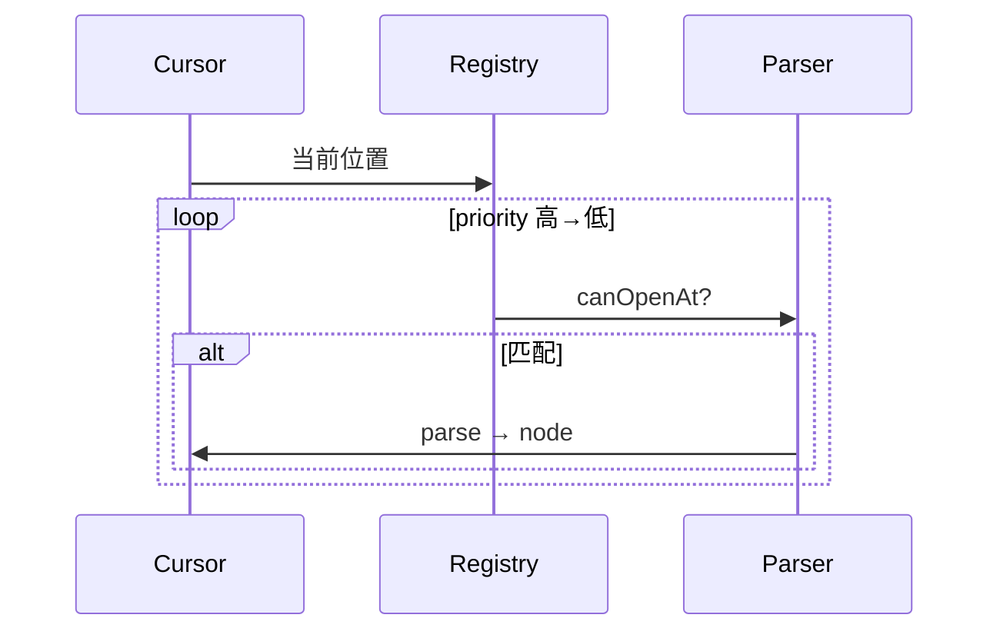

2. 创建 BlockParser 骨架

```typescript title="helloBlock.ts"
import type { BlockParser, ParseContext } from "../types.js";

export const helloBlock: BlockParser = {
  name: "helloBlock",
  priority: 120,
  canOpenAt(ctx: ParseContext) {
    return ctx.line.startsWith("!!! hello");
  },
  parse(ctx) {
    ctx.consumeLine();
    return { type: "hello", content: "world" };
  },
  render(node) {
    return `<p class="hello">${node.content}</p>\n`;
  },
};
```

3. 注册并编写测试

```typescript title="helloBlock.test.ts"
import { describe, it, expect } from "vitest";
import { createTestEngine } from "../helpers/engine.js";

describe("helloBlock", () => {
  it("parses marker line", () => {
    const { html } = createTestEngine(["helloBlock"]).run("!!! hello\n");
    expect(html).toContain('class="hello"');
  });
});
```

4. 在 Demo 中验证

::: tip 本地调试
打开 `demo/ast`，在本文档末尾临时加入 `!!! hello` 行，观察 AST 是否出现自定义节点。
:::

5. 提交规范

- parser 文件放在 `src/transformer/extends/block/` 或 `inline/`
- 在 `extends/index.ts` 导出并在 Registry 默认列表注册
- 更新 `demo/test.md` 语法一览 + 至少一条边界样例
- `pnpm test` 全绿后再提 PR

:::

::: collapse accordion

- 块级 vs 行内的边界

  块级 parser 按**行**扫描；行内 parser 在段落/标题/单元格内按字符扫描。不要把块级语法做成行内——会破坏 lazy continuation。

- priority 冲突怎么解？

  提高 priority 或收紧 `canOpenAt` 条件。禁止在核心循环里写 `if (isSpecialCase)` 补丁链。

- render 里能否访问 DOM？

  不能。`render` 只产出 HTML 字符串；交互由 Renderer 层 `delegate` 绑定。

- 如何与 GFM 表格共存？

  表格单元格内行内 parser 全集可用；块级容器**不能**直接出现在表格单元格（GFM 限制）。

- 破坏性变更流程

  标记 `[Breaking]{.danger}`：必须在 Release Note 时间线记录，并提供迁移示例。
  :::

---

## 数学与科学排版大全

### 行内公式密集段

设 $f: \mathbb{R}^n \to \mathbb{R}$ 可微，梯度 $\nabla f(\mathbf{x}) = \big(\frac{\partial f}{\partial x_1}, \ldots, \frac{\partial f}{\partial x_n}\big)^\top$。Taylor 展开：$f(\mathbf{x}+\mathbf{h}) = f(\mathbf{x}) + \nabla f^\top \mathbf{h} + \frac{1}{2}\mathbf{h}^\top H \mathbf{h} + o(\|\mathbf{h}\|^2)$。

概率：$P(A \cup B) = P(A) + P(B) - P(A \cap B)$；Bayes：$P(A|B) = \frac{P(B|A)P(A)}{P(B)}$。

复数：$e^{i\theta} = \cos\theta + i\sin\theta$，故 $e^{i\pi}+1=0$。

### 块级公式：微积分

$$
\int_{-\infty}^{\infty} e^{-x^2}\, dx = \sqrt{\pi}
$$

$$
\nabla \times \mathbf{E} = -\frac{\partial \mathbf{B}}{\partial t}, \quad
\nabla \times \mathbf{B} = \mu_0 \mathbf{J} + \mu_0 \varepsilon_0 \frac{\partial \mathbf{E}}{\partial t}
$$

### 块级公式：线性代数

$$
\det(A) = \sum_{\sigma \in S_n} \operatorname{sgn}(\sigma) \prod_{i=1}^{n} a_{i,\sigma(i)}
$$

$$
\begin{pmatrix}
\lambda_1 & & \\
& \ddots & \\
& & \lambda_n
\end{pmatrix}
= Q \Lambda Q^\top
$$

### 块级公式：求和与极限

$$
\sum_{k=1}^{n} k = \frac{n(n+1)}{2}, \quad
\sum_{k=0}^{\infty} ar^k = \frac{a}{1-r}\ (|r|<1)
$$

$$
\lim_{n \to \infty} \left(1 + \frac{1}{n}\right)^n = e
$$

### 块级公式：分段函数

$$
f(x) = \begin{cases}
x^2 & x \geq 0 \\
-x & x < 0
\end{cases}
$$

### 公式与 Penna 语法混搭

::: note 考试公式卡
**定义**：设 $X$ 是随机变量，==期望=={.important} $\mathbb{E}[X] = \sum_x x\, P(X=x)$。

!! 证明细节 !! {click}：利用指示函数 $\mathbf{1}_A$ 与 $P(A)=\mathbb{E}[\mathbf{1}_A]$。

化学：H~~2~~SO~~4~~ 与 $c = \frac{n}{V}$ 可同段出现。
:::

---

## 复杂布局实验室

### 时间线 + Tabs + 卡片网格

::: timeline placement="between"

- [2026-01-01:success] Sprint 1 · 基础管线

  :::: card-grid cols="2"
  ::: card 解析器
  Block + Inline 双 Registry
  :::
  ::: card 渲染器
  HTML + 客户端增强
  :::
  ::::

- [2026-02-01:tip] Sprint 2 · 扩展语法

  ::: tabs
  @tab 行内
  ==高亮==、$math$、!!spoiler!!
  @tab 块级
  ::: tip 容器
  嵌套在 Tab 内
  :::
  @tab 卡片
  ::: link-card 文档 link="[[repo]]"
  :::
  :::

- [2026-03-01:warning] Sprint 3 · 质量

  - [x] 单元测试
  - [/] E2E
  - [ ] 性能基准

:::

### Alert + Steps + Field 嵌套

> [!TIP]
> 下面在 Alert 引用块内嵌 steps（若解析为独立块则各自渲染，观察实际 DOM 结构）：

::: steps

1. 阅读 `src/transformer/extends/index.ts`

2. 对照 field 文档

:::: field-group
::: field priority
@type number
@required
@default 100
数值越大越先匹配。
:::
::::

3. 运行测试

```bash
pnpm test -- test/extends
```

:::

### Masonry + 多图 + 脚注

:::: card-masonry cols="4" gap="12"


::: card 说明 C
瀑布流中的卡片，引用脚注[^masonry-note]。
:::


::::

[^masonry-note]: Masonry 布局用于不等高卡片/图片混排压力测试。

### 全宽折叠 FAQ

::: collapse accordion

- 如何切换代码高亮引擎？

  ::: tabs
  @tab hljs

  ```ts
  new TransformerEngine({ code: { highlight: "hljs" } });
  ```

  @tab shiki

  ```ts
  new TransformerEngine({ code: { highlight: "shiki" } });
  ```

  :::

- 公式不显示怎么办？

  > [!WARNING]
  > 检查 `syntaxOptions.math` 与 Renderer 主题；块级 `$$` 须独占段落或同行闭合。

- 容器没有样式？

  确认已引入 `penna-markdown/transformer.css` 与 `demo/penna.css`。

- AST 调试台卡顿？

  本文档故意很长——可暂时注释「规模与性能压力段」做对比。

- 如何贡献新语法？

  见 [实战：自定义 Parser 教程](#实战自定义-parser-教程)，并更新活文档。
  :::

---

## GFM Spec 回归集（扩展）

以下用例来自 CommonMark / GFM 讨论中的易错点，**期望行为**写在注释或紧随其后的说明段。

### 列表与段落

1.  one
2.  two

    段落属于 item 2，不是新列表。

- bullet

  1.  nested ordered
  2.  second

缩进代码块在列表中：

- item

      code_in_list
      second_line

### 链接嵌套与优先级

[outer [inner](https://inner.example) text](https://outer.example)

[_italic_ **[bold** link](https://example.com)

<autolink-test@example.com> 与 <https://example.com/path?foo=bar&baz=1>

### 强调边界扩展

*foo*bar*baz*

**foo**bar**baz**

_**foo** bar_

*foo _**bar**_

abc__def__ghi

### 表格扩展

| a                     | b        |
| --------------------- | -------- |
| `\|` pipe             | **bold** |
| [link](https://x.com) | `code`   |

| 左             |  中   |       右 |
| :------------- | :---: | -------: |
| L              |   C   |        R |
| 多行<br>第二行 | $x^2$ | ==高亮== |

### 引用与 Alert 相邻

> 普通引用

> [!NOTE]
> 紧随其后的 Alert，不应被上一引用吞并。

> 引用内 `code` 与 **emphasis**

### 分隔线与空行

段落前

---

段落后

### 代码围栏 info 字符串

```js title="a"b" {1}
console.log(1);
```

```txt
info 字符串含空格和 { braces }
```

---

## 国际化与 Unicode 压力

### 多书写系统混排

English · **中文粗体** · _日本語斜体_ · Русский · Ελληνικά · עברית · العربية · ไทย · 한국어

### CJK 与标点

「引号」、『书名号』、《标题》、——破折号、……省略号、3000字不会换行异常的长词测试：这是一个没有任何空格的中文长句用于观察自动换行与 justify 容器在 CJK 文本下的表现是否符合预期。

### Emoji 与肤色修饰

:smile: :thumbsup: :+1: :heart: 👨‍💻 🏳️‍🌈 组合 emoji ZWJ 序列在段落内应原样或按平台渲染。

### 特殊空白与方向

- 不间断空格：A\u00A0B
- 零宽空格：A​B（U+200B）
- BOM 不应出现在输出（源码已剥离）
- RTL 嵌入：עברית mixed with English

### 全角与半角符号

１２３ vs 123、ＡＢＣ vs ABC、，。！？ vs , . ! ?

---

## Penna 与 GFM 对照表

| 能力        | GFM / CommonMark | Penna 扩展               | 备注                    |
| ----------- | ---------------- | ------------------------ | ----------------------- |
| ATX 标题    | `#` … `######`   | 同左 + 徽章 `[t]{.tip}`  | 徽章仅标题行            |
| Setext      | `===` / `---`    | 同左                     |                         |
| 强调        | `*` `_`          | 同左                     | 与上下标 `~` `^` 不冲突 |
| 删除线      | `~~`             | 同左                     |                         |
| 链接        | `[]()` 引用式    | 同左 + `{attrs}`         |                         |
| 图片        | ``          | 同左 + `{attrs}`         |                         |
| 列表        | 有序/无序        | + 任务 `- [ ]`           | Penna 扩展状态符        |
| 表格        | `\|` 管道        | 同左                     | 单元格内行内扩展可用    |
| 引用        | `>`              | + Alert `> [!NOTE]`      | 不同 parser             |
| 代码        | 围栏/缩进        | + `title` `{lines}` 折叠 | enhancedCode            |
| 分隔线      | `---` `***`      | 同左                     |                         |
| HTML        | 块/行内          | 同左                     | sanitize 可关           |
| 脚注        | GFM 脚注         | 同左 + 多行正文          |                         |
| 数学        | —                | `$` `$$`                 | KaTeX/MathJax/remote    |
| 高亮        | —                | `==`                     |                         |
| 容器        | —                | `:::`                    | note/tip/…              |
| 卡片        | —                | card/link-card/…         |                         |
| Tabs        | —                | `::: tabs`               |                         |
| Timeline    | —                | `::: timeline`           |                         |
| 媒体        | —                | `!video` `!audio`        | 须独立行                |
| iframe      | —                | `!iframe`                | http(s) only            |
| Frontmatter | —                | YAML + `[[var]]`         |                         |
| Emoji       | —                | `:name:`                 |                         |
| 剧透        | —                | `!!`                     |                         |
| 注释        | —                | `%%` / `%%%`             | 输出不可见              |
| Mermaid     | —                | ` ```mermaid`            | specialCode             |
| ECharts     | —                | ` ```echarts`            | JSON 配置               |

---

## 规模与性能压力段

> [!CAUTION]
> 本节故意放大文档体积，用于 AST 调试台与编辑器滚动/解析性能目测。生产站点请勿直接复制整段。

### 长有序列表（50 项）

1. item-001 · ==highlight== · :check:
2. item-002 · $x^2$ · [^perf-2]
3. item-003 · plain
4. item-004 · plain
5. item-005 · plain
6. item-006 · plain
7. item-007 · plain
8. item-008 · plain
9. item-009 · plain
10. item-010 · plain
11. item-011 · plain
12. item-012 · plain
13. item-013 · plain
14. item-014 · plain
15. item-015 · plain
16. item-016 · plain
17. item-017 · plain
18. item-018 · plain
19. item-019 · plain
20. item-020 · plain
21. item-021 · plain
22. item-022 · plain
23. item-023 · plain
24. item-024 · plain
25. item-025 · plain
26. item-026 · plain
27. item-027 · plain
28. item-028 · plain
29. item-029 · plain
30. item-030 · plain
31. item-031 · plain
32. item-032 · plain
33. item-033 · plain
34. item-034 · plain
35. item-035 · plain
36. item-036 · plain
37. item-037 · plain
38. item-038 · plain
39. item-039 · plain
40. item-040 · plain
41. item-041 · plain
42. item-042 · plain
43. item-043 · plain
44. item-044 · plain
45. item-045 · plain
46. item-046 · plain
47. item-047 · plain
48. item-048 · plain
49. item-049 · plain
50. item-050 · **done** :tada:

[^perf-2]: 脚注 perf-2：长列表中间插入脚注引用。

### 宽表格（10 列 × 12 行）

| C1    | C2    | C3    | C4    | C5                 | C6    | C7     | C8    | C9      | C10         |
| ----- | ----- | ----- | ----- | ------------------ | ----- | ------ | ----- | ------- | ----------- |
| r1c1  | r1c2  | r1c3  | r1c4  | r1c5               | r1c6  | r1c7   | r1c8  | r1c9    | r1c10       |
| r2c1  | **b** | _i_   | `c`   | [L](https://e.com) | ==h== | :fire: | $n$   | H~~2~~O | [tag]{.tip} |
| r3c1  | r3c2  | r3c3  | r3c4  | r3c5               | r3c6  | r3c7   | r3c8  | r3c9    | r3c10       |
| r4c1  | r4c2  | r4c3  | r4c4  | r4c5               | r4c6  | r4c7   | r4c8  | r4c9    | r4c10       |
| r5c1  | r5c2  | r5c3  | r5c4  | r5c5               | r5c6  | r5c7   | r5c8  | r5c9    | r5c10       |
| r6c1  | r6c2  | r6c3  | r6c4  | r6c5               | r6c6  | r6c7   | r6c8  | r6c9    | r6c10       |
| r7c1  | r7c2  | r7c3  | r7c4  | r7c5               | r7c6  | r7c7   | r7c8  | r7c9    | r7c10       |
| r8c1  | r8c2  | r8c3  | r8c4  | r8c5               | r8c6  | r8c7   | r8c8  | r8c9    | r8c10       |
| r9c1  | r9c2  | r9c3  | r9c4  | r9c5               | r9c6  | r9c7   | r9c8  | r9c9    | r9c10       |
| r10c1 | r10c2 | r10c3 | r10c4 | r10c5              | r10c6 | r10c7  | r10c8 | r10c9   | r10c10      |
| r11c1 | r11c2 | r11c3 | r11c4 | r11c5              | r11c6 | r11c7  | r11c8 | r11c9   | r11c10      |
| r12c1 | r12c2 | r12c3 | r12c4 | r12c5              | r12c6 | r12c7  | r12c8 | r12c9   | r12c10      |

### 重复块级结构（8 组相同 Tabs）

::: tabs
@tab Alpha
Alpha content with ==highlight== and $E=mc^2$.
@tab Beta
Beta **bold** _italic_ `code`.
@tab Gamma
::: tip nested
Inner container
:::
:::

::: tabs
@tab Alpha
Alpha content with ==highlight== and $E=mc^2$.
@tab Beta
Beta **bold** _italic_ `code`.
@tab Gamma
::: tip nested
Inner container
:::
:::

::: tabs
@tab Alpha
Alpha content with ==highlight== and $E=mc^2$.
@tab Beta
Beta **bold** _italic_ `code`.
@tab Gamma
::: tip nested
Inner container
:::
:::

::: tabs
@tab Alpha
Alpha content with ==highlight== and $E=mc^2$.
@tab Beta
Beta **bold** _italic_ `code`.
@tab Gamma
::: tip nested
Inner container
:::
:::

::: tabs
@tab Alpha
Alpha content with ==highlight== and $E=mc^2$.
@tab Beta
Beta **bold** _italic_ `code`.
@tab Gamma
::: tip nested
Inner container
:::
:::

::: tabs
@tab Alpha
Alpha content with ==highlight== and $E=mc^2$.
@tab Beta
Beta **bold** _italic_ `code`.
@tab Gamma
::: tip nested
Inner container
:::
:::

::: tabs
@tab Alpha
Alpha content with ==highlight== and $E=mc^2$.
@tab Beta
Beta **bold** _italic_ `code`.
@tab Gamma
::: tip nested
Inner container
:::
:::

::: tabs
@tab Alpha
Alpha content with ==highlight== and $E=mc^2$.
@tab Beta
Beta **bold** _italic_ `code`.
@tab Gamma
::: tip nested
Inner container
:::
:::

### 超长单行段落（换行压力）

Lorem ipsum dolor sit amet, consectetur adipiscing elit, sed do eiusmod tempor incididunt ut labore et dolore magna aliqua. Ut enim ad minim veniam, quis nostrud exercitation ullamco laboris nisi ut aliquip ex ea commodo consequat. Duis aute irure dolor in reprehenderit in voluptate velit esse cillum dolore eu fugiat nulla pariatur. Excepteur sint occaecat cupidatat non proident, sunt in culpa qui officia deserunt mollit anim id est laborum. **Penna Markdown** 在同一句话里再塞入 ==高亮==、$a^2+b^2=c^2$、!!spoiler!! {click}、:rocket:、[链接](https://example.com){.important}、H~~2~~O、[^perf-long] 与 %%隐藏备注%%，用于观察单行内多种 token 扫描是否稳定。

[^perf-long]: 超长段落末尾脚注：解析与渲染耗时应线性可接受，不应出现明显卡顿或栈溢出。

### 深度引用塔（10 层）

> L1
>
> > L2
> >
> > > L3
> > >
> > > > L4
> > > >
> > > > > L5
> > > > >
> > > > > > L6
> > > > > >
> > > > > > > L7
> > > > > > >
> > > > > > > > L8
> > > > > > > >
> > > > > > > > > L9
> > > > > > > > >
> > > > > > > > > > L10 — 最深层仍应可嵌套 **bold** 与 `code`

---

# 附录 A · Penna Markdown 技术白皮书 [Draft]{.warning .top} {#appendix-whitepaper}

> 本文档为 **模拟技术文档**，追加于 `demo/test.md` 尾部，用于：
>
> 1. 测试超长 Markdown 的 parse / render 性能与稳定性；
> 2. 验证复杂排版（章节、API、表格、容器嵌套）在 AST 调试台的表现；
> 3. 使活文档体积 **≥ 100KB**，接近真实生产级技术手册规模。
>
> 文档版本：**0.1.0-draft** · 生成日期：**2026-07-02** · 维护者：**Ankio**

## 附录目录

- [第 1–10 章 模块详解](#appendix-ch1)
- [附录 B · REST API 参考](#appendix-api)
- [附录 C · 错误码全集](#appendix-errors)
- [附录 D · 版本发布记录](#appendix-releases)
- [附录 E · 配置项大全](#appendix-config)
- [附录 F · 集成指南](#appendix-integration)

---

## 第 1 章 · Transformer 转换引擎 {#appendix-ch1}

> [!IMPORTANT]
> **模块标识**：`transformer` · **文档版本**：0.1.0-draft · **最后更新**：2026-07-02

负责 Markdown 源码到 AST 的解析，以及 AST 到 HTML 的渲染。采用 Block/Inline 双 Registry 优先级扫描模型。

### 1.1 设计目标

- **单一职责**：Transformer 转换引擎 只做一件事并做好，不越界调用其他模块的内部状态。
- **零破坏性**：默认配置下 GFM 行为与官方 spec 对齐；扩展语法 opt-in。
- **可测试性**：每个 parser / renderer 适配器都有独立 vitest 用例，不依赖浏览器 DOM。
- **可扩展性**：新语法通过 `registry.register()` 注入，禁止修改核心 `blockScan` 循环。

### 1.2 核心接口

:::: field-group
::: field transformer.enabled
@type boolean
@optional
@default true

是否启用 Transformer 转换引擎 模块。
:::

::: field transformer.priority
@type number
@optional
@default 100

Registry 匹配优先级，仅对 parser 类模块生效。
:::

::: field transformer.options
@type Record<string, unknown>
@optional
@default {}

模块级选项对象，详见下表。
:::
::::

| 选项键             | 类型              | 默认值 | 说明                                                    |
| ------------------ | ----------------- | ------ | ------------------------------------------------------- |
| `transformer.opt1` | string \| boolean | `true` | Transformer 转换引擎 配置项 1：控制子功能开关或渲染模式 |
| `transformer.opt2` | string \| boolean | `auto` | Transformer 转换引擎 配置项 2：控制子功能开关或渲染模式 |
| `transformer.opt3` | string \| boolean | `true` | Transformer 转换引擎 配置项 3：控制子功能开关或渲染模式 |
| `transformer.opt4` | string \| boolean | `auto` | Transformer 转换引擎 配置项 4：控制子功能开关或渲染模式 |
| `transformer.opt5` | string \| boolean | `true` | Transformer 转换引擎 配置项 5：控制子功能开关或渲染模式 |
| `transformer.opt6` | string \| boolean | `auto` | Transformer 转换引擎 配置项 6：控制子功能开关或渲染模式 |
| `transformer.opt7` | string \| boolean | `true` | Transformer 转换引擎 配置项 7：控制子功能开关或渲染模式 |
| `transformer.opt8` | string \| boolean | `auto` | Transformer 转换引擎 配置项 8：控制子功能开关或渲染模式 |

### 1.3 数据流

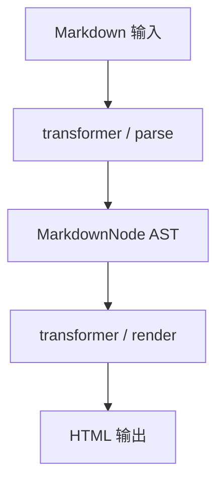

### 1.4 使用示例

::: tabs
@tab TypeScript

```typescript title="transformer-example.ts"
import { TransformerEngine } from "penna-markdown/transformer";

const engine = new TransformerEngine({
  transformer: { enabled: true, priority: 100 },
});

const markdown = "# Transformer 转换引擎 Demo\n\n正文内容。";
const html = engine.render(engine.parse(markdown));
console.log(html.length);
```

@tab 配置

```yaml title="transformer.yaml"
transformer:
  enabled: true
  priority: 100
  options:
    debug: false
    timeout: 30000
```

@tab 输出

```html
<h1>Transformer 转换引擎 Demo</h1>
<p>正文内容。</p>
```

:::

### 1.5 性能基准（参考值）

| 场景                         | 输入规模 | parse (ms) | render (ms) | 备注              |
| ---------------------------- | -------- | ---------: | ----------: | ----------------- |
| Transformer 转换引擎 · 1KB   | 1KB      |        0.5 |         0.1 | 本地 M2 / Node 22 |
| Transformer 转换引擎 · 10KB  | 10KB     |        3.0 |         0.4 | 本地 M2 / Node 22 |
| Transformer 转换引擎 · 60KB  | 60KB     |       35.0 |         4.2 | 本地 M2 / Node 22 |
| Transformer 转换引擎 · 100KB | 100KB    |       58.0 |         7.0 | 本地 M2 / Node 22 |

### 1.6 常见问题

::: collapse accordion

- Q1：Transformer 转换引擎 相关问题 1？

  **A1**：首先检查 `transformer.enabled` 是否为 `true`；其次确认 Registry 中 parser priority 未被其他扩展抢占。若仍异常，在 `demo/ast` 加载本文档并定位「附录 · Transformer 转换引擎」章节，对比 AST 节点类型。参考错误码 `E001` 与下表。

- Q2：Transformer 转换引擎 相关问题 2？

  **A2**：首先检查 `transformer.enabled` 是否为 `true`；其次确认 Registry 中 parser priority 未被其他扩展抢占。若仍异常，在 `demo/ast` 加载本文档并定位「附录 · Transformer 转换引擎」章节，对比 AST 节点类型。参考错误码 `E002` 与下表。

- Q3：Transformer 转换引擎 相关问题 3？

  **A3**：首先检查 `transformer.enabled` 是否为 `true`；其次确认 Registry 中 parser priority 未被其他扩展抢占。若仍异常，在 `demo/ast` 加载本文档并定位「附录 · Transformer 转换引擎」章节，对比 AST 节点类型。参考错误码 `E003` 与下表。

- Q4：Transformer 转换引擎 相关问题 4？

  **A4**：首先检查 `transformer.enabled` 是否为 `true`；其次确认 Registry 中 parser priority 未被其他扩展抢占。若仍异常，在 `demo/ast` 加载本文档并定位「附录 · Transformer 转换引擎」章节，对比 AST 节点类型。参考错误码 `E004` 与下表。

- Q5：Transformer 转换引擎 相关问题 5？

  **A5**：首先检查 `transformer.enabled` 是否为 `true`；其次确认 Registry 中 parser priority 未被其他扩展抢占。若仍异常，在 `demo/ast` 加载本文档并定位「附录 · Transformer 转换引擎」章节，对比 AST 节点类型。参考错误码 `E005` 与下表。

:::

### 1.7 与其他模块的依赖关系

| 依赖方向                  | 模块        | 耦合类型 | 说明                                           |
| ------------------------- | ----------- | -------- | ---------------------------------------------- |
| transformer → transformer | transformer | 编译期   | 所有模块最终汇入 TransformerEngine             |
| transformer → gfm         | gfm         | 运行时   | GFM parser 与扩展 parser 共享 Registry         |
| renderer → transformer    | renderer    | 运行时   | Renderer 增强 Transformer 转换引擎 输出的 HTML |
| security → transformer    | security    | 运行时   | sanitize 在 render 后或 render 内应用          |

---

## 第 2 章 · Renderer 渲染增强层 {#appendix-ch2}

> [!IMPORTANT]
> **模块标识**：`renderer` · **文档版本**：0.1.0-draft · **最后更新**：2026-07-02

在 HTML 字符串注入客户端交互：代码高亮、复制按钮、主题切换、TOC、折叠面板绑定。

### 2.1 设计目标

- **单一职责**：Renderer 渲染增强层 只做一件事并做好，不越界调用其他模块的内部状态。
- **零破坏性**：默认配置下 GFM 行为与官方 spec 对齐；扩展语法 opt-in。
- **可测试性**：每个 parser / renderer 适配器都有独立 vitest 用例，不依赖浏览器 DOM。
- **可扩展性**：新语法通过 `registry.register()` 注入，禁止修改核心 `blockScan` 循环。

### 2.2 核心接口

:::: field-group
::: field renderer.enabled
@type boolean
@optional
@default true

是否启用 Renderer 渲染增强层 模块。
:::

::: field renderer.priority
@type number
@optional
@default 95

Registry 匹配优先级，仅对 parser 类模块生效。
:::

::: field renderer.options
@type Record<string, unknown>
@optional
@default {}

模块级选项对象，详见下表。
:::
::::

| 选项键          | 类型              | 默认值 | 说明                                                   |
| --------------- | ----------------- | ------ | ------------------------------------------------------ |
| `renderer.opt1` | string \| boolean | `true` | Renderer 渲染增强层 配置项 1：控制子功能开关或渲染模式 |
| `renderer.opt2` | string \| boolean | `auto` | Renderer 渲染增强层 配置项 2：控制子功能开关或渲染模式 |
| `renderer.opt3` | string \| boolean | `true` | Renderer 渲染增强层 配置项 3：控制子功能开关或渲染模式 |
| `renderer.opt4` | string \| boolean | `auto` | Renderer 渲染增强层 配置项 4：控制子功能开关或渲染模式 |
| `renderer.opt5` | string \| boolean | `true` | Renderer 渲染增强层 配置项 5：控制子功能开关或渲染模式 |
| `renderer.opt6` | string \| boolean | `auto` | Renderer 渲染增强层 配置项 6：控制子功能开关或渲染模式 |
| `renderer.opt7` | string \| boolean | `true` | Renderer 渲染增强层 配置项 7：控制子功能开关或渲染模式 |
| `renderer.opt8` | string \| boolean | `auto` | Renderer 渲染增强层 配置项 8：控制子功能开关或渲染模式 |

### 2.3 数据流

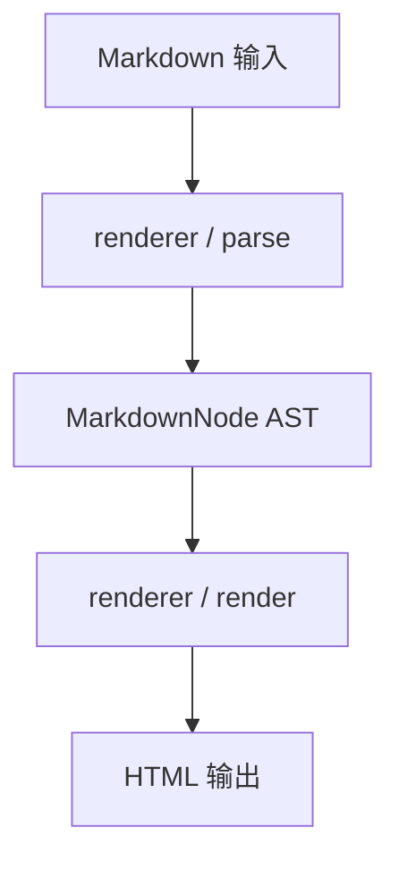

### 2.4 使用示例

::: tabs
@tab TypeScript

```typescript title="renderer-example.ts"
import { TransformerEngine } from "penna-markdown/transformer";

const engine = new TransformerEngine({
  renderer: { enabled: true, priority: 95 },
});

const markdown = "# Renderer 渲染增强层 Demo\n\n正文内容。";
const html = engine.render(engine.parse(markdown));
console.log(html.length);
```

@tab 配置

```yaml title="renderer.yaml"
renderer:
  enabled: true
  priority: 95
  options:
    debug: false
    timeout: 30000
```

@tab 输出

```html
<h1>Renderer 渲染增强层 Demo</h1>
<p>正文内容。</p>
```

:::

### 2.5 性能基准（参考值）

| 场景                        | 输入规模 | parse (ms) | render (ms) | 备注              |
| --------------------------- | -------- | ---------: | ----------: | ----------------- |
| Renderer 渲染增强层 · 1KB   | 1KB      |        0.8 |         0.1 | 本地 M2 / Node 22 |
| Renderer 渲染增强层 · 10KB  | 10KB     |        3.3 |         0.4 | 本地 M2 / Node 22 |
| Renderer 渲染增强层 · 60KB  | 60KB     |       35.3 |         4.3 | 本地 M2 / Node 22 |
| Renderer 渲染增强层 · 100KB | 100KB    |       58.3 |         7.0 | 本地 M2 / Node 22 |

### 2.6 常见问题

::: collapse accordion

- Q1：Renderer 渲染增强层 相关问题 1？

  **A1**：首先检查 `renderer.enabled` 是否为 `true`；其次确认 Registry 中 parser priority 未被其他扩展抢占。若仍异常，在 `demo/ast` 加载本文档并定位「附录 · Renderer 渲染增强层」章节，对比 AST 节点类型。参考错误码 `E001` 与下表。

- Q2：Renderer 渲染增强层 相关问题 2？

  **A2**：首先检查 `renderer.enabled` 是否为 `true`；其次确认 Registry 中 parser priority 未被其他扩展抢占。若仍异常，在 `demo/ast` 加载本文档并定位「附录 · Renderer 渲染增强层」章节，对比 AST 节点类型。参考错误码 `E002` 与下表。

- Q3：Renderer 渲染增强层 相关问题 3？

  **A3**：首先检查 `renderer.enabled` 是否为 `true`；其次确认 Registry 中 parser priority 未被其他扩展抢占。若仍异常，在 `demo/ast` 加载本文档并定位「附录 · Renderer 渲染增强层」章节，对比 AST 节点类型。参考错误码 `E003` 与下表。

- Q4：Renderer 渲染增强层 相关问题 4？

  **A4**：首先检查 `renderer.enabled` 是否为 `true`；其次确认 Registry 中 parser priority 未被其他扩展抢占。若仍异常，在 `demo/ast` 加载本文档并定位「附录 · Renderer 渲染增强层」章节，对比 AST 节点类型。参考错误码 `E004` 与下表。

- Q5：Renderer 渲染增强层 相关问题 5？

  **A5**：首先检查 `renderer.enabled` 是否为 `true`；其次确认 Registry 中 parser priority 未被其他扩展抢占。若仍异常，在 `demo/ast` 加载本文档并定位「附录 · Renderer 渲染增强层」章节，对比 AST 节点类型。参考错误码 `E005` 与下表。

:::

### 2.7 与其他模块的依赖关系

| 依赖方向               | 模块        | 耦合类型 | 说明                                          |
| ---------------------- | ----------- | -------- | --------------------------------------------- |
| renderer → transformer | transformer | 编译期   | 所有模块最终汇入 TransformerEngine            |
| renderer → gfm         | gfm         | 运行时   | GFM parser 与扩展 parser 共享 Registry        |
| renderer → renderer    | renderer    | 运行时   | Renderer 增强 Renderer 渲染增强层 输出的 HTML |
| security → renderer    | security    | 运行时   | sanitize 在 render 后或 render 内应用         |

---

## 第 3 章 · Penna 编辑器集成 {#appendix-ch3}

> [!IMPORTANT]
> **模块标识**：`editor` · **文档版本**：0.1.0-draft · **最后更新**：2026-07-02

ProseMirror / CodeMirror 集成点，提供 WYSIWYG 与源码模式切换。

### 3.1 设计目标

- **单一职责**：Penna 编辑器集成 只做一件事并做好，不越界调用其他模块的内部状态。
- **零破坏性**：默认配置下 GFM 行为与官方 spec 对齐；扩展语法 opt-in。
- **可测试性**：每个 parser / renderer 适配器都有独立 vitest 用例，不依赖浏览器 DOM。
- **可扩展性**：新语法通过 `registry.register()` 注入，禁止修改核心 `blockScan` 循环。

### 3.2 核心接口

:::: field-group
::: field editor.enabled
@type boolean
@optional
@default true

是否启用 Penna 编辑器集成 模块。
:::

::: field editor.priority
@type number
@optional
@default 90

Registry 匹配优先级，仅对 parser 类模块生效。
:::

::: field editor.options
@type Record<string, unknown>
@optional
@default {}

模块级选项对象，详见下表。
:::
::::

| 选项键        | 类型              | 默认值 | 说明                                                |
| ------------- | ----------------- | ------ | --------------------------------------------------- |
| `editor.opt1` | string \| boolean | `true` | Penna 编辑器集成 配置项 1：控制子功能开关或渲染模式 |
| `editor.opt2` | string \| boolean | `auto` | Penna 编辑器集成 配置项 2：控制子功能开关或渲染模式 |
| `editor.opt3` | string \| boolean | `true` | Penna 编辑器集成 配置项 3：控制子功能开关或渲染模式 |
| `editor.opt4` | string \| boolean | `auto` | Penna 编辑器集成 配置项 4：控制子功能开关或渲染模式 |
| `editor.opt5` | string \| boolean | `true` | Penna 编辑器集成 配置项 5：控制子功能开关或渲染模式 |
| `editor.opt6` | string \| boolean | `auto` | Penna 编辑器集成 配置项 6：控制子功能开关或渲染模式 |
| `editor.opt7` | string \| boolean | `true` | Penna 编辑器集成 配置项 7：控制子功能开关或渲染模式 |
| `editor.opt8` | string \| boolean | `auto` | Penna 编辑器集成 配置项 8：控制子功能开关或渲染模式 |

### 3.3 数据流

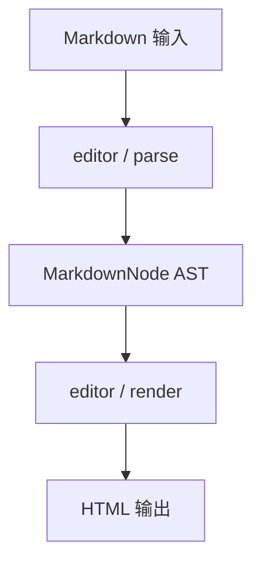

### 3.4 使用示例

::: tabs
@tab TypeScript

```typescript title="editor-example.ts"
import { TransformerEngine } from "penna-markdown/transformer";

const engine = new TransformerEngine({
  editor: { enabled: true, priority: 90 },
});

const markdown = "# Penna 编辑器集成 Demo\n\n正文内容。";
const html = engine.render(engine.parse(markdown));
console.log(html.length);
```

@tab 配置

```yaml title="editor.yaml"
editor:
  enabled: true
  priority: 90
  options:
    debug: false
    timeout: 30000
```

@tab 输出

```html
<h1>Penna 编辑器集成 Demo</h1>
<p>正文内容。</p>
```

:::

### 3.5 性能基准（参考值）

| 场景                     | 输入规模 | parse (ms) | render (ms) | 备注              |
| ------------------------ | -------- | ---------: | ----------: | ----------------- |
| Penna 编辑器集成 · 1KB   | 1KB      |        1.1 |         0.2 | 本地 M2 / Node 22 |
| Penna 编辑器集成 · 10KB  | 10KB     |        3.6 |         0.5 | 本地 M2 / Node 22 |
| Penna 编辑器集成 · 60KB  | 60KB     |       35.6 |         4.3 | 本地 M2 / Node 22 |
| Penna 编辑器集成 · 100KB | 100KB    |       58.6 |         7.1 | 本地 M2 / Node 22 |

### 3.6 常见问题

::: collapse accordion

- Q1：Penna 编辑器集成 相关问题 1？

  **A1**：首先检查 `editor.enabled` 是否为 `true`；其次确认 Registry 中 parser priority 未被其他扩展抢占。若仍异常，在 `demo/ast` 加载本文档并定位「附录 · Penna 编辑器集成」章节，对比 AST 节点类型。参考错误码 `E001` 与下表。

- Q2：Penna 编辑器集成 相关问题 2？

  **A2**：首先检查 `editor.enabled` 是否为 `true`；其次确认 Registry 中 parser priority 未被其他扩展抢占。若仍异常，在 `demo/ast` 加载本文档并定位「附录 · Penna 编辑器集成」章节，对比 AST 节点类型。参考错误码 `E002` 与下表。

- Q3：Penna 编辑器集成 相关问题 3？

  **A3**：首先检查 `editor.enabled` 是否为 `true`；其次确认 Registry 中 parser priority 未被其他扩展抢占。若仍异常，在 `demo/ast` 加载本文档并定位「附录 · Penna 编辑器集成」章节，对比 AST 节点类型。参考错误码 `E003` 与下表。

- Q4：Penna 编辑器集成 相关问题 4？

  **A4**：首先检查 `editor.enabled` 是否为 `true`；其次确认 Registry 中 parser priority 未被其他扩展抢占。若仍异常，在 `demo/ast` 加载本文档并定位「附录 · Penna 编辑器集成」章节，对比 AST 节点类型。参考错误码 `E004` 与下表。

- Q5：Penna 编辑器集成 相关问题 5？

  **A5**：首先检查 `editor.enabled` 是否为 `true`；其次确认 Registry 中 parser priority 未被其他扩展抢占。若仍异常，在 `demo/ast` 加载本文档并定位「附录 · Penna 编辑器集成」章节，对比 AST 节点类型。参考错误码 `E005` 与下表。

:::

### 3.7 与其他模块的依赖关系

| 依赖方向             | 模块        | 耦合类型 | 说明                                       |
| -------------------- | ----------- | -------- | ------------------------------------------ |
| editor → transformer | transformer | 编译期   | 所有模块最终汇入 TransformerEngine         |
| editor → gfm         | gfm         | 运行时   | GFM parser 与扩展 parser 共享 Registry     |
| renderer → editor    | renderer    | 运行时   | Renderer 增强 Penna 编辑器集成 输出的 HTML |
| security → editor    | security    | 运行时   | sanitize 在 render 后或 render 内应用      |

---

## 第 4 章 · Security 安全模块 {#appendix-ch4}

> [!IMPORTANT]
> **模块标识**：`security` · **文档版本**：0.1.0-draft · **最后更新**：2026-07-02

safeHtml、safeUrl、DOMPurify 集成，拒绝 javascript: 与 data: 等危险协议。

### 4.1 设计目标

- **单一职责**：Security 安全模块 只做一件事并做好，不越界调用其他模块的内部状态。
- **零破坏性**：默认配置下 GFM 行为与官方 spec 对齐；扩展语法 opt-in。
- **可测试性**：每个 parser / renderer 适配器都有独立 vitest 用例，不依赖浏览器 DOM。
- **可扩展性**：新语法通过 `registry.register()` 注入，禁止修改核心 `blockScan` 循环。

### 4.2 核心接口

:::: field-group
::: field security.enabled
@type boolean
@optional
@default true

是否启用 Security 安全模块 模块。
:::

::: field security.priority
@type number
@optional
@default 85

Registry 匹配优先级，仅对 parser 类模块生效。
:::

::: field security.options
@type Record<string, unknown>
@optional
@default {}

模块级选项对象，详见下表。
:::
::::

| 选项键          | 类型              | 默认值 | 说明                                                 |
| --------------- | ----------------- | ------ | ---------------------------------------------------- |
| `security.opt1` | string \| boolean | `true` | Security 安全模块 配置项 1：控制子功能开关或渲染模式 |
| `security.opt2` | string \| boolean | `auto` | Security 安全模块 配置项 2：控制子功能开关或渲染模式 |
| `security.opt3` | string \| boolean | `true` | Security 安全模块 配置项 3：控制子功能开关或渲染模式 |
| `security.opt4` | string \| boolean | `auto` | Security 安全模块 配置项 4：控制子功能开关或渲染模式 |
| `security.opt5` | string \| boolean | `true` | Security 安全模块 配置项 5：控制子功能开关或渲染模式 |
| `security.opt6` | string \| boolean | `auto` | Security 安全模块 配置项 6：控制子功能开关或渲染模式 |
| `security.opt7` | string \| boolean | `true` | Security 安全模块 配置项 7：控制子功能开关或渲染模式 |
| `security.opt8` | string \| boolean | `auto` | Security 安全模块 配置项 8：控制子功能开关或渲染模式 |

### 4.3 数据流

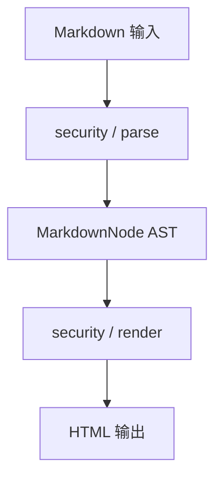

### 4.4 使用示例

::: tabs
@tab TypeScript

```typescript title="security-example.ts"
import { TransformerEngine } from "penna-markdown/transformer";

const engine = new TransformerEngine({
  security: { enabled: true, priority: 85 },
});

const markdown = "# Security 安全模块 Demo\n\n正文内容。";
const html = engine.render(engine.parse(markdown));
console.log(html.length);
```

@tab 配置

```yaml title="security.yaml"
security:
  enabled: true
  priority: 85
  options:
    debug: false
    timeout: 30000
```

@tab 输出

```html
<h1>Security 安全模块 Demo</h1>
<p>正文内容。</p>
```

:::

### 4.5 性能基准（参考值）

| 场景                      | 输入规模 | parse (ms) | render (ms) | 备注              |
| ------------------------- | -------- | ---------: | ----------: | ----------------- |
| Security 安全模块 · 1KB   | 1KB      |        1.4 |         0.2 | 本地 M2 / Node 22 |
| Security 安全模块 · 10KB  | 10KB     |        3.9 |         0.5 | 本地 M2 / Node 22 |
| Security 安全模块 · 60KB  | 60KB     |       35.9 |         4.4 | 本地 M2 / Node 22 |
| Security 安全模块 · 100KB | 100KB    |       58.9 |         7.1 | 本地 M2 / Node 22 |

### 4.6 常见问题

::: collapse accordion

- Q1：Security 安全模块 相关问题 1？

  **A1**：首先检查 `security.enabled` 是否为 `true`；其次确认 Registry 中 parser priority 未被其他扩展抢占。若仍异常，在 `demo/ast` 加载本文档并定位「附录 · Security 安全模块」章节，对比 AST 节点类型。参考错误码 `E001` 与下表。

- Q2：Security 安全模块 相关问题 2？

  **A2**：首先检查 `security.enabled` 是否为 `true`；其次确认 Registry 中 parser priority 未被其他扩展抢占。若仍异常，在 `demo/ast` 加载本文档并定位「附录 · Security 安全模块」章节，对比 AST 节点类型。参考错误码 `E002` 与下表。

- Q3：Security 安全模块 相关问题 3？

  **A3**：首先检查 `security.enabled` 是否为 `true`；其次确认 Registry 中 parser priority 未被其他扩展抢占。若仍异常，在 `demo/ast` 加载本文档并定位「附录 · Security 安全模块」章节，对比 AST 节点类型。参考错误码 `E003` 与下表。

- Q4：Security 安全模块 相关问题 4？

  **A4**：首先检查 `security.enabled` 是否为 `true`；其次确认 Registry 中 parser priority 未被其他扩展抢占。若仍异常，在 `demo/ast` 加载本文档并定位「附录 · Security 安全模块」章节，对比 AST 节点类型。参考错误码 `E004` 与下表。

- Q5：Security 安全模块 相关问题 5？

  **A5**：首先检查 `security.enabled` 是否为 `true`；其次确认 Registry 中 parser priority 未被其他扩展抢占。若仍异常，在 `demo/ast` 加载本文档并定位「附录 · Security 安全模块」章节，对比 AST 节点类型。参考错误码 `E005` 与下表。

:::

### 4.7 与其他模块的依赖关系

| 依赖方向               | 模块        | 耦合类型 | 说明                                        |
| ---------------------- | ----------- | -------- | ------------------------------------------- |
| security → transformer | transformer | 编译期   | 所有模块最终汇入 TransformerEngine          |
| security → gfm         | gfm         | 运行时   | GFM parser 与扩展 parser 共享 Registry      |
| renderer → security    | renderer    | 运行时   | Renderer 增强 Security 安全模块 输出的 HTML |
| security → security    | security    | 运行时   | sanitize 在 render 后或 render 内应用       |

---

## 第 5 章 · Extends 扩展语法 {#appendix-ch5}

> [!IMPORTANT]
> **模块标识**：`extends` · **文档版本**：0.1.0-draft · **最后更新**：2026-07-02

Penna 特有语法 parser 集合，通过 Registry 注册，priority 决定匹配顺序。

### 5.1 设计目标

- **单一职责**：Extends 扩展语法 只做一件事并做好，不越界调用其他模块的内部状态。
- **零破坏性**：默认配置下 GFM 行为与官方 spec 对齐；扩展语法 opt-in。
- **可测试性**：每个 parser / renderer 适配器都有独立 vitest 用例，不依赖浏览器 DOM。
- **可扩展性**：新语法通过 `registry.register()` 注入，禁止修改核心 `blockScan` 循环。

### 5.2 核心接口

:::: field-group
::: field extends.enabled
@type boolean
@optional
@default true

是否启用 Extends 扩展语法 模块。
:::

::: field extends.priority
@type number
@optional
@default 80

Registry 匹配优先级，仅对 parser 类模块生效。
:::

::: field extends.options
@type Record<string, unknown>
@optional
@default {}

模块级选项对象，详见下表。
:::
::::

| 选项键         | 类型              | 默认值 | 说明                                                |
| -------------- | ----------------- | ------ | --------------------------------------------------- |
| `extends.opt1` | string \| boolean | `true` | Extends 扩展语法 配置项 1：控制子功能开关或渲染模式 |
| `extends.opt2` | string \| boolean | `auto` | Extends 扩展语法 配置项 2：控制子功能开关或渲染模式 |
| `extends.opt3` | string \| boolean | `true` | Extends 扩展语法 配置项 3：控制子功能开关或渲染模式 |
| `extends.opt4` | string \| boolean | `auto` | Extends 扩展语法 配置项 4：控制子功能开关或渲染模式 |
| `extends.opt5` | string \| boolean | `true` | Extends 扩展语法 配置项 5：控制子功能开关或渲染模式 |
| `extends.opt6` | string \| boolean | `auto` | Extends 扩展语法 配置项 6：控制子功能开关或渲染模式 |
| `extends.opt7` | string \| boolean | `true` | Extends 扩展语法 配置项 7：控制子功能开关或渲染模式 |
| `extends.opt8` | string \| boolean | `auto` | Extends 扩展语法 配置项 8：控制子功能开关或渲染模式 |

### 5.3 数据流

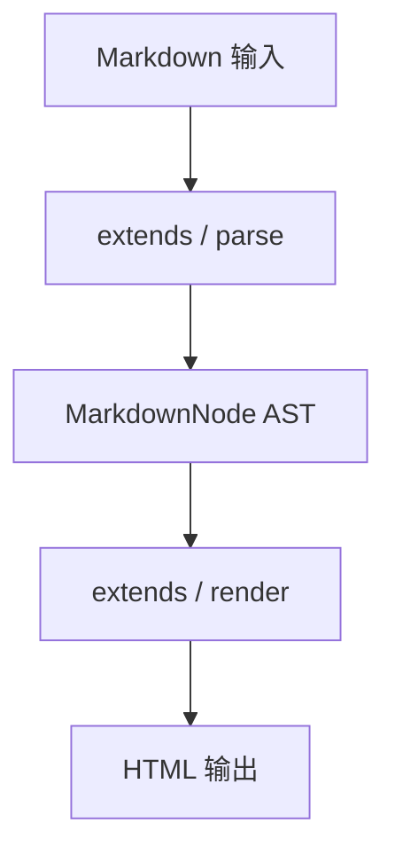

### 5.4 使用示例

::: tabs
@tab TypeScript

```typescript title="extends-example.ts"
import { TransformerEngine } from "penna-markdown/transformer";

const engine = new TransformerEngine({
  extends: { enabled: true, priority: 80 },
});

const markdown = "# Extends 扩展语法 Demo\n\n正文内容。";
const html = engine.render(engine.parse(markdown));
console.log(html.length);
```

@tab 配置

```yaml title="extends.yaml"
extends:
  enabled: true
  priority: 80
  options:
    debug: false
    timeout: 30000
```

@tab 输出

```html
<h1>Extends 扩展语法 Demo</h1>
<p>正文内容。</p>
```

:::

### 5.5 性能基准（参考值）

| 场景                     | 输入规模 | parse (ms) | render (ms) | 备注              |
| ------------------------ | -------- | ---------: | ----------: | ----------------- |
| Extends 扩展语法 · 1KB   | 1KB      |        1.7 |         0.3 | 本地 M2 / Node 22 |
| Extends 扩展语法 · 10KB  | 10KB     |        4.2 |         0.6 | 本地 M2 / Node 22 |
| Extends 扩展语法 · 60KB  | 60KB     |       36.2 |         4.4 | 本地 M2 / Node 22 |
| Extends 扩展语法 · 100KB | 100KB    |       59.2 |         7.2 | 本地 M2 / Node 22 |

### 5.6 常见问题

::: collapse accordion

- Q1：Extends 扩展语法 相关问题 1？

  **A1**：首先检查 `extends.enabled` 是否为 `true`；其次确认 Registry 中 parser priority 未被其他扩展抢占。若仍异常，在 `demo/ast` 加载本文档并定位「附录 · Extends 扩展语法」章节，对比 AST 节点类型。参考错误码 `E001` 与下表。

- Q2：Extends 扩展语法 相关问题 2？

  **A2**：首先检查 `extends.enabled` 是否为 `true`；其次确认 Registry 中 parser priority 未被其他扩展抢占。若仍异常，在 `demo/ast` 加载本文档并定位「附录 · Extends 扩展语法」章节，对比 AST 节点类型。参考错误码 `E002` 与下表。

- Q3：Extends 扩展语法 相关问题 3？

  **A3**：首先检查 `extends.enabled` 是否为 `true`；其次确认 Registry 中 parser priority 未被其他扩展抢占。若仍异常，在 `demo/ast` 加载本文档并定位「附录 · Extends 扩展语法」章节，对比 AST 节点类型。参考错误码 `E003` 与下表。

- Q4：Extends 扩展语法 相关问题 4？

  **A4**：首先检查 `extends.enabled` 是否为 `true`；其次确认 Registry 中 parser priority 未被其他扩展抢占。若仍异常，在 `demo/ast` 加载本文档并定位「附录 · Extends 扩展语法」章节，对比 AST 节点类型。参考错误码 `E004` 与下表。

- Q5：Extends 扩展语法 相关问题 5？

  **A5**：首先检查 `extends.enabled` 是否为 `true`；其次确认 Registry 中 parser priority 未被其他扩展抢占。若仍异常，在 `demo/ast` 加载本文档并定位「附录 · Extends 扩展语法」章节，对比 AST 节点类型。参考错误码 `E005` 与下表。

:::

### 5.7 与其他模块的依赖关系

| 依赖方向              | 模块        | 耦合类型 | 说明                                       |
| --------------------- | ----------- | -------- | ------------------------------------------ |
| extends → transformer | transformer | 编译期   | 所有模块最终汇入 TransformerEngine         |
| extends → gfm         | gfm         | 运行时   | GFM parser 与扩展 parser 共享 Registry     |
| renderer → extends    | renderer    | 运行时   | Renderer 增强 Extends 扩展语法 输出的 HTML |
| security → extends    | security    | 运行时   | sanitize 在 render 后或 render 内应用      |

---

## 第 6 章 · GFM 标准语法 {#appendix-ch6}

> [!IMPORTANT]
> **模块标识**：`gfm` · **文档版本**：0.1.0-draft · **最后更新**：2026-07-02

GitHub Flavored Markdown 内置实现：表格、任务列表、删除线、Autolink、脚注等。

### 6.1 设计目标

- **单一职责**：GFM 标准语法 只做一件事并做好，不越界调用其他模块的内部状态。
- **零破坏性**：默认配置下 GFM 行为与官方 spec 对齐；扩展语法 opt-in。
- **可测试性**：每个 parser / renderer 适配器都有独立 vitest 用例，不依赖浏览器 DOM。
- **可扩展性**：新语法通过 `registry.register()` 注入，禁止修改核心 `blockScan` 循环。

### 6.2 核心接口

:::: field-group
::: field gfm.enabled
@type boolean
@optional
@default true

是否启用 GFM 标准语法 模块。
:::

::: field gfm.priority
@type number
@optional
@default 75

Registry 匹配优先级，仅对 parser 类模块生效。
:::

::: field gfm.options
@type Record<string, unknown>
@optional
@default {}

模块级选项对象，详见下表。
:::
::::

| 选项键     | 类型              | 默认值 | 说明                                            |
| ---------- | ----------------- | ------ | ----------------------------------------------- |
| `gfm.opt1` | string \| boolean | `true` | GFM 标准语法 配置项 1：控制子功能开关或渲染模式 |
| `gfm.opt2` | string \| boolean | `auto` | GFM 标准语法 配置项 2：控制子功能开关或渲染模式 |
| `gfm.opt3` | string \| boolean | `true` | GFM 标准语法 配置项 3：控制子功能开关或渲染模式 |
| `gfm.opt4` | string \| boolean | `auto` | GFM 标准语法 配置项 4：控制子功能开关或渲染模式 |
| `gfm.opt5` | string \| boolean | `true` | GFM 标准语法 配置项 5：控制子功能开关或渲染模式 |
| `gfm.opt6` | string \| boolean | `auto` | GFM 标准语法 配置项 6：控制子功能开关或渲染模式 |
| `gfm.opt7` | string \| boolean | `true` | GFM 标准语法 配置项 7：控制子功能开关或渲染模式 |
| `gfm.opt8` | string \| boolean | `auto` | GFM 标准语法 配置项 8：控制子功能开关或渲染模式 |

### 6.3 数据流

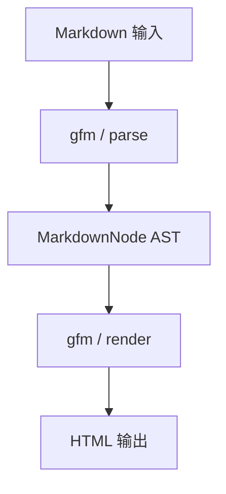

### 6.4 使用示例

::: tabs
@tab TypeScript

```typescript title="gfm-example.ts"
import { TransformerEngine } from "penna-markdown/transformer";

const engine = new TransformerEngine({
  gfm: { enabled: true, priority: 75 },
});

const markdown = "# GFM 标准语法 Demo\n\n正文内容。";
const html = engine.render(engine.parse(markdown));
console.log(html.length);
```

@tab 配置

```yaml title="gfm.yaml"
gfm:
  enabled: true
  priority: 75
  options:
    debug: false
    timeout: 30000
```

@tab 输出

```html
<h1>GFM 标准语法 Demo</h1>
<p>正文内容。</p>
```

:::

### 6.5 性能基准（参考值）

| 场景                 | 输入规模 | parse (ms) | render (ms) | 备注              |
| -------------------- | -------- | ---------: | ----------: | ----------------- |
| GFM 标准语法 · 1KB   | 1KB      |        2.0 |         0.3 | 本地 M2 / Node 22 |
| GFM 标准语法 · 10KB  | 10KB     |        4.5 |         0.6 | 本地 M2 / Node 22 |
| GFM 标准语法 · 60KB  | 60KB     |       36.5 |         4.5 | 本地 M2 / Node 22 |
| GFM 标准语法 · 100KB | 100KB    |       59.5 |         7.2 | 本地 M2 / Node 22 |

### 6.6 常见问题

::: collapse accordion

- Q1：GFM 标准语法 相关问题 1？

  **A1**：首先检查 `gfm.enabled` 是否为 `true`；其次确认 Registry 中 parser priority 未被其他扩展抢占。若仍异常，在 `demo/ast` 加载本文档并定位「附录 · GFM 标准语法」章节，对比 AST 节点类型。参考错误码 `E001` 与下表。

- Q2：GFM 标准语法 相关问题 2？

  **A2**：首先检查 `gfm.enabled` 是否为 `true`；其次确认 Registry 中 parser priority 未被其他扩展抢占。若仍异常，在 `demo/ast` 加载本文档并定位「附录 · GFM 标准语法」章节，对比 AST 节点类型。参考错误码 `E002` 与下表。

- Q3：GFM 标准语法 相关问题 3？

  **A3**：首先检查 `gfm.enabled` 是否为 `true`；其次确认 Registry 中 parser priority 未被其他扩展抢占。若仍异常，在 `demo/ast` 加载本文档并定位「附录 · GFM 标准语法」章节，对比 AST 节点类型。参考错误码 `E003` 与下表。

- Q4：GFM 标准语法 相关问题 4？

  **A4**：首先检查 `gfm.enabled` 是否为 `true`；其次确认 Registry 中 parser priority 未被其他扩展抢占。若仍异常，在 `demo/ast` 加载本文档并定位「附录 · GFM 标准语法」章节，对比 AST 节点类型。参考错误码 `E004` 与下表。

- Q5：GFM 标准语法 相关问题 5？

  **A5**：首先检查 `gfm.enabled` 是否为 `true`；其次确认 Registry 中 parser priority 未被其他扩展抢占。若仍异常，在 `demo/ast` 加载本文档并定位「附录 · GFM 标准语法」章节，对比 AST 节点类型。参考错误码 `E005` 与下表。

:::

### 6.7 与其他模块的依赖关系

| 依赖方向          | 模块        | 耦合类型 | 说明                                   |
| ----------------- | ----------- | -------- | -------------------------------------- |
| gfm → transformer | transformer | 编译期   | 所有模块最终汇入 TransformerEngine     |
| gfm → gfm         | gfm         | 运行时   | GFM parser 与扩展 parser 共享 Registry |
| renderer → gfm    | renderer    | 运行时   | Renderer 增强 GFM 标准语法 输出的 HTML |
| security → gfm    | security    | 运行时   | sanitize 在 render 后或 render 内应用  |

---

## 第 7 章 · Highlight 代码高亮 {#appendix-ch7}

> [!IMPORTANT]
> **模块标识**：`highlight` · **文档版本**：0.1.0-draft · **最后更新**：2026-07-02

highlight.js / Shiki 双引擎适配，支持行号、行高亮、折叠与复制。

### 7.1 设计目标

- **单一职责**：Highlight 代码高亮 只做一件事并做好，不越界调用其他模块的内部状态。
- **零破坏性**：默认配置下 GFM 行为与官方 spec 对齐；扩展语法 opt-in。
- **可测试性**：每个 parser / renderer 适配器都有独立 vitest 用例，不依赖浏览器 DOM。
- **可扩展性**：新语法通过 `registry.register()` 注入，禁止修改核心 `blockScan` 循环。

### 7.2 核心接口

:::: field-group
::: field highlight.enabled
@type boolean
@optional
@default true

是否启用 Highlight 代码高亮 模块。
:::

::: field highlight.priority
@type number
@optional
@default 70

Registry 匹配优先级，仅对 parser 类模块生效。
:::

::: field highlight.options
@type Record<string, unknown>
@optional
@default {}

模块级选项对象，详见下表。
:::
::::

| 选项键           | 类型              | 默认值 | 说明                                                  |
| ---------------- | ----------------- | ------ | ----------------------------------------------------- |
| `highlight.opt1` | string \| boolean | `true` | Highlight 代码高亮 配置项 1：控制子功能开关或渲染模式 |
| `highlight.opt2` | string \| boolean | `auto` | Highlight 代码高亮 配置项 2：控制子功能开关或渲染模式 |
| `highlight.opt3` | string \| boolean | `true` | Highlight 代码高亮 配置项 3：控制子功能开关或渲染模式 |
| `highlight.opt4` | string \| boolean | `auto` | Highlight 代码高亮 配置项 4：控制子功能开关或渲染模式 |
| `highlight.opt5` | string \| boolean | `true` | Highlight 代码高亮 配置项 5：控制子功能开关或渲染模式 |
| `highlight.opt6` | string \| boolean | `auto` | Highlight 代码高亮 配置项 6：控制子功能开关或渲染模式 |
| `highlight.opt7` | string \| boolean | `true` | Highlight 代码高亮 配置项 7：控制子功能开关或渲染模式 |
| `highlight.opt8` | string \| boolean | `auto` | Highlight 代码高亮 配置项 8：控制子功能开关或渲染模式 |

### 7.3 数据流

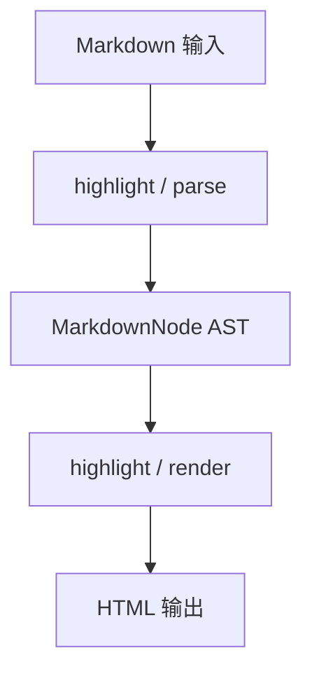

### 7.4 使用示例

::: tabs
@tab TypeScript

```typescript title="highlight-example.ts"
import { TransformerEngine } from "penna-markdown/transformer";

const engine = new TransformerEngine({
  highlight: { enabled: true, priority: 70 },
});

const markdown = "# Highlight 代码高亮 Demo\n\n正文内容。";
const html = engine.render(engine.parse(markdown));
console.log(html.length);
```

@tab 配置

```yaml title="highlight.yaml"
highlight:
  enabled: true
  priority: 70
  options:
    debug: false
    timeout: 30000
```

@tab 输出

```html
<h1>Highlight 代码高亮 Demo</h1>
<p>正文内容。</p>
```

:::

### 7.5 性能基准（参考值）

| 场景                       | 输入规模 | parse (ms) | render (ms) | 备注              |
| -------------------------- | -------- | ---------: | ----------: | ----------------- |
| Highlight 代码高亮 · 1KB   | 1KB      |        2.3 |         0.4 | 本地 M2 / Node 22 |
| Highlight 代码高亮 · 10KB  | 10KB     |        4.8 |         0.7 | 本地 M2 / Node 22 |
| Highlight 代码高亮 · 60KB  | 60KB     |       36.8 |         4.5 | 本地 M2 / Node 22 |
| Highlight 代码高亮 · 100KB | 100KB    |       59.8 |         7.3 | 本地 M2 / Node 22 |

### 7.6 常见问题

::: collapse accordion

- Q1：Highlight 代码高亮 相关问题 1？

  **A1**：首先检查 `highlight.enabled` 是否为 `true`；其次确认 Registry 中 parser priority 未被其他扩展抢占。若仍异常，在 `demo/ast` 加载本文档并定位「附录 · Highlight 代码高亮」章节，对比 AST 节点类型。参考错误码 `E001` 与下表。

- Q2：Highlight 代码高亮 相关问题 2？

  **A2**：首先检查 `highlight.enabled` 是否为 `true`；其次确认 Registry 中 parser priority 未被其他扩展抢占。若仍异常，在 `demo/ast` 加载本文档并定位「附录 · Highlight 代码高亮」章节，对比 AST 节点类型。参考错误码 `E002` 与下表。

- Q3：Highlight 代码高亮 相关问题 3？

  **A3**：首先检查 `highlight.enabled` 是否为 `true`；其次确认 Registry 中 parser priority 未被其他扩展抢占。若仍异常，在 `demo/ast` 加载本文档并定位「附录 · Highlight 代码高亮」章节，对比 AST 节点类型。参考错误码 `E003` 与下表。

- Q4：Highlight 代码高亮 相关问题 4？

  **A4**：首先检查 `highlight.enabled` 是否为 `true`；其次确认 Registry 中 parser priority 未被其他扩展抢占。若仍异常，在 `demo/ast` 加载本文档并定位「附录 · Highlight 代码高亮」章节，对比 AST 节点类型。参考错误码 `E004` 与下表。

- Q5：Highlight 代码高亮 相关问题 5？

  **A5**：首先检查 `highlight.enabled` 是否为 `true`；其次确认 Registry 中 parser priority 未被其他扩展抢占。若仍异常，在 `demo/ast` 加载本文档并定位「附录 · Highlight 代码高亮」章节，对比 AST 节点类型。参考错误码 `E005` 与下表。

:::

### 7.7 与其他模块的依赖关系

| 依赖方向                | 模块        | 耦合类型 | 说明                                         |
| ----------------------- | ----------- | -------- | -------------------------------------------- |
| highlight → transformer | transformer | 编译期   | 所有模块最终汇入 TransformerEngine           |
| highlight → gfm         | gfm         | 运行时   | GFM parser 与扩展 parser 共享 Registry       |
| renderer → highlight    | renderer    | 运行时   | Renderer 增强 Highlight 代码高亮 输出的 HTML |
| security → highlight    | security    | 运行时   | sanitize 在 render 后或 render 内应用        |

---

## 第 8 章 · Theme 主题系统 {#appendix-ch8}

> [!IMPORTANT]
> **模块标识**：`theme` · **文档版本**：0.1.0-draft · **最后更新**：2026-07-02

深浅色切换，联动 Mermaid、ECharts、远程公式 SVG 配色。

### 8.1 设计目标

- **单一职责**：Theme 主题系统 只做一件事并做好，不越界调用其他模块的内部状态。
- **零破坏性**：默认配置下 GFM 行为与官方 spec 对齐；扩展语法 opt-in。
- **可测试性**：每个 parser / renderer 适配器都有独立 vitest 用例，不依赖浏览器 DOM。
- **可扩展性**：新语法通过 `registry.register()` 注入，禁止修改核心 `blockScan` 循环。

### 8.2 核心接口

:::: field-group
::: field theme.enabled
@type boolean
@optional
@default true

是否启用 Theme 主题系统 模块。
:::

::: field theme.priority
@type number
@optional
@default 65

Registry 匹配优先级，仅对 parser 类模块生效。
:::

::: field theme.options
@type Record<string, unknown>
@optional
@default {}

模块级选项对象，详见下表。
:::
::::

| 选项键       | 类型              | 默认值 | 说明                                              |
| ------------ | ----------------- | ------ | ------------------------------------------------- |
| `theme.opt1` | string \| boolean | `true` | Theme 主题系统 配置项 1：控制子功能开关或渲染模式 |
| `theme.opt2` | string \| boolean | `auto` | Theme 主题系统 配置项 2：控制子功能开关或渲染模式 |
| `theme.opt3` | string \| boolean | `true` | Theme 主题系统 配置项 3：控制子功能开关或渲染模式 |
| `theme.opt4` | string \| boolean | `auto` | Theme 主题系统 配置项 4：控制子功能开关或渲染模式 |
| `theme.opt5` | string \| boolean | `true` | Theme 主题系统 配置项 5：控制子功能开关或渲染模式 |
| `theme.opt6` | string \| boolean | `auto` | Theme 主题系统 配置项 6：控制子功能开关或渲染模式 |
| `theme.opt7` | string \| boolean | `true` | Theme 主题系统 配置项 7：控制子功能开关或渲染模式 |
| `theme.opt8` | string \| boolean | `auto` | Theme 主题系统 配置项 8：控制子功能开关或渲染模式 |

### 8.3 数据流

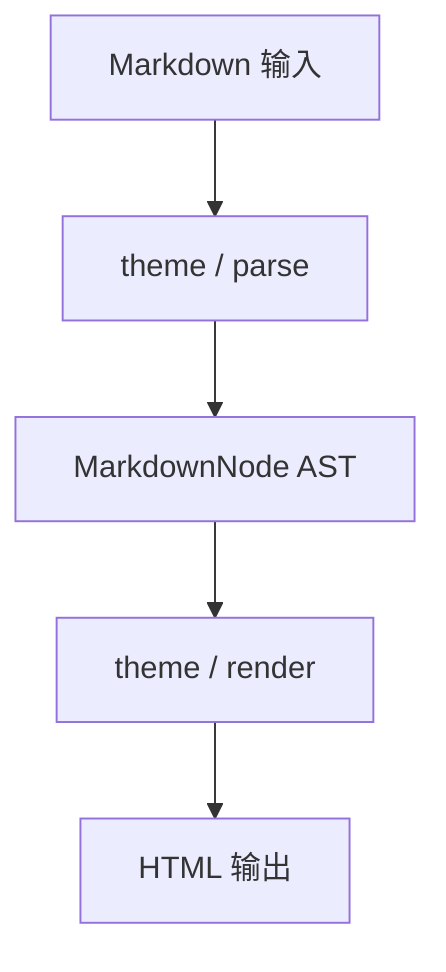

### 8.4 使用示例

::: tabs
@tab TypeScript

```typescript title="theme-example.ts"
import { TransformerEngine } from "penna-markdown/transformer";

const engine = new TransformerEngine({
  theme: { enabled: true, priority: 65 },
});

const markdown = "# Theme 主题系统 Demo\n\n正文内容。";
const html = engine.render(engine.parse(markdown));
console.log(html.length);
```

@tab 配置

```yaml title="theme.yaml"
theme:
  enabled: true
  priority: 65
  options:
    debug: false
    timeout: 30000
```

@tab 输出

```html
<h1>Theme 主题系统 Demo</h1>
<p>正文内容。</p>
```

:::

### 8.5 性能基准（参考值）

| 场景                   | 输入规模 | parse (ms) | render (ms) | 备注              |
| ---------------------- | -------- | ---------: | ----------: | ----------------- |
| Theme 主题系统 · 1KB   | 1KB      |        2.6 |         0.4 | 本地 M2 / Node 22 |
| Theme 主题系统 · 10KB  | 10KB     |        5.1 |         0.7 | 本地 M2 / Node 22 |
| Theme 主题系统 · 60KB  | 60KB     |       37.1 |         4.5 | 本地 M2 / Node 22 |
| Theme 主题系统 · 100KB | 100KB    |       60.1 |         7.3 | 本地 M2 / Node 22 |

### 8.6 常见问题

::: collapse accordion

- Q1：Theme 主题系统 相关问题 1？

  **A1**：首先检查 `theme.enabled` 是否为 `true`；其次确认 Registry 中 parser priority 未被其他扩展抢占。若仍异常，在 `demo/ast` 加载本文档并定位「附录 · Theme 主题系统」章节，对比 AST 节点类型。参考错误码 `E001` 与下表。

- Q2：Theme 主题系统 相关问题 2？

  **A2**：首先检查 `theme.enabled` 是否为 `true`；其次确认 Registry 中 parser priority 未被其他扩展抢占。若仍异常，在 `demo/ast` 加载本文档并定位「附录 · Theme 主题系统」章节，对比 AST 节点类型。参考错误码 `E002` 与下表。

- Q3：Theme 主题系统 相关问题 3？

  **A3**：首先检查 `theme.enabled` 是否为 `true`；其次确认 Registry 中 parser priority 未被其他扩展抢占。若仍异常，在 `demo/ast` 加载本文档并定位「附录 · Theme 主题系统」章节，对比 AST 节点类型。参考错误码 `E003` 与下表。

- Q4：Theme 主题系统 相关问题 4？

  **A4**：首先检查 `theme.enabled` 是否为 `true`；其次确认 Registry 中 parser priority 未被其他扩展抢占。若仍异常，在 `demo/ast` 加载本文档并定位「附录 · Theme 主题系统」章节，对比 AST 节点类型。参考错误码 `E004` 与下表。

- Q5：Theme 主题系统 相关问题 5？

  **A5**：首先检查 `theme.enabled` 是否为 `true`；其次确认 Registry 中 parser priority 未被其他扩展抢占。若仍异常，在 `demo/ast` 加载本文档并定位「附录 · Theme 主题系统」章节，对比 AST 节点类型。参考错误码 `E005` 与下表。

:::

### 8.7 与其他模块的依赖关系

| 依赖方向            | 模块        | 耦合类型 | 说明                                     |
| ------------------- | ----------- | -------- | ---------------------------------------- |
| theme → transformer | transformer | 编译期   | 所有模块最终汇入 TransformerEngine       |
| theme → gfm         | gfm         | 运行时   | GFM parser 与扩展 parser 共享 Registry   |
| renderer → theme    | renderer    | 运行时   | Renderer 增强 Theme 主题系统 输出的 HTML |
| security → theme    | security    | 运行时   | sanitize 在 render 后或 render 内应用    |

---

## 第 9 章 · TOC 目录生成 {#appendix-ch9}

> [!IMPORTANT]
> **模块标识**：`toc` · **文档版本**：0.1.0-draft · **最后更新**：2026-07-02

基于 heading slug 自动生成可点击目录，支持 depth 与自定义 slugify。

### 9.1 设计目标

- **单一职责**：TOC 目录生成 只做一件事并做好，不越界调用其他模块的内部状态。
- **零破坏性**：默认配置下 GFM 行为与官方 spec 对齐；扩展语法 opt-in。
- **可测试性**：每个 parser / renderer 适配器都有独立 vitest 用例，不依赖浏览器 DOM。
- **可扩展性**：新语法通过 `registry.register()` 注入，禁止修改核心 `blockScan` 循环。

### 9.2 核心接口

:::: field-group
::: field toc.enabled
@type boolean
@optional
@default true

是否启用 TOC 目录生成 模块。
:::

::: field toc.priority
@type number
@optional
@default 60

Registry 匹配优先级，仅对 parser 类模块生效。
:::

::: field toc.options
@type Record<string, unknown>
@optional
@default {}

模块级选项对象，详见下表。
:::
::::

| 选项键     | 类型              | 默认值 | 说明                                            |
| ---------- | ----------------- | ------ | ----------------------------------------------- |
| `toc.opt1` | string \| boolean | `true` | TOC 目录生成 配置项 1：控制子功能开关或渲染模式 |
| `toc.opt2` | string \| boolean | `auto` | TOC 目录生成 配置项 2：控制子功能开关或渲染模式 |
| `toc.opt3` | string \| boolean | `true` | TOC 目录生成 配置项 3：控制子功能开关或渲染模式 |
| `toc.opt4` | string \| boolean | `auto` | TOC 目录生成 配置项 4：控制子功能开关或渲染模式 |
| `toc.opt5` | string \| boolean | `true` | TOC 目录生成 配置项 5：控制子功能开关或渲染模式 |
| `toc.opt6` | string \| boolean | `auto` | TOC 目录生成 配置项 6：控制子功能开关或渲染模式 |
| `toc.opt7` | string \| boolean | `true` | TOC 目录生成 配置项 7：控制子功能开关或渲染模式 |
| `toc.opt8` | string \| boolean | `auto` | TOC 目录生成 配置项 8：控制子功能开关或渲染模式 |

### 9.3 数据流

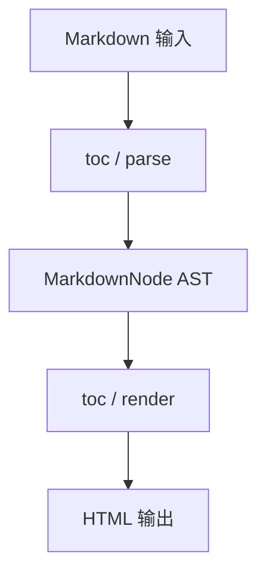

### 9.4 使用示例

::: tabs
@tab TypeScript

```typescript title="toc-example.ts"
import { TransformerEngine } from "penna-markdown/transformer";

const engine = new TransformerEngine({
  toc: { enabled: true, priority: 60 },
});

const markdown = "# TOC 目录生成 Demo\n\n正文内容。";
const html = engine.render(engine.parse(markdown));
console.log(html.length);
```

@tab 配置

```yaml title="toc.yaml"
toc:
  enabled: true
  priority: 60
  options:
    debug: false
    timeout: 30000
```

@tab 输出

```html
<h1>TOC 目录生成 Demo</h1>
<p>正文内容。</p>
```

:::

### 9.5 性能基准（参考值）

| 场景                 | 输入规模 | parse (ms) | render (ms) | 备注              |
| -------------------- | -------- | ---------: | ----------: | ----------------- |
| TOC 目录生成 · 1KB   | 1KB      |        2.9 |         0.5 | 本地 M2 / Node 22 |
| TOC 目录生成 · 10KB  | 10KB     |        5.4 |         0.8 | 本地 M2 / Node 22 |
| TOC 目录生成 · 60KB  | 60KB     |       37.4 |         4.6 | 本地 M2 / Node 22 |
| TOC 目录生成 · 100KB | 100KB    |       60.4 |         7.4 | 本地 M2 / Node 22 |

### 9.6 常见问题

::: collapse accordion

- Q1：TOC 目录生成 相关问题 1？

  **A1**：首先检查 `toc.enabled` 是否为 `true`；其次确认 Registry 中 parser priority 未被其他扩展抢占。若仍异常，在 `demo/ast` 加载本文档并定位「附录 · TOC 目录生成」章节，对比 AST 节点类型。参考错误码 `E001` 与下表。

- Q2：TOC 目录生成 相关问题 2？

  **A2**：首先检查 `toc.enabled` 是否为 `true`；其次确认 Registry 中 parser priority 未被其他扩展抢占。若仍异常，在 `demo/ast` 加载本文档并定位「附录 · TOC 目录生成」章节，对比 AST 节点类型。参考错误码 `E002` 与下表。

- Q3：TOC 目录生成 相关问题 3？

  **A3**：首先检查 `toc.enabled` 是否为 `true`；其次确认 Registry 中 parser priority 未被其他扩展抢占。若仍异常，在 `demo/ast` 加载本文档并定位「附录 · TOC 目录生成」章节，对比 AST 节点类型。参考错误码 `E003` 与下表。

- Q4：TOC 目录生成 相关问题 4？

  **A4**：首先检查 `toc.enabled` 是否为 `true`；其次确认 Registry 中 parser priority 未被其他扩展抢占。若仍异常，在 `demo/ast` 加载本文档并定位「附录 · TOC 目录生成」章节，对比 AST 节点类型。参考错误码 `E004` 与下表。

- Q5：TOC 目录生成 相关问题 5？

  **A5**：首先检查 `toc.enabled` 是否为 `true`；其次确认 Registry 中 parser priority 未被其他扩展抢占。若仍异常，在 `demo/ast` 加载本文档并定位「附录 · TOC 目录生成」章节，对比 AST 节点类型。参考错误码 `E005` 与下表。

:::

### 9.7 与其他模块的依赖关系

| 依赖方向          | 模块        | 耦合类型 | 说明                                   |
| ----------------- | ----------- | -------- | -------------------------------------- |
| toc → transformer | transformer | 编译期   | 所有模块最终汇入 TransformerEngine     |
| toc → gfm         | gfm         | 运行时   | GFM parser 与扩展 parser 共享 Registry |
| renderer → toc    | renderer    | 运行时   | Renderer 增强 TOC 目录生成 输出的 HTML |
| security → toc    | security    | 运行时   | sanitize 在 render 后或 render 内应用  |

---

## 第 10 章 · Math 数学公式 {#appendix-ch10}

> [!IMPORTANT]
> **模块标识**：`math` · **文档版本**：0.1.0-draft · **最后更新**：2026-07-02

行内 $ 与块级 $ 解析，支持 KaTeX / MathJax / remote SVG 三种渲染后端。

### 10.1 设计目标

- **单一职责**：Math 数学公式 只做一件事并做好，不越界调用其他模块的内部状态。
- **零破坏性**：默认配置下 GFM 行为与官方 spec 对齐；扩展语法 opt-in。
- **可测试性**：每个 parser / renderer 适配器都有独立 vitest 用例，不依赖浏览器 DOM。
- **可扩展性**：新语法通过 `registry.register()` 注入，禁止修改核心 `blockScan` 循环。

### 10.2 核心接口

:::: field-group
::: field math.enabled
@type boolean
@optional
@default true

是否启用 Math 数学公式 模块。
:::

::: field math.priority
@type number
@optional
@default 55

Registry 匹配优先级，仅对 parser 类模块生效。
:::

::: field math.options
@type Record<string, unknown>
@optional
@default {}

模块级选项对象，详见下表。
:::
::::

| 选项键      | 类型              | 默认值 | 说明                                             |
| ----------- | ----------------- | ------ | ------------------------------------------------ |
| `math.opt1` | string \| boolean | `true` | Math 数学公式 配置项 1：控制子功能开关或渲染模式 |
| `math.opt2` | string \| boolean | `auto` | Math 数学公式 配置项 2：控制子功能开关或渲染模式 |
| `math.opt3` | string \| boolean | `true` | Math 数学公式 配置项 3：控制子功能开关或渲染模式 |
| `math.opt4` | string \| boolean | `auto` | Math 数学公式 配置项 4：控制子功能开关或渲染模式 |
| `math.opt5` | string \| boolean | `true` | Math 数学公式 配置项 5：控制子功能开关或渲染模式 |
| `math.opt6` | string \| boolean | `auto` | Math 数学公式 配置项 6：控制子功能开关或渲染模式 |
| `math.opt7` | string \| boolean | `true` | Math 数学公式 配置项 7：控制子功能开关或渲染模式 |
| `math.opt8` | string \| boolean | `auto` | Math 数学公式 配置项 8：控制子功能开关或渲染模式 |

### 10.3 数据流

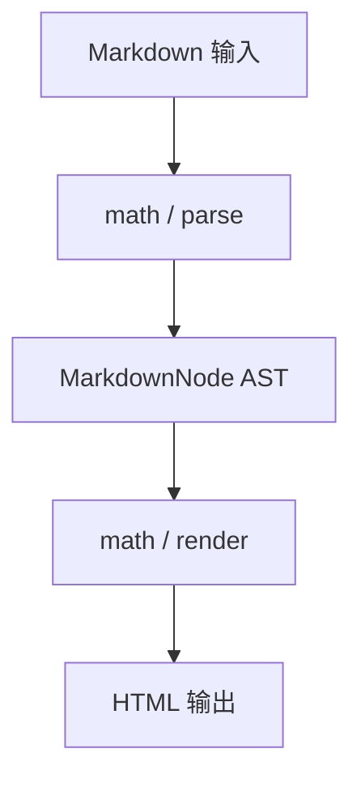

### 10.4 使用示例

::: tabs
@tab TypeScript

```typescript title="math-example.ts"
import { TransformerEngine } from "penna-markdown/transformer";

const engine = new TransformerEngine({
  math: { enabled: true, priority: 55 },
});

const markdown = "# Math 数学公式 Demo\n\n正文内容。";
const html = engine.render(engine.parse(markdown));
console.log(html.length);
```

@tab 配置

```yaml title="math.yaml"
math:
  enabled: true
  priority: 55
  options:
    debug: false
    timeout: 30000
```

@tab 输出

```html
<h1>Math 数学公式 Demo</h1>
<p>正文内容。</p>
```

:::

### 10.5 性能基准（参考值）

| 场景                  | 输入规模 | parse (ms) | render (ms) | 备注              |
| --------------------- | -------- | ---------: | ----------: | ----------------- |
| Math 数学公式 · 1KB   | 1KB      |        3.2 |         0.5 | 本地 M2 / Node 22 |
| Math 数学公式 · 10KB  | 10KB     |        5.7 |         0.8 | 本地 M2 / Node 22 |
| Math 数学公式 · 60KB  | 60KB     |       37.7 |         4.7 | 本地 M2 / Node 22 |
| Math 数学公式 · 100KB | 100KB    |       60.7 |         7.4 | 本地 M2 / Node 22 |

### 10.6 常见问题

::: collapse accordion

- Q1：Math 数学公式 相关问题 1？

  **A1**：首先检查 `math.enabled` 是否为 `true`；其次确认 Registry 中 parser priority 未被其他扩展抢占。若仍异常，在 `demo/ast` 加载本文档并定位「附录 · Math 数学公式」章节，对比 AST 节点类型。参考错误码 `E001` 与下表。

- Q2：Math 数学公式 相关问题 2？

  **A2**：首先检查 `math.enabled` 是否为 `true`；其次确认 Registry 中 parser priority 未被其他扩展抢占。若仍异常，在 `demo/ast` 加载本文档并定位「附录 · Math 数学公式」章节，对比 AST 节点类型。参考错误码 `E002` 与下表。

- Q3：Math 数学公式 相关问题 3？

  **A3**：首先检查 `math.enabled` 是否为 `true`；其次确认 Registry 中 parser priority 未被其他扩展抢占。若仍异常，在 `demo/ast` 加载本文档并定位「附录 · Math 数学公式」章节，对比 AST 节点类型。参考错误码 `E003` 与下表。

- Q4：Math 数学公式 相关问题 4？

  **A4**：首先检查 `math.enabled` 是否为 `true`；其次确认 Registry 中 parser priority 未被其他扩展抢占。若仍异常，在 `demo/ast` 加载本文档并定位「附录 · Math 数学公式」章节，对比 AST 节点类型。参考错误码 `E004` 与下表。

- Q5：Math 数学公式 相关问题 5？

  **A5**：首先检查 `math.enabled` 是否为 `true`；其次确认 Registry 中 parser priority 未被其他扩展抢占。若仍异常，在 `demo/ast` 加载本文档并定位「附录 · Math 数学公式」章节，对比 AST 节点类型。参考错误码 `E005` 与下表。

:::

### 10.7 与其他模块的依赖关系

| 依赖方向           | 模块        | 耦合类型 | 说明                                    |
| ------------------ | ----------- | -------- | --------------------------------------- |
| math → transformer | transformer | 编译期   | 所有模块最终汇入 TransformerEngine      |
| math → gfm         | gfm         | 运行时   | GFM parser 与扩展 parser 共享 Registry  |
| renderer → math    | renderer    | 运行时   | Renderer 增强 Math 数学公式 输出的 HTML |
| security → math    | security    | 运行时   | sanitize 在 render 后或 render 内应用   |

---

# 附录 B · REST API 参考 {#appendix-api}

> [!NOTE]
> 以下 API 为**文档模拟**，不代表真实 HTTP 服务。格式遵循 OpenAPI 风格 Markdown 描述。

**Base URL**：`https://api.penna-markdown.example/v1`

**认证**：`Authorization: Bearer <token>`

### API-001 · `POST /api/v1/parse/1`

[POST]{.important} [v0.1.0]{.note}

**描述**：Penna Markdown 内部服务接口第 1 号端点，用于演示超长 API 文档排版。实际项目中此端点可能不存在——此处仅作活文档体积与格式回归用途。

**请求参数**

| 参数     | 位置  | 类型   | 必填 | 说明                                    |
| -------- | ----- | ------ | ---- | --------------------------------------- |
| `param1` | path  | string | 是   | 参数 1 说明：/api/v1/parse/1 的业务字段 |
| `param2` | path  | string | 是   | 参数 2 说明：/api/v1/parse/1 的业务字段 |
| `param3` | query | string | 是   | 参数 3 说明：/api/v1/parse/1 的业务字段 |
| `param4` | query | string | 否   | 参数 4 说明：/api/v1/parse/1 的业务字段 |
| `param5` | body  | string | 否   | 参数 5 说明：/api/v1/parse/1 的业务字段 |
| `param6` | body  | string | 否   | 参数 6 说明：/api/v1/parse/1 的业务字段 |

**响应示例**

```json title="response-1.json"
{
  "code": 0,
  "message": "ok",
  "data": {
    "id": "1",
    "path": "/api/v1/parse/1",
    "method": "POST",
    "timestamp": "2026-07-02T00:00:00.000Z"
  }
}
```

**错误码**

- `E002` **PARSE_UNCLOSED_CONTAINER**：容器 ::: 未闭合 → 后续内容可能被吞入容器，需目视确认
- `E003` **RENDER_HIGHLIGHT_FAIL**：代码高亮引擎加载失败 → 回退为 plain `<pre><code>`
- `E004` **RENDER_MATH_REMOTE_FAIL**：远程公式 SVG 请求失败 → 显示 alt 文本或占位符

### API-002 · `PUT /api/v1/render/2`

[PUT]{.important} [v0.1.0]{.note}

**描述**：Penna Markdown 内部服务接口第 2 号端点，用于演示超长 API 文档排版。实际项目中此端点可能不存在——此处仅作活文档体积与格式回归用途。

**请求参数**

| 参数     | 位置  | 类型   | 必填 | 说明                                     |
| -------- | ----- | ------ | ---- | ---------------------------------------- |
| `param1` | path  | string | 是   | 参数 1 说明：/api/v1/render/2 的业务字段 |
| `param2` | path  | string | 是   | 参数 2 说明：/api/v1/render/2 的业务字段 |
| `param3` | query | string | 是   | 参数 3 说明：/api/v1/render/2 的业务字段 |
| `param4` | query | string | 否   | 参数 4 说明：/api/v1/render/2 的业务字段 |
| `param5` | body  | string | 否   | 参数 5 说明：/api/v1/render/2 的业务字段 |
| `param6` | body  | string | 否   | 参数 6 说明：/api/v1/render/2 的业务字段 |

**响应示例**

```json title="response-2.json"
{
  "code": 0,
  "message": "ok",
  "data": {
    "id": "2",
    "path": "/api/v1/render/2",
    "method": "PUT",
    "timestamp": "2026-07-02T00:00:00.000Z"
  }
}
```

**错误码**

- `E003` **RENDER_HIGHLIGHT_FAIL**：代码高亮引擎加载失败 → 回退为 plain `<pre><code>`
- `E004` **RENDER_MATH_REMOTE_FAIL**：远程公式 SVG 请求失败 → 显示 alt 文本或占位符
- `E005` **SECURITY_URL_REJECTED**：URL 协议不在白名单 → 链接/iframe/src 被 strip 或拒绝渲染

### API-003 · `PATCH /api/v1/ast/3`

[PATCH]{.important} [v0.1.0]{.note}

**描述**：Penna Markdown 内部服务接口第 3 号端点，用于演示超长 API 文档排版。实际项目中此端点可能不存在——此处仅作活文档体积与格式回归用途。

**请求参数**

| 参数     | 位置  | 类型   | 必填 | 说明                                  |
| -------- | ----- | ------ | ---- | ------------------------------------- |
| `param1` | path  | string | 是   | 参数 1 说明：/api/v1/ast/3 的业务字段 |
| `param2` | path  | string | 是   | 参数 2 说明：/api/v1/ast/3 的业务字段 |
| `param3` | query | string | 是   | 参数 3 说明：/api/v1/ast/3 的业务字段 |
| `param4` | query | string | 否   | 参数 4 说明：/api/v1/ast/3 的业务字段 |
| `param5` | body  | string | 否   | 参数 5 说明：/api/v1/ast/3 的业务字段 |
| `param6` | body  | string | 否   | 参数 6 说明：/api/v1/ast/3 的业务字段 |

**响应示例**

```json title="response-3.json"
{
  "code": 0,
  "message": "ok",
  "data": {
    "id": "3",
    "path": "/api/v1/ast/3",
    "method": "PATCH",
    "timestamp": "2026-07-02T00:00:00.000Z"
  }
}
```

**错误码**

- `E004` **RENDER_MATH_REMOTE_FAIL**：远程公式 SVG 请求失败 → 显示 alt 文本或占位符
- `E005` **SECURITY_URL_REJECTED**：URL 协议不在白名单 → 链接/iframe/src 被 strip 或拒绝渲染
- `E006` **SECURITY_HTML_STRIPPED**：HTML 标签被 sanitize 移除 → 保留文本内容

### API-004 · `DELETE /api/v1/extensions/4`

[DELETE]{.danger} [v0.1.0]{.note}

**描述**：Penna Markdown 内部服务接口第 4 号端点，用于演示超长 API 文档排版。实际项目中此端点可能不存在——此处仅作活文档体积与格式回归用途。

**请求参数**

| 参数     | 位置  | 类型   | 必填 | 说明                                         |
| -------- | ----- | ------ | ---- | -------------------------------------------- |
| `param1` | path  | string | 是   | 参数 1 说明：/api/v1/extensions/4 的业务字段 |
| `param2` | path  | string | 是   | 参数 2 说明：/api/v1/extensions/4 的业务字段 |
| `param3` | query | string | 是   | 参数 3 说明：/api/v1/extensions/4 的业务字段 |
| `param4` | query | string | 否   | 参数 4 说明：/api/v1/extensions/4 的业务字段 |
| `param5` | body  | string | 否   | 参数 5 说明：/api/v1/extensions/4 的业务字段 |
| `param6` | body  | string | 否   | 参数 6 说明：/api/v1/extensions/4 的业务字段 |

**响应示例**

```json title="response-4.json"
{
  "code": 0,
  "message": "ok",
  "data": {
    "id": "4",
    "path": "/api/v1/extensions/4",
    "method": "DELETE",
    "timestamp": "2026-07-02T00:00:00.000Z"
  }
}
```

**错误码**

- `E005` **SECURITY_URL_REJECTED**：URL 协议不在白名单 → 链接/iframe/src 被 strip 或拒绝渲染
- `E006` **SECURITY_HTML_STRIPPED**：HTML 标签被 sanitize 移除 → 保留文本内容
- `E007` **FOOTNOTE_UNDEFINED**：引用未定义的脚注 → 保持字面量 [^id]

### API-005 · `GET /api/v1/themes/5`

[GET]{.tip} [v0.1.0]{.note}

**描述**：Penna Markdown 内部服务接口第 5 号端点，用于演示超长 API 文档排版。实际项目中此端点可能不存在——此处仅作活文档体积与格式回归用途。

**请求参数**

| 参数     | 位置  | 类型   | 必填 | 说明                                     |
| -------- | ----- | ------ | ---- | ---------------------------------------- |
| `param1` | path  | string | 是   | 参数 1 说明：/api/v1/themes/5 的业务字段 |
| `param2` | path  | string | 是   | 参数 2 说明：/api/v1/themes/5 的业务字段 |
| `param3` | query | string | 是   | 参数 3 说明：/api/v1/themes/5 的业务字段 |
| `param4` | query | string | 否   | 参数 4 说明：/api/v1/themes/5 的业务字段 |
| `param5` | body  | string | 否   | 参数 5 说明：/api/v1/themes/5 的业务字段 |
| `param6` | body  | string | 否   | 参数 6 说明：/api/v1/themes/5 的业务字段 |

**响应示例**

```json title="response-5.json"
{
  "code": 0,
  "message": "ok",
  "data": {
    "id": "5",
    "path": "/api/v1/themes/5",
    "method": "GET",
    "timestamp": "2026-07-02T00:00:00.000Z"
  }
}
```

**错误码**

- `E006` **SECURITY_HTML_STRIPPED**：HTML 标签被 sanitize 移除 → 保留文本内容
- `E007` **FOOTNOTE_UNDEFINED**：引用未定义的脚注 → 保持字面量 [^id]
- `E008` **FRONTMATTER_INVALID_YAML**：Frontmatter YAML 语法错误 → 整段 frontmatter 按普通段落处理

### API-006 · `POST /api/v1/health/6`

[POST]{.important} [v0.1.0]{.note}

**描述**：Penna Markdown 内部服务接口第 6 号端点，用于演示超长 API 文档排版。实际项目中此端点可能不存在——此处仅作活文档体积与格式回归用途。

**请求参数**

| 参数     | 位置  | 类型   | 必填 | 说明                                     |
| -------- | ----- | ------ | ---- | ---------------------------------------- |
| `param1` | path  | string | 是   | 参数 1 说明：/api/v1/health/6 的业务字段 |
| `param2` | path  | string | 是   | 参数 2 说明：/api/v1/health/6 的业务字段 |
| `param3` | query | string | 是   | 参数 3 说明：/api/v1/health/6 的业务字段 |
| `param4` | query | string | 否   | 参数 4 说明：/api/v1/health/6 的业务字段 |
| `param5` | body  | string | 否   | 参数 5 说明：/api/v1/health/6 的业务字段 |
| `param6` | body  | string | 否   | 参数 6 说明：/api/v1/health/6 的业务字段 |

**响应示例**

```json title="response-6.json"
{
  "code": 0,
  "message": "ok",
  "data": {
    "id": "6",
    "path": "/api/v1/health/6",
    "method": "POST",
    "timestamp": "2026-07-02T00:00:00.000Z"
  }
}
```

**错误码**

- `E007` **FOOTNOTE_UNDEFINED**：引用未定义的脚注 → 保持字面量 [^id]
- `E008` **FRONTMATTER_INVALID_YAML**：Frontmatter YAML 语法错误 → 整段 frontmatter 按普通段落处理
- `E009` **REGISTRY_DUPLICATE_NAME**：重复注册同名 parser → 开发模式 throw，生产模式后者覆盖

### API-007 · `PUT /api/v1/batch/7`

[PUT]{.important} [v0.1.0]{.note}

**描述**：Penna Markdown 内部服务接口第 7 号端点，用于演示超长 API 文档排版。实际项目中此端点可能不存在——此处仅作活文档体积与格式回归用途。

**请求参数**

| 参数     | 位置  | 类型   | 必填 | 说明                                    |
| -------- | ----- | ------ | ---- | --------------------------------------- |
| `param1` | path  | string | 是   | 参数 1 说明：/api/v1/batch/7 的业务字段 |
| `param2` | path  | string | 是   | 参数 2 说明：/api/v1/batch/7 的业务字段 |
| `param3` | query | string | 是   | 参数 3 说明：/api/v1/batch/7 的业务字段 |
| `param4` | query | string | 否   | 参数 4 说明：/api/v1/batch/7 的业务字段 |
| `param5` | body  | string | 否   | 参数 5 说明：/api/v1/batch/7 的业务字段 |
| `param6` | body  | string | 否   | 参数 6 说明：/api/v1/batch/7 的业务字段 |

**响应示例**

```json title="response-7.json"
{
  "code": 0,
  "message": "ok",
  "data": {
    "id": "7",
    "path": "/api/v1/batch/7",
    "method": "PUT",
    "timestamp": "2026-07-02T00:00:00.000Z"
  }
}
```

**错误码**

- `E008` **FRONTMATTER_INVALID_YAML**：Frontmatter YAML 语法错误 → 整段 frontmatter 按普通段落处理
- `E009` **REGISTRY_DUPLICATE_NAME**：重复注册同名 parser → 开发模式 throw，生产模式后者覆盖
- `E010` **DELEGATE_NO_DOM**：SSR 环境无 document → 跳过客户端 delegate 绑定

### API-008 · `PATCH /api/v1/documents/8`

[PATCH]{.important} [v0.1.0]{.note}

**描述**：Penna Markdown 内部服务接口第 8 号端点，用于演示超长 API 文档排版。实际项目中此端点可能不存在——此处仅作活文档体积与格式回归用途。

**请求参数**

| 参数     | 位置  | 类型   | 必填 | 说明                                        |
| -------- | ----- | ------ | ---- | ------------------------------------------- |
| `param1` | path  | string | 是   | 参数 1 说明：/api/v1/documents/8 的业务字段 |
| `param2` | path  | string | 是   | 参数 2 说明：/api/v1/documents/8 的业务字段 |
| `param3` | query | string | 是   | 参数 3 说明：/api/v1/documents/8 的业务字段 |
| `param4` | query | string | 否   | 参数 4 说明：/api/v1/documents/8 的业务字段 |
| `param5` | body  | string | 否   | 参数 5 说明：/api/v1/documents/8 的业务字段 |
| `param6` | body  | string | 否   | 参数 6 说明：/api/v1/documents/8 的业务字段 |

**响应示例**

```json title="response-8.json"
{
  "code": 0,
  "message": "ok",
  "data": {
    "id": "8",
    "path": "/api/v1/documents/8",
    "method": "PATCH",
    "timestamp": "2026-07-02T00:00:00.000Z"
  }
}
```

**错误码**

- `E009` **REGISTRY_DUPLICATE_NAME**：重复注册同名 parser → 开发模式 throw，生产模式后者覆盖
- `E010` **DELEGATE_NO_DOM**：SSR 环境无 document → 跳过客户端 delegate 绑定
- `E001` **PARSE_UNCLOSED_FENCE**：围栏代码块未闭合 → 降级为段落直至文档末尾

### API-009 · `DELETE /api/v1/parse/9`

[DELETE]{.danger} [v0.1.0]{.note}

**描述**：Penna Markdown 内部服务接口第 9 号端点，用于演示超长 API 文档排版。实际项目中此端点可能不存在——此处仅作活文档体积与格式回归用途。

**请求参数**

| 参数     | 位置  | 类型   | 必填 | 说明                                    |
| -------- | ----- | ------ | ---- | --------------------------------------- |
| `param1` | path  | string | 是   | 参数 1 说明：/api/v1/parse/9 的业务字段 |
| `param2` | path  | string | 是   | 参数 2 说明：/api/v1/parse/9 的业务字段 |
| `param3` | query | string | 是   | 参数 3 说明：/api/v1/parse/9 的业务字段 |
| `param4` | query | string | 否   | 参数 4 说明：/api/v1/parse/9 的业务字段 |
| `param5` | body  | string | 否   | 参数 5 说明：/api/v1/parse/9 的业务字段 |
| `param6` | body  | string | 否   | 参数 6 说明：/api/v1/parse/9 的业务字段 |

**响应示例**

```json title="response-9.json"
{
  "code": 0,
  "message": "ok",
  "data": {
    "id": "9",
    "path": "/api/v1/parse/9",
    "method": "DELETE",
    "timestamp": "2026-07-02T00:00:00.000Z"
  }
}
```

**错误码**

- `E010` **DELEGATE_NO_DOM**：SSR 环境无 document → 跳过客户端 delegate 绑定
- `E001` **PARSE_UNCLOSED_FENCE**：围栏代码块未闭合 → 降级为段落直至文档末尾
- `E002` **PARSE_UNCLOSED_CONTAINER**：容器 ::: 未闭合 → 后续内容可能被吞入容器，需目视确认

### API-010 · `GET /api/v1/render/10`

[GET]{.tip} [v0.1.0]{.note}

**描述**：Penna Markdown 内部服务接口第 10 号端点，用于演示超长 API 文档排版。实际项目中此端点可能不存在——此处仅作活文档体积与格式回归用途。

**请求参数**

| 参数     | 位置  | 类型   | 必填 | 说明                                      |
| -------- | ----- | ------ | ---- | ----------------------------------------- |
| `param1` | path  | string | 是   | 参数 1 说明：/api/v1/render/10 的业务字段 |
| `param2` | path  | string | 是   | 参数 2 说明：/api/v1/render/10 的业务字段 |
| `param3` | query | string | 是   | 参数 3 说明：/api/v1/render/10 的业务字段 |
| `param4` | query | string | 否   | 参数 4 说明：/api/v1/render/10 的业务字段 |
| `param5` | body  | string | 否   | 参数 5 说明：/api/v1/render/10 的业务字段 |
| `param6` | body  | string | 否   | 参数 6 说明：/api/v1/render/10 的业务字段 |

**响应示例**

```json title="response-10.json"
{
  "code": 0,
  "message": "ok",
  "data": {
    "id": "10",
    "path": "/api/v1/render/10",
    "method": "GET",
    "timestamp": "2026-07-02T00:00:00.000Z"
  }
}
```

**错误码**

- `E001` **PARSE_UNCLOSED_FENCE**：围栏代码块未闭合 → 降级为段落直至文档末尾
- `E002` **PARSE_UNCLOSED_CONTAINER**：容器 ::: 未闭合 → 后续内容可能被吞入容器，需目视确认
- `E003` **RENDER_HIGHLIGHT_FAIL**：代码高亮引擎加载失败 → 回退为 plain `<pre><code>`

### API-011 · `POST /api/v1/ast/11`

[POST]{.important} [v0.1.0]{.note}

**描述**：Penna Markdown 内部服务接口第 11 号端点，用于演示超长 API 文档排版。实际项目中此端点可能不存在——此处仅作活文档体积与格式回归用途。

**请求参数**

| 参数     | 位置  | 类型   | 必填 | 说明                                   |
| -------- | ----- | ------ | ---- | -------------------------------------- |
| `param1` | path  | string | 是   | 参数 1 说明：/api/v1/ast/11 的业务字段 |
| `param2` | path  | string | 是   | 参数 2 说明：/api/v1/ast/11 的业务字段 |
| `param3` | query | string | 是   | 参数 3 说明：/api/v1/ast/11 的业务字段 |
| `param4` | query | string | 否   | 参数 4 说明：/api/v1/ast/11 的业务字段 |
| `param5` | body  | string | 否   | 参数 5 说明：/api/v1/ast/11 的业务字段 |
| `param6` | body  | string | 否   | 参数 6 说明：/api/v1/ast/11 的业务字段 |

**响应示例**

```json title="response-11.json"
{
  "code": 0,
  "message": "ok",
  "data": {
    "id": "11",
    "path": "/api/v1/ast/11",
    "method": "POST",
    "timestamp": "2026-07-02T00:00:00.000Z"
  }
}
```

**错误码**

- `E002` **PARSE_UNCLOSED_CONTAINER**：容器 ::: 未闭合 → 后续内容可能被吞入容器，需目视确认
- `E003` **RENDER_HIGHLIGHT_FAIL**：代码高亮引擎加载失败 → 回退为 plain `<pre><code>`
- `E004` **RENDER_MATH_REMOTE_FAIL**：远程公式 SVG 请求失败 → 显示 alt 文本或占位符

### API-012 · `PUT /api/v1/extensions/12`

[PUT]{.important} [v0.1.0]{.note}

**描述**：Penna Markdown 内部服务接口第 12 号端点，用于演示超长 API 文档排版。实际项目中此端点可能不存在——此处仅作活文档体积与格式回归用途。

**请求参数**

| 参数     | 位置  | 类型   | 必填 | 说明                                          |
| -------- | ----- | ------ | ---- | --------------------------------------------- |
| `param1` | path  | string | 是   | 参数 1 说明：/api/v1/extensions/12 的业务字段 |
| `param2` | path  | string | 是   | 参数 2 说明：/api/v1/extensions/12 的业务字段 |
| `param3` | query | string | 是   | 参数 3 说明：/api/v1/extensions/12 的业务字段 |
| `param4` | query | string | 否   | 参数 4 说明：/api/v1/extensions/12 的业务字段 |
| `param5` | body  | string | 否   | 参数 5 说明：/api/v1/extensions/12 的业务字段 |
| `param6` | body  | string | 否   | 参数 6 说明：/api/v1/extensions/12 的业务字段 |

**响应示例**

```json title="response-12.json"
{
  "code": 0,
  "message": "ok",
  "data": {
    "id": "12",
    "path": "/api/v1/extensions/12",
    "method": "PUT",
    "timestamp": "2026-07-02T00:00:00.000Z"
  }
}
```

**错误码**

- `E003` **RENDER_HIGHLIGHT_FAIL**：代码高亮引擎加载失败 → 回退为 plain `<pre><code>`
- `E004` **RENDER_MATH_REMOTE_FAIL**：远程公式 SVG 请求失败 → 显示 alt 文本或占位符
- `E005` **SECURITY_URL_REJECTED**：URL 协议不在白名单 → 链接/iframe/src 被 strip 或拒绝渲染

### API-013 · `PATCH /api/v1/themes/13`

[PATCH]{.important} [v0.1.0]{.note}

**描述**：Penna Markdown 内部服务接口第 13 号端点，用于演示超长 API 文档排版。实际项目中此端点可能不存在——此处仅作活文档体积与格式回归用途。

**请求参数**

| 参数     | 位置  | 类型   | 必填 | 说明                                      |
| -------- | ----- | ------ | ---- | ----------------------------------------- |
| `param1` | path  | string | 是   | 参数 1 说明：/api/v1/themes/13 的业务字段 |
| `param2` | path  | string | 是   | 参数 2 说明：/api/v1/themes/13 的业务字段 |
| `param3` | query | string | 是   | 参数 3 说明：/api/v1/themes/13 的业务字段 |
| `param4` | query | string | 否   | 参数 4 说明：/api/v1/themes/13 的业务字段 |
| `param5` | body  | string | 否   | 参数 5 说明：/api/v1/themes/13 的业务字段 |
| `param6` | body  | string | 否   | 参数 6 说明：/api/v1/themes/13 的业务字段 |

**响应示例**

```json title="response-13.json"
{
  "code": 0,
  "message": "ok",
  "data": {
    "id": "13",
    "path": "/api/v1/themes/13",
    "method": "PATCH",
    "timestamp": "2026-07-02T00:00:00.000Z"
  }
}
```

**错误码**

- `E004` **RENDER_MATH_REMOTE_FAIL**：远程公式 SVG 请求失败 → 显示 alt 文本或占位符
- `E005` **SECURITY_URL_REJECTED**：URL 协议不在白名单 → 链接/iframe/src 被 strip 或拒绝渲染
- `E006` **SECURITY_HTML_STRIPPED**：HTML 标签被 sanitize 移除 → 保留文本内容

### API-014 · `DELETE /api/v1/health/14`

[DELETE]{.danger} [v0.1.0]{.note}

**描述**：Penna Markdown 内部服务接口第 14 号端点，用于演示超长 API 文档排版。实际项目中此端点可能不存在——此处仅作活文档体积与格式回归用途。

**请求参数**

| 参数     | 位置  | 类型   | 必填 | 说明                                      |
| -------- | ----- | ------ | ---- | ----------------------------------------- |
| `param1` | path  | string | 是   | 参数 1 说明：/api/v1/health/14 的业务字段 |
| `param2` | path  | string | 是   | 参数 2 说明：/api/v1/health/14 的业务字段 |
| `param3` | query | string | 是   | 参数 3 说明：/api/v1/health/14 的业务字段 |
| `param4` | query | string | 否   | 参数 4 说明：/api/v1/health/14 的业务字段 |
| `param5` | body  | string | 否   | 参数 5 说明：/api/v1/health/14 的业务字段 |
| `param6` | body  | string | 否   | 参数 6 说明：/api/v1/health/14 的业务字段 |

**响应示例**

```json title="response-14.json"
{
  "code": 0,
  "message": "ok",
  "data": {
    "id": "14",
    "path": "/api/v1/health/14",
    "method": "DELETE",
    "timestamp": "2026-07-02T00:00:00.000Z"
  }
}
```

**错误码**

- `E005` **SECURITY_URL_REJECTED**：URL 协议不在白名单 → 链接/iframe/src 被 strip 或拒绝渲染
- `E006` **SECURITY_HTML_STRIPPED**：HTML 标签被 sanitize 移除 → 保留文本内容
- `E007` **FOOTNOTE_UNDEFINED**：引用未定义的脚注 → 保持字面量 [^id]

### API-015 · `GET /api/v1/batch/15`

[GET]{.tip} [v0.1.0]{.note}

**描述**：Penna Markdown 内部服务接口第 15 号端点，用于演示超长 API 文档排版。实际项目中此端点可能不存在——此处仅作活文档体积与格式回归用途。

**请求参数**

| 参数     | 位置  | 类型   | 必填 | 说明                                     |
| -------- | ----- | ------ | ---- | ---------------------------------------- |
| `param1` | path  | string | 是   | 参数 1 说明：/api/v1/batch/15 的业务字段 |
| `param2` | path  | string | 是   | 参数 2 说明：/api/v1/batch/15 的业务字段 |
| `param3` | query | string | 是   | 参数 3 说明：/api/v1/batch/15 的业务字段 |
| `param4` | query | string | 否   | 参数 4 说明：/api/v1/batch/15 的业务字段 |
| `param5` | body  | string | 否   | 参数 5 说明：/api/v1/batch/15 的业务字段 |
| `param6` | body  | string | 否   | 参数 6 说明：/api/v1/batch/15 的业务字段 |

**响应示例**

```json title="response-15.json"
{
  "code": 0,
  "message": "ok",
  "data": {
    "id": "15",
    "path": "/api/v1/batch/15",
    "method": "GET",
    "timestamp": "2026-07-02T00:00:00.000Z"
  }
}
```

**错误码**

- `E006` **SECURITY_HTML_STRIPPED**：HTML 标签被 sanitize 移除 → 保留文本内容
- `E007` **FOOTNOTE_UNDEFINED**：引用未定义的脚注 → 保持字面量 [^id]
- `E008` **FRONTMATTER_INVALID_YAML**：Frontmatter YAML 语法错误 → 整段 frontmatter 按普通段落处理

### API-016 · `POST /api/v1/documents/16`

[POST]{.important} [v0.1.0]{.note}

**描述**：Penna Markdown 内部服务接口第 16 号端点，用于演示超长 API 文档排版。实际项目中此端点可能不存在——此处仅作活文档体积与格式回归用途。

**请求参数**

| 参数     | 位置  | 类型   | 必填 | 说明                                         |
| -------- | ----- | ------ | ---- | -------------------------------------------- |
| `param1` | path  | string | 是   | 参数 1 说明：/api/v1/documents/16 的业务字段 |
| `param2` | path  | string | 是   | 参数 2 说明：/api/v1/documents/16 的业务字段 |
| `param3` | query | string | 是   | 参数 3 说明：/api/v1/documents/16 的业务字段 |
| `param4` | query | string | 否   | 参数 4 说明：/api/v1/documents/16 的业务字段 |
| `param5` | body  | string | 否   | 参数 5 说明：/api/v1/documents/16 的业务字段 |
| `param6` | body  | string | 否   | 参数 6 说明：/api/v1/documents/16 的业务字段 |

**响应示例**

```json title="response-16.json"
{
  "code": 0,
  "message": "ok",
  "data": {
    "id": "16",
    "path": "/api/v1/documents/16",
    "method": "POST",
    "timestamp": "2026-07-02T00:00:00.000Z"
  }
}
```

**错误码**

- `E007` **FOOTNOTE_UNDEFINED**：引用未定义的脚注 → 保持字面量 [^id]
- `E008` **FRONTMATTER_INVALID_YAML**：Frontmatter YAML 语法错误 → 整段 frontmatter 按普通段落处理
- `E009` **REGISTRY_DUPLICATE_NAME**：重复注册同名 parser → 开发模式 throw，生产模式后者覆盖

### API-017 · `PUT /api/v1/parse/17`

[PUT]{.important} [v0.1.0]{.note}

**描述**：Penna Markdown 内部服务接口第 17 号端点，用于演示超长 API 文档排版。实际项目中此端点可能不存在——此处仅作活文档体积与格式回归用途。

**请求参数**

| 参数     | 位置  | 类型   | 必填 | 说明                                     |
| -------- | ----- | ------ | ---- | ---------------------------------------- |
| `param1` | path  | string | 是   | 参数 1 说明：/api/v1/parse/17 的业务字段 |
| `param2` | path  | string | 是   | 参数 2 说明：/api/v1/parse/17 的业务字段 |
| `param3` | query | string | 是   | 参数 3 说明：/api/v1/parse/17 的业务字段 |
| `param4` | query | string | 否   | 参数 4 说明：/api/v1/parse/17 的业务字段 |
| `param5` | body  | string | 否   | 参数 5 说明：/api/v1/parse/17 的业务字段 |
| `param6` | body  | string | 否   | 参数 6 说明：/api/v1/parse/17 的业务字段 |

**响应示例**

```json title="response-17.json"
{
  "code": 0,
  "message": "ok",
  "data": {
    "id": "17",
    "path": "/api/v1/parse/17",
    "method": "PUT",
    "timestamp": "2026-07-02T00:00:00.000Z"
  }
}
```

**错误码**

- `E008` **FRONTMATTER_INVALID_YAML**：Frontmatter YAML 语法错误 → 整段 frontmatter 按普通段落处理
- `E009` **REGISTRY_DUPLICATE_NAME**：重复注册同名 parser → 开发模式 throw，生产模式后者覆盖
- `E010` **DELEGATE_NO_DOM**：SSR 环境无 document → 跳过客户端 delegate 绑定

### API-018 · `PATCH /api/v1/render/18`

[PATCH]{.important} [v0.1.0]{.note}

**描述**：Penna Markdown 内部服务接口第 18 号端点，用于演示超长 API 文档排版。实际项目中此端点可能不存在——此处仅作活文档体积与格式回归用途。

**请求参数**

| 参数     | 位置  | 类型   | 必填 | 说明                                      |
| -------- | ----- | ------ | ---- | ----------------------------------------- |
| `param1` | path  | string | 是   | 参数 1 说明：/api/v1/render/18 的业务字段 |
| `param2` | path  | string | 是   | 参数 2 说明：/api/v1/render/18 的业务字段 |
| `param3` | query | string | 是   | 参数 3 说明：/api/v1/render/18 的业务字段 |
| `param4` | query | string | 否   | 参数 4 说明：/api/v1/render/18 的业务字段 |
| `param5` | body  | string | 否   | 参数 5 说明：/api/v1/render/18 的业务字段 |
| `param6` | body  | string | 否   | 参数 6 说明：/api/v1/render/18 的业务字段 |

**响应示例**

```json title="response-18.json"
{
  "code": 0,
  "message": "ok",
  "data": {
    "id": "18",
    "path": "/api/v1/render/18",
    "method": "PATCH",
    "timestamp": "2026-07-02T00:00:00.000Z"
  }
}
```

**错误码**

- `E009` **REGISTRY_DUPLICATE_NAME**：重复注册同名 parser → 开发模式 throw，生产模式后者覆盖
- `E010` **DELEGATE_NO_DOM**：SSR 环境无 document → 跳过客户端 delegate 绑定
- `E001` **PARSE_UNCLOSED_FENCE**：围栏代码块未闭合 → 降级为段落直至文档末尾

### API-019 · `DELETE /api/v1/ast/19`

[DELETE]{.danger} [v0.1.0]{.note}

**描述**：Penna Markdown 内部服务接口第 19 号端点，用于演示超长 API 文档排版。实际项目中此端点可能不存在——此处仅作活文档体积与格式回归用途。

**请求参数**

| 参数     | 位置  | 类型   | 必填 | 说明                                   |
| -------- | ----- | ------ | ---- | -------------------------------------- |
| `param1` | path  | string | 是   | 参数 1 说明：/api/v1/ast/19 的业务字段 |
| `param2` | path  | string | 是   | 参数 2 说明：/api/v1/ast/19 的业务字段 |
| `param3` | query | string | 是   | 参数 3 说明：/api/v1/ast/19 的业务字段 |
| `param4` | query | string | 否   | 参数 4 说明：/api/v1/ast/19 的业务字段 |
| `param5` | body  | string | 否   | 参数 5 说明：/api/v1/ast/19 的业务字段 |
| `param6` | body  | string | 否   | 参数 6 说明：/api/v1/ast/19 的业务字段 |

**响应示例**

```json title="response-19.json"
{
  "code": 0,
  "message": "ok",
  "data": {
    "id": "19",
    "path": "/api/v1/ast/19",
    "method": "DELETE",
    "timestamp": "2026-07-02T00:00:00.000Z"
  }
}
```

**错误码**

- `E010` **DELEGATE_NO_DOM**：SSR 环境无 document → 跳过客户端 delegate 绑定
- `E001` **PARSE_UNCLOSED_FENCE**：围栏代码块未闭合 → 降级为段落直至文档末尾
- `E002` **PARSE_UNCLOSED_CONTAINER**：容器 ::: 未闭合 → 后续内容可能被吞入容器，需目视确认

### API-020 · `GET /api/v1/extensions/20`

[GET]{.tip} [v0.1.0]{.note}

**描述**：Penna Markdown 内部服务接口第 20 号端点，用于演示超长 API 文档排版。实际项目中此端点可能不存在——此处仅作活文档体积与格式回归用途。

**请求参数**

| 参数     | 位置  | 类型   | 必填 | 说明                                          |
| -------- | ----- | ------ | ---- | --------------------------------------------- |
| `param1` | path  | string | 是   | 参数 1 说明：/api/v1/extensions/20 的业务字段 |
| `param2` | path  | string | 是   | 参数 2 说明：/api/v1/extensions/20 的业务字段 |
| `param3` | query | string | 是   | 参数 3 说明：/api/v1/extensions/20 的业务字段 |
| `param4` | query | string | 否   | 参数 4 说明：/api/v1/extensions/20 的业务字段 |
| `param5` | body  | string | 否   | 参数 5 说明：/api/v1/extensions/20 的业务字段 |
| `param6` | body  | string | 否   | 参数 6 说明：/api/v1/extensions/20 的业务字段 |

**响应示例**

```json title="response-20.json"
{
  "code": 0,
  "message": "ok",
  "data": {
    "id": "20",
    "path": "/api/v1/extensions/20",
    "method": "GET",
    "timestamp": "2026-07-02T00:00:00.000Z"
  }
}
```

**错误码**

- `E001` **PARSE_UNCLOSED_FENCE**：围栏代码块未闭合 → 降级为段落直至文档末尾
- `E002` **PARSE_UNCLOSED_CONTAINER**：容器 ::: 未闭合 → 后续内容可能被吞入容器，需目视确认
- `E003` **RENDER_HIGHLIGHT_FAIL**：代码高亮引擎加载失败 → 回退为 plain `<pre><code>`

### API-021 · `POST /api/v1/themes/21`

[POST]{.important} [v0.1.0]{.note}

**描述**：Penna Markdown 内部服务接口第 21 号端点，用于演示超长 API 文档排版。实际项目中此端点可能不存在——此处仅作活文档体积与格式回归用途。

**请求参数**

| 参数     | 位置  | 类型   | 必填 | 说明                                      |
| -------- | ----- | ------ | ---- | ----------------------------------------- |
| `param1` | path  | string | 是   | 参数 1 说明：/api/v1/themes/21 的业务字段 |
| `param2` | path  | string | 是   | 参数 2 说明：/api/v1/themes/21 的业务字段 |
| `param3` | query | string | 是   | 参数 3 说明：/api/v1/themes/21 的业务字段 |
| `param4` | query | string | 否   | 参数 4 说明：/api/v1/themes/21 的业务字段 |
| `param5` | body  | string | 否   | 参数 5 说明：/api/v1/themes/21 的业务字段 |
| `param6` | body  | string | 否   | 参数 6 说明：/api/v1/themes/21 的业务字段 |

**响应示例**

```json title="response-21.json"
{
  "code": 0,
  "message": "ok",
  "data": {
    "id": "21",
    "path": "/api/v1/themes/21",
    "method": "POST",
    "timestamp": "2026-07-02T00:00:00.000Z"
  }
}
```

**错误码**

- `E002` **PARSE_UNCLOSED_CONTAINER**：容器 ::: 未闭合 → 后续内容可能被吞入容器，需目视确认
- `E003` **RENDER_HIGHLIGHT_FAIL**：代码高亮引擎加载失败 → 回退为 plain `<pre><code>`
- `E004` **RENDER_MATH_REMOTE_FAIL**：远程公式 SVG 请求失败 → 显示 alt 文本或占位符

### API-022 · `PUT /api/v1/health/22`

[PUT]{.important} [v0.1.0]{.note}

**描述**：Penna Markdown 内部服务接口第 22 号端点，用于演示超长 API 文档排版。实际项目中此端点可能不存在——此处仅作活文档体积与格式回归用途。

**请求参数**

| 参数     | 位置  | 类型   | 必填 | 说明                                      |
| -------- | ----- | ------ | ---- | ----------------------------------------- |
| `param1` | path  | string | 是   | 参数 1 说明：/api/v1/health/22 的业务字段 |
| `param2` | path  | string | 是   | 参数 2 说明：/api/v1/health/22 的业务字段 |
| `param3` | query | string | 是   | 参数 3 说明：/api/v1/health/22 的业务字段 |
| `param4` | query | string | 否   | 参数 4 说明：/api/v1/health/22 的业务字段 |
| `param5` | body  | string | 否   | 参数 5 说明：/api/v1/health/22 的业务字段 |
| `param6` | body  | string | 否   | 参数 6 说明：/api/v1/health/22 的业务字段 |

**响应示例**

```json title="response-22.json"
{
  "code": 0,
  "message": "ok",
  "data": {
    "id": "22",
    "path": "/api/v1/health/22",
    "method": "PUT",
    "timestamp": "2026-07-02T00:00:00.000Z"
  }
}
```

**错误码**

- `E003` **RENDER_HIGHLIGHT_FAIL**：代码高亮引擎加载失败 → 回退为 plain `<pre><code>`
- `E004` **RENDER_MATH_REMOTE_FAIL**：远程公式 SVG 请求失败 → 显示 alt 文本或占位符
- `E005` **SECURITY_URL_REJECTED**：URL 协议不在白名单 → 链接/iframe/src 被 strip 或拒绝渲染

### API-023 · `PATCH /api/v1/batch/23`

[PATCH]{.important} [v0.1.0]{.note}

**描述**：Penna Markdown 内部服务接口第 23 号端点，用于演示超长 API 文档排版。实际项目中此端点可能不存在——此处仅作活文档体积与格式回归用途。

**请求参数**

| 参数     | 位置  | 类型   | 必填 | 说明                                     |
| -------- | ----- | ------ | ---- | ---------------------------------------- |
| `param1` | path  | string | 是   | 参数 1 说明：/api/v1/batch/23 的业务字段 |
| `param2` | path  | string | 是   | 参数 2 说明：/api/v1/batch/23 的业务字段 |
| `param3` | query | string | 是   | 参数 3 说明：/api/v1/batch/23 的业务字段 |
| `param4` | query | string | 否   | 参数 4 说明：/api/v1/batch/23 的业务字段 |
| `param5` | body  | string | 否   | 参数 5 说明：/api/v1/batch/23 的业务字段 |
| `param6` | body  | string | 否   | 参数 6 说明：/api/v1/batch/23 的业务字段 |

**响应示例**

```json title="response-23.json"
{
  "code": 0,
  "message": "ok",
  "data": {
    "id": "23",
    "path": "/api/v1/batch/23",
    "method": "PATCH",
    "timestamp": "2026-07-02T00:00:00.000Z"
  }
}
```

**错误码**

- `E004` **RENDER_MATH_REMOTE_FAIL**：远程公式 SVG 请求失败 → 显示 alt 文本或占位符
- `E005` **SECURITY_URL_REJECTED**：URL 协议不在白名单 → 链接/iframe/src 被 strip 或拒绝渲染
- `E006` **SECURITY_HTML_STRIPPED**：HTML 标签被 sanitize 移除 → 保留文本内容

### API-024 · `DELETE /api/v1/documents/24`

[DELETE]{.danger} [v0.1.0]{.note}

**描述**：Penna Markdown 内部服务接口第 24 号端点，用于演示超长 API 文档排版。实际项目中此端点可能不存在——此处仅作活文档体积与格式回归用途。

**请求参数**

| 参数     | 位置  | 类型   | 必填 | 说明                                         |
| -------- | ----- | ------ | ---- | -------------------------------------------- |
| `param1` | path  | string | 是   | 参数 1 说明：/api/v1/documents/24 的业务字段 |
| `param2` | path  | string | 是   | 参数 2 说明：/api/v1/documents/24 的业务字段 |
| `param3` | query | string | 是   | 参数 3 说明：/api/v1/documents/24 的业务字段 |
| `param4` | query | string | 否   | 参数 4 说明：/api/v1/documents/24 的业务字段 |
| `param5` | body  | string | 否   | 参数 5 说明：/api/v1/documents/24 的业务字段 |
| `param6` | body  | string | 否   | 参数 6 说明：/api/v1/documents/24 的业务字段 |

**响应示例**

```json title="response-24.json"
{
  "code": 0,
  "message": "ok",
  "data": {
    "id": "24",
    "path": "/api/v1/documents/24",
    "method": "DELETE",
    "timestamp": "2026-07-02T00:00:00.000Z"
  }
}
```

**错误码**

- `E005` **SECURITY_URL_REJECTED**：URL 协议不在白名单 → 链接/iframe/src 被 strip 或拒绝渲染
- `E006` **SECURITY_HTML_STRIPPED**：HTML 标签被 sanitize 移除 → 保留文本内容
- `E007` **FOOTNOTE_UNDEFINED**：引用未定义的脚注 → 保持字面量 [^id]

### API-025 · `GET /api/v1/parse/25`

[GET]{.tip} [v0.1.0]{.note}

**描述**：Penna Markdown 内部服务接口第 25 号端点，用于演示超长 API 文档排版。实际项目中此端点可能不存在——此处仅作活文档体积与格式回归用途。

**请求参数**

| 参数     | 位置  | 类型   | 必填 | 说明                                     |
| -------- | ----- | ------ | ---- | ---------------------------------------- |
| `param1` | path  | string | 是   | 参数 1 说明：/api/v1/parse/25 的业务字段 |
| `param2` | path  | string | 是   | 参数 2 说明：/api/v1/parse/25 的业务字段 |
| `param3` | query | string | 是   | 参数 3 说明：/api/v1/parse/25 的业务字段 |
| `param4` | query | string | 否   | 参数 4 说明：/api/v1/parse/25 的业务字段 |
| `param5` | body  | string | 否   | 参数 5 说明：/api/v1/parse/25 的业务字段 |
| `param6` | body  | string | 否   | 参数 6 说明：/api/v1/parse/25 的业务字段 |

**响应示例**

```json title="response-25.json"
{
  "code": 0,
  "message": "ok",
  "data": {
    "id": "25",
    "path": "/api/v1/parse/25",
    "method": "GET",
    "timestamp": "2026-07-02T00:00:00.000Z"
  }
}
```

**错误码**

- `E006` **SECURITY_HTML_STRIPPED**：HTML 标签被 sanitize 移除 → 保留文本内容
- `E007` **FOOTNOTE_UNDEFINED**：引用未定义的脚注 → 保持字面量 [^id]
- `E008` **FRONTMATTER_INVALID_YAML**：Frontmatter YAML 语法错误 → 整段 frontmatter 按普通段落处理

### API-026 · `POST /api/v1/render/26`

[POST]{.important} [v0.1.0]{.note}

**描述**：Penna Markdown 内部服务接口第 26 号端点，用于演示超长 API 文档排版。实际项目中此端点可能不存在——此处仅作活文档体积与格式回归用途。

**请求参数**

| 参数     | 位置  | 类型   | 必填 | 说明                                      |
| -------- | ----- | ------ | ---- | ----------------------------------------- |
| `param1` | path  | string | 是   | 参数 1 说明：/api/v1/render/26 的业务字段 |
| `param2` | path  | string | 是   | 参数 2 说明：/api/v1/render/26 的业务字段 |
| `param3` | query | string | 是   | 参数 3 说明：/api/v1/render/26 的业务字段 |
| `param4` | query | string | 否   | 参数 4 说明：/api/v1/render/26 的业务字段 |
| `param5` | body  | string | 否   | 参数 5 说明：/api/v1/render/26 的业务字段 |
| `param6` | body  | string | 否   | 参数 6 说明：/api/v1/render/26 的业务字段 |

**响应示例**

```json title="response-26.json"
{
  "code": 0,
  "message": "ok",
  "data": {
    "id": "26",
    "path": "/api/v1/render/26",
    "method": "POST",
    "timestamp": "2026-07-02T00:00:00.000Z"
  }
}
```

**错误码**

- `E007` **FOOTNOTE_UNDEFINED**：引用未定义的脚注 → 保持字面量 [^id]
- `E008` **FRONTMATTER_INVALID_YAML**：Frontmatter YAML 语法错误 → 整段 frontmatter 按普通段落处理
- `E009` **REGISTRY_DUPLICATE_NAME**：重复注册同名 parser → 开发模式 throw，生产模式后者覆盖

### API-027 · `PUT /api/v1/ast/27`

[PUT]{.important} [v0.1.0]{.note}

**描述**：Penna Markdown 内部服务接口第 27 号端点，用于演示超长 API 文档排版。实际项目中此端点可能不存在——此处仅作活文档体积与格式回归用途。

**请求参数**

| 参数     | 位置  | 类型   | 必填 | 说明                                   |
| -------- | ----- | ------ | ---- | -------------------------------------- |
| `param1` | path  | string | 是   | 参数 1 说明：/api/v1/ast/27 的业务字段 |
| `param2` | path  | string | 是   | 参数 2 说明：/api/v1/ast/27 的业务字段 |
| `param3` | query | string | 是   | 参数 3 说明：/api/v1/ast/27 的业务字段 |
| `param4` | query | string | 否   | 参数 4 说明：/api/v1/ast/27 的业务字段 |
| `param5` | body  | string | 否   | 参数 5 说明：/api/v1/ast/27 的业务字段 |
| `param6` | body  | string | 否   | 参数 6 说明：/api/v1/ast/27 的业务字段 |

**响应示例**

```json title="response-27.json"
{
  "code": 0,
  "message": "ok",
  "data": {
    "id": "27",
    "path": "/api/v1/ast/27",
    "method": "PUT",
    "timestamp": "2026-07-02T00:00:00.000Z"
  }
}
```

**错误码**

- `E008` **FRONTMATTER_INVALID_YAML**：Frontmatter YAML 语法错误 → 整段 frontmatter 按普通段落处理
- `E009` **REGISTRY_DUPLICATE_NAME**：重复注册同名 parser → 开发模式 throw，生产模式后者覆盖
- `E010` **DELEGATE_NO_DOM**：SSR 环境无 document → 跳过客户端 delegate 绑定

### API-028 · `PATCH /api/v1/extensions/28`

[PATCH]{.important} [v0.1.0]{.note}

**描述**：Penna Markdown 内部服务接口第 28 号端点，用于演示超长 API 文档排版。实际项目中此端点可能不存在——此处仅作活文档体积与格式回归用途。

**请求参数**

| 参数     | 位置  | 类型   | 必填 | 说明                                          |
| -------- | ----- | ------ | ---- | --------------------------------------------- |
| `param1` | path  | string | 是   | 参数 1 说明：/api/v1/extensions/28 的业务字段 |
| `param2` | path  | string | 是   | 参数 2 说明：/api/v1/extensions/28 的业务字段 |
| `param3` | query | string | 是   | 参数 3 说明：/api/v1/extensions/28 的业务字段 |
| `param4` | query | string | 否   | 参数 4 说明：/api/v1/extensions/28 的业务字段 |
| `param5` | body  | string | 否   | 参数 5 说明：/api/v1/extensions/28 的业务字段 |
| `param6` | body  | string | 否   | 参数 6 说明：/api/v1/extensions/28 的业务字段 |

**响应示例**

```json title="response-28.json"
{
  "code": 0,
  "message": "ok",
  "data": {
    "id": "28",
    "path": "/api/v1/extensions/28",
    "method": "PATCH",
    "timestamp": "2026-07-02T00:00:00.000Z"
  }
}
```

**错误码**

- `E009` **REGISTRY_DUPLICATE_NAME**：重复注册同名 parser → 开发模式 throw，生产模式后者覆盖
- `E010` **DELEGATE_NO_DOM**：SSR 环境无 document → 跳过客户端 delegate 绑定
- `E001` **PARSE_UNCLOSED_FENCE**：围栏代码块未闭合 → 降级为段落直至文档末尾

### API-029 · `DELETE /api/v1/themes/29`

[DELETE]{.danger} [v0.1.0]{.note}

**描述**：Penna Markdown 内部服务接口第 29 号端点，用于演示超长 API 文档排版。实际项目中此端点可能不存在——此处仅作活文档体积与格式回归用途。

**请求参数**

| 参数     | 位置  | 类型   | 必填 | 说明                                      |
| -------- | ----- | ------ | ---- | ----------------------------------------- |
| `param1` | path  | string | 是   | 参数 1 说明：/api/v1/themes/29 的业务字段 |
| `param2` | path  | string | 是   | 参数 2 说明：/api/v1/themes/29 的业务字段 |
| `param3` | query | string | 是   | 参数 3 说明：/api/v1/themes/29 的业务字段 |
| `param4` | query | string | 否   | 参数 4 说明：/api/v1/themes/29 的业务字段 |
| `param5` | body  | string | 否   | 参数 5 说明：/api/v1/themes/29 的业务字段 |
| `param6` | body  | string | 否   | 参数 6 说明：/api/v1/themes/29 的业务字段 |

**响应示例**

```json title="response-29.json"
{
  "code": 0,
  "message": "ok",
  "data": {
    "id": "29",
    "path": "/api/v1/themes/29",
    "method": "DELETE",
    "timestamp": "2026-07-02T00:00:00.000Z"
  }
}
```

**错误码**

- `E010` **DELEGATE_NO_DOM**：SSR 环境无 document → 跳过客户端 delegate 绑定
- `E001` **PARSE_UNCLOSED_FENCE**：围栏代码块未闭合 → 降级为段落直至文档末尾
- `E002` **PARSE_UNCLOSED_CONTAINER**：容器 ::: 未闭合 → 后续内容可能被吞入容器，需目视确认

### API-030 · `GET /api/v1/health/30`

[GET]{.tip} [v0.1.0]{.note}

**描述**：Penna Markdown 内部服务接口第 30 号端点，用于演示超长 API 文档排版。实际项目中此端点可能不存在——此处仅作活文档体积与格式回归用途。

**请求参数**

| 参数     | 位置  | 类型   | 必填 | 说明                                      |
| -------- | ----- | ------ | ---- | ----------------------------------------- |
| `param1` | path  | string | 是   | 参数 1 说明：/api/v1/health/30 的业务字段 |
| `param2` | path  | string | 是   | 参数 2 说明：/api/v1/health/30 的业务字段 |
| `param3` | query | string | 是   | 参数 3 说明：/api/v1/health/30 的业务字段 |
| `param4` | query | string | 否   | 参数 4 说明：/api/v1/health/30 的业务字段 |
| `param5` | body  | string | 否   | 参数 5 说明：/api/v1/health/30 的业务字段 |
| `param6` | body  | string | 否   | 参数 6 说明：/api/v1/health/30 的业务字段 |

**响应示例**

```json title="response-30.json"
{
  "code": 0,
  "message": "ok",
  "data": {
    "id": "30",
    "path": "/api/v1/health/30",
    "method": "GET",
    "timestamp": "2026-07-02T00:00:00.000Z"
  }
}
```

**错误码**

- `E001` **PARSE_UNCLOSED_FENCE**：围栏代码块未闭合 → 降级为段落直至文档末尾
- `E002` **PARSE_UNCLOSED_CONTAINER**：容器 ::: 未闭合 → 后续内容可能被吞入容器，需目视确认
- `E003` **RENDER_HIGHLIGHT_FAIL**：代码高亮引擎加载失败 → 回退为 plain `<pre><code>`

### API-031 · `POST /api/v1/batch/31`

[POST]{.important} [v0.1.0]{.note}

**描述**：Penna Markdown 内部服务接口第 31 号端点，用于演示超长 API 文档排版。实际项目中此端点可能不存在——此处仅作活文档体积与格式回归用途。

**请求参数**

| 参数     | 位置  | 类型   | 必填 | 说明                                     |
| -------- | ----- | ------ | ---- | ---------------------------------------- |
| `param1` | path  | string | 是   | 参数 1 说明：/api/v1/batch/31 的业务字段 |
| `param2` | path  | string | 是   | 参数 2 说明：/api/v1/batch/31 的业务字段 |
| `param3` | query | string | 是   | 参数 3 说明：/api/v1/batch/31 的业务字段 |
| `param4` | query | string | 否   | 参数 4 说明：/api/v1/batch/31 的业务字段 |
| `param5` | body  | string | 否   | 参数 5 说明：/api/v1/batch/31 的业务字段 |
| `param6` | body  | string | 否   | 参数 6 说明：/api/v1/batch/31 的业务字段 |

**响应示例**

```json title="response-31.json"
{
  "code": 0,
  "message": "ok",
  "data": {
    "id": "31",
    "path": "/api/v1/batch/31",
    "method": "POST",
    "timestamp": "2026-07-02T00:00:00.000Z"
  }
}
```

**错误码**

- `E002` **PARSE_UNCLOSED_CONTAINER**：容器 ::: 未闭合 → 后续内容可能被吞入容器，需目视确认
- `E003` **RENDER_HIGHLIGHT_FAIL**：代码高亮引擎加载失败 → 回退为 plain `<pre><code>`
- `E004` **RENDER_MATH_REMOTE_FAIL**：远程公式 SVG 请求失败 → 显示 alt 文本或占位符

### API-032 · `PUT /api/v1/documents/32`

[PUT]{.important} [v0.1.0]{.note}

**描述**：Penna Markdown 内部服务接口第 32 号端点，用于演示超长 API 文档排版。实际项目中此端点可能不存在——此处仅作活文档体积与格式回归用途。

**请求参数**

| 参数     | 位置  | 类型   | 必填 | 说明                                         |
| -------- | ----- | ------ | ---- | -------------------------------------------- |
| `param1` | path  | string | 是   | 参数 1 说明：/api/v1/documents/32 的业务字段 |
| `param2` | path  | string | 是   | 参数 2 说明：/api/v1/documents/32 的业务字段 |
| `param3` | query | string | 是   | 参数 3 说明：/api/v1/documents/32 的业务字段 |
| `param4` | query | string | 否   | 参数 4 说明：/api/v1/documents/32 的业务字段 |
| `param5` | body  | string | 否   | 参数 5 说明：/api/v1/documents/32 的业务字段 |
| `param6` | body  | string | 否   | 参数 6 说明：/api/v1/documents/32 的业务字段 |

**响应示例**

```json title="response-32.json"
{
  "code": 0,
  "message": "ok",
  "data": {
    "id": "32",
    "path": "/api/v1/documents/32",
    "method": "PUT",
    "timestamp": "2026-07-02T00:00:00.000Z"
  }
}
```

**错误码**

- `E003` **RENDER_HIGHLIGHT_FAIL**：代码高亮引擎加载失败 → 回退为 plain `<pre><code>`
- `E004` **RENDER_MATH_REMOTE_FAIL**：远程公式 SVG 请求失败 → 显示 alt 文本或占位符
- `E005` **SECURITY_URL_REJECTED**：URL 协议不在白名单 → 链接/iframe/src 被 strip 或拒绝渲染

### API-033 · `PATCH /api/v1/parse/33`

[PATCH]{.important} [v0.1.0]{.note}

**描述**：Penna Markdown 内部服务接口第 33 号端点，用于演示超长 API 文档排版。实际项目中此端点可能不存在——此处仅作活文档体积与格式回归用途。

**请求参数**

| 参数     | 位置  | 类型   | 必填 | 说明                                     |
| -------- | ----- | ------ | ---- | ---------------------------------------- |
| `param1` | path  | string | 是   | 参数 1 说明：/api/v1/parse/33 的业务字段 |
| `param2` | path  | string | 是   | 参数 2 说明：/api/v1/parse/33 的业务字段 |
| `param3` | query | string | 是   | 参数 3 说明：/api/v1/parse/33 的业务字段 |
| `param4` | query | string | 否   | 参数 4 说明：/api/v1/parse/33 的业务字段 |
| `param5` | body  | string | 否   | 参数 5 说明：/api/v1/parse/33 的业务字段 |
| `param6` | body  | string | 否   | 参数 6 说明：/api/v1/parse/33 的业务字段 |

**响应示例**

```json title="response-33.json"
{
  "code": 0,
  "message": "ok",
  "data": {
    "id": "33",
    "path": "/api/v1/parse/33",
    "method": "PATCH",
    "timestamp": "2026-07-02T00:00:00.000Z"
  }
}
```

**错误码**

- `E004` **RENDER_MATH_REMOTE_FAIL**：远程公式 SVG 请求失败 → 显示 alt 文本或占位符
- `E005` **SECURITY_URL_REJECTED**：URL 协议不在白名单 → 链接/iframe/src 被 strip 或拒绝渲染
- `E006` **SECURITY_HTML_STRIPPED**：HTML 标签被 sanitize 移除 → 保留文本内容

### API-034 · `DELETE /api/v1/render/34`

[DELETE]{.danger} [v0.1.0]{.note}

**描述**：Penna Markdown 内部服务接口第 34 号端点，用于演示超长 API 文档排版。实际项目中此端点可能不存在——此处仅作活文档体积与格式回归用途。

**请求参数**

| 参数     | 位置  | 类型   | 必填 | 说明                                      |
| -------- | ----- | ------ | ---- | ----------------------------------------- |
| `param1` | path  | string | 是   | 参数 1 说明：/api/v1/render/34 的业务字段 |
| `param2` | path  | string | 是   | 参数 2 说明：/api/v1/render/34 的业务字段 |
| `param3` | query | string | 是   | 参数 3 说明：/api/v1/render/34 的业务字段 |
| `param4` | query | string | 否   | 参数 4 说明：/api/v1/render/34 的业务字段 |
| `param5` | body  | string | 否   | 参数 5 说明：/api/v1/render/34 的业务字段 |
| `param6` | body  | string | 否   | 参数 6 说明：/api/v1/render/34 的业务字段 |

**响应示例**

```json title="response-34.json"
{
  "code": 0,
  "message": "ok",
  "data": {
    "id": "34",
    "path": "/api/v1/render/34",
    "method": "DELETE",
    "timestamp": "2026-07-02T00:00:00.000Z"
  }
}
```

**错误码**

- `E005` **SECURITY_URL_REJECTED**：URL 协议不在白名单 → 链接/iframe/src 被 strip 或拒绝渲染
- `E006` **SECURITY_HTML_STRIPPED**：HTML 标签被 sanitize 移除 → 保留文本内容
- `E007` **FOOTNOTE_UNDEFINED**：引用未定义的脚注 → 保持字面量 [^id]

### API-035 · `GET /api/v1/ast/35`

[GET]{.tip} [v0.1.0]{.note}

**描述**：Penna Markdown 内部服务接口第 35 号端点，用于演示超长 API 文档排版。实际项目中此端点可能不存在——此处仅作活文档体积与格式回归用途。

**请求参数**

| 参数     | 位置  | 类型   | 必填 | 说明                                   |
| -------- | ----- | ------ | ---- | -------------------------------------- |
| `param1` | path  | string | 是   | 参数 1 说明：/api/v1/ast/35 的业务字段 |
| `param2` | path  | string | 是   | 参数 2 说明：/api/v1/ast/35 的业务字段 |
| `param3` | query | string | 是   | 参数 3 说明：/api/v1/ast/35 的业务字段 |
| `param4` | query | string | 否   | 参数 4 说明：/api/v1/ast/35 的业务字段 |
| `param5` | body  | string | 否   | 参数 5 说明：/api/v1/ast/35 的业务字段 |
| `param6` | body  | string | 否   | 参数 6 说明：/api/v1/ast/35 的业务字段 |

**响应示例**

```json title="response-35.json"
{
  "code": 0,
  "message": "ok",
  "data": {
    "id": "35",
    "path": "/api/v1/ast/35",
    "method": "GET",
    "timestamp": "2026-07-02T00:00:00.000Z"
  }
}
```

**错误码**

- `E006` **SECURITY_HTML_STRIPPED**：HTML 标签被 sanitize 移除 → 保留文本内容
- `E007` **FOOTNOTE_UNDEFINED**：引用未定义的脚注 → 保持字面量 [^id]
- `E008` **FRONTMATTER_INVALID_YAML**：Frontmatter YAML 语法错误 → 整段 frontmatter 按普通段落处理

### API-036 · `POST /api/v1/extensions/36`

[POST]{.important} [v0.1.0]{.note}

**描述**：Penna Markdown 内部服务接口第 36 号端点，用于演示超长 API 文档排版。实际项目中此端点可能不存在——此处仅作活文档体积与格式回归用途。

**请求参数**

| 参数     | 位置  | 类型   | 必填 | 说明                                          |
| -------- | ----- | ------ | ---- | --------------------------------------------- |
| `param1` | path  | string | 是   | 参数 1 说明：/api/v1/extensions/36 的业务字段 |
| `param2` | path  | string | 是   | 参数 2 说明：/api/v1/extensions/36 的业务字段 |
| `param3` | query | string | 是   | 参数 3 说明：/api/v1/extensions/36 的业务字段 |
| `param4` | query | string | 否   | 参数 4 说明：/api/v1/extensions/36 的业务字段 |
| `param5` | body  | string | 否   | 参数 5 说明：/api/v1/extensions/36 的业务字段 |
| `param6` | body  | string | 否   | 参数 6 说明：/api/v1/extensions/36 的业务字段 |

**响应示例**

```json title="response-36.json"
{
  "code": 0,
  "message": "ok",
  "data": {
    "id": "36",
    "path": "/api/v1/extensions/36",
    "method": "POST",
    "timestamp": "2026-07-02T00:00:00.000Z"
  }
}
```

**错误码**

- `E007` **FOOTNOTE_UNDEFINED**：引用未定义的脚注 → 保持字面量 [^id]
- `E008` **FRONTMATTER_INVALID_YAML**：Frontmatter YAML 语法错误 → 整段 frontmatter 按普通段落处理
- `E009` **REGISTRY_DUPLICATE_NAME**：重复注册同名 parser → 开发模式 throw，生产模式后者覆盖

### API-037 · `PUT /api/v1/themes/37`

[PUT]{.important} [v0.1.0]{.note}

**描述**：Penna Markdown 内部服务接口第 37 号端点，用于演示超长 API 文档排版。实际项目中此端点可能不存在——此处仅作活文档体积与格式回归用途。

**请求参数**

| 参数     | 位置  | 类型   | 必填 | 说明                                      |
| -------- | ----- | ------ | ---- | ----------------------------------------- |
| `param1` | path  | string | 是   | 参数 1 说明：/api/v1/themes/37 的业务字段 |
| `param2` | path  | string | 是   | 参数 2 说明：/api/v1/themes/37 的业务字段 |
| `param3` | query | string | 是   | 参数 3 说明：/api/v1/themes/37 的业务字段 |
| `param4` | query | string | 否   | 参数 4 说明：/api/v1/themes/37 的业务字段 |
| `param5` | body  | string | 否   | 参数 5 说明：/api/v1/themes/37 的业务字段 |
| `param6` | body  | string | 否   | 参数 6 说明：/api/v1/themes/37 的业务字段 |

**响应示例**

```json title="response-37.json"
{
  "code": 0,
  "message": "ok",
  "data": {
    "id": "37",
    "path": "/api/v1/themes/37",
    "method": "PUT",
    "timestamp": "2026-07-02T00:00:00.000Z"
  }
}
```

**错误码**

- `E008` **FRONTMATTER_INVALID_YAML**：Frontmatter YAML 语法错误 → 整段 frontmatter 按普通段落处理
- `E009` **REGISTRY_DUPLICATE_NAME**：重复注册同名 parser → 开发模式 throw，生产模式后者覆盖
- `E010` **DELEGATE_NO_DOM**：SSR 环境无 document → 跳过客户端 delegate 绑定

### API-038 · `PATCH /api/v1/health/38`

[PATCH]{.important} [v0.1.0]{.note}

**描述**：Penna Markdown 内部服务接口第 38 号端点，用于演示超长 API 文档排版。实际项目中此端点可能不存在——此处仅作活文档体积与格式回归用途。

**请求参数**

| 参数     | 位置  | 类型   | 必填 | 说明                                      |
| -------- | ----- | ------ | ---- | ----------------------------------------- |
| `param1` | path  | string | 是   | 参数 1 说明：/api/v1/health/38 的业务字段 |
| `param2` | path  | string | 是   | 参数 2 说明：/api/v1/health/38 的业务字段 |
| `param3` | query | string | 是   | 参数 3 说明：/api/v1/health/38 的业务字段 |
| `param4` | query | string | 否   | 参数 4 说明：/api/v1/health/38 的业务字段 |
| `param5` | body  | string | 否   | 参数 5 说明：/api/v1/health/38 的业务字段 |
| `param6` | body  | string | 否   | 参数 6 说明：/api/v1/health/38 的业务字段 |

**响应示例**

```json title="response-38.json"
{
  "code": 0,
  "message": "ok",
  "data": {
    "id": "38",
    "path": "/api/v1/health/38",
    "method": "PATCH",
    "timestamp": "2026-07-02T00:00:00.000Z"
  }
}
```

**错误码**

- `E009` **REGISTRY_DUPLICATE_NAME**：重复注册同名 parser → 开发模式 throw，生产模式后者覆盖
- `E010` **DELEGATE_NO_DOM**：SSR 环境无 document → 跳过客户端 delegate 绑定
- `E001` **PARSE_UNCLOSED_FENCE**：围栏代码块未闭合 → 降级为段落直至文档末尾

### API-039 · `DELETE /api/v1/batch/39`

[DELETE]{.danger} [v0.1.0]{.note}

**描述**：Penna Markdown 内部服务接口第 39 号端点，用于演示超长 API 文档排版。实际项目中此端点可能不存在——此处仅作活文档体积与格式回归用途。

**请求参数**

| 参数     | 位置  | 类型   | 必填 | 说明                                     |
| -------- | ----- | ------ | ---- | ---------------------------------------- |
| `param1` | path  | string | 是   | 参数 1 说明：/api/v1/batch/39 的业务字段 |
| `param2` | path  | string | 是   | 参数 2 说明：/api/v1/batch/39 的业务字段 |
| `param3` | query | string | 是   | 参数 3 说明：/api/v1/batch/39 的业务字段 |
| `param4` | query | string | 否   | 参数 4 说明：/api/v1/batch/39 的业务字段 |
| `param5` | body  | string | 否   | 参数 5 说明：/api/v1/batch/39 的业务字段 |
| `param6` | body  | string | 否   | 参数 6 说明：/api/v1/batch/39 的业务字段 |

**响应示例**

```json title="response-39.json"
{
  "code": 0,
  "message": "ok",
  "data": {
    "id": "39",
    "path": "/api/v1/batch/39",
    "method": "DELETE",
    "timestamp": "2026-07-02T00:00:00.000Z"
  }
}
```

**错误码**

- `E010` **DELEGATE_NO_DOM**：SSR 环境无 document → 跳过客户端 delegate 绑定
- `E001` **PARSE_UNCLOSED_FENCE**：围栏代码块未闭合 → 降级为段落直至文档末尾
- `E002` **PARSE_UNCLOSED_CONTAINER**：容器 ::: 未闭合 → 后续内容可能被吞入容器，需目视确认

### API-040 · `GET /api/v1/documents/40`

[GET]{.tip} [v0.1.0]{.note}

**描述**：Penna Markdown 内部服务接口第 40 号端点，用于演示超长 API 文档排版。实际项目中此端点可能不存在——此处仅作活文档体积与格式回归用途。

**请求参数**

| 参数     | 位置  | 类型   | 必填 | 说明                                         |
| -------- | ----- | ------ | ---- | -------------------------------------------- |
| `param1` | path  | string | 是   | 参数 1 说明：/api/v1/documents/40 的业务字段 |
| `param2` | path  | string | 是   | 参数 2 说明：/api/v1/documents/40 的业务字段 |
| `param3` | query | string | 是   | 参数 3 说明：/api/v1/documents/40 的业务字段 |
| `param4` | query | string | 否   | 参数 4 说明：/api/v1/documents/40 的业务字段 |
| `param5` | body  | string | 否   | 参数 5 说明：/api/v1/documents/40 的业务字段 |
| `param6` | body  | string | 否   | 参数 6 说明：/api/v1/documents/40 的业务字段 |

**响应示例**

```json title="response-40.json"
{
  "code": 0,
  "message": "ok",
  "data": {
    "id": "40",
    "path": "/api/v1/documents/40",
    "method": "GET",
    "timestamp": "2026-07-02T00:00:00.000Z"
  }
}
```

**错误码**

- `E001` **PARSE_UNCLOSED_FENCE**：围栏代码块未闭合 → 降级为段落直至文档末尾
- `E002` **PARSE_UNCLOSED_CONTAINER**：容器 ::: 未闭合 → 后续内容可能被吞入容器，需目视确认
- `E003` **RENDER_HIGHLIGHT_FAIL**：代码高亮引擎加载失败 → 回退为 plain `<pre><code>`

# 附录 C · 错误码全集 {#appendix-errors}

| 代码 | 标识                       | 中文说明                                 | 恢复策略                            |
| ---- | -------------------------- | ---------------------------------------- | ----------------------------------- |
| E001 | `PARSE_UNCLOSED_FENCE`     | 围栏代码块未闭合                         | 降级为段落直至文档末尾              |
| E002 | `PARSE_UNCLOSED_CONTAINER` | 容器 ::: 未闭合                          | 后续内容可能被吞入容器，需目视确认  |
| E003 | `RENDER_HIGHLIGHT_FAIL`    | 代码高亮引擎加载失败                     | 回退为 plain `<pre><code>`          |
| E004 | `RENDER_MATH_REMOTE_FAIL`  | 远程公式 SVG 请求失败                    | 显示 alt 文本或占位符               |
| E005 | `SECURITY_URL_REJECTED`    | URL 协议不在白名单                       | 链接/iframe/src 被 strip 或拒绝渲染 |
| E006 | `SECURITY_HTML_STRIPPED`   | HTML 标签被 sanitize 移除                | 保留文本内容                        |
| E007 | `FOOTNOTE_UNDEFINED`       | 引用未定义的脚注                         | 保持字面量 [^id]                    |
| E008 | `FRONTMATTER_INVALID_YAML` | Frontmatter YAML 语法错误                | 整段 frontmatter 按普通段落处理     |
| E009 | `REGISTRY_DUPLICATE_NAME`  | 重复注册同名 parser                      | 开发模式 throw，生产模式后者覆盖    |
| E010 | `DELEGATE_NO_DOM`          | SSR 环境无 document                      | 跳过客户端 delegate 绑定            |
| E011 | `CHERRY_ERR_011`           | 扩展错误 011：模块边界条件下的可恢复异常 | 记录日志并重试或降级渲染            |
| E012 | `CHERRY_ERR_012`           | 扩展错误 012：模块边界条件下的可恢复异常 | 记录日志并重试或降级渲染            |
| E013 | `CHERRY_ERR_013`           | 扩展错误 013：模块边界条件下的可恢复异常 | 记录日志并重试或降级渲染            |
| E014 | `CHERRY_ERR_014`           | 扩展错误 014：模块边界条件下的可恢复异常 | 记录日志并重试或降级渲染            |
| E015 | `CHERRY_ERR_015`           | 扩展错误 015：模块边界条件下的可恢复异常 | 记录日志并重试或降级渲染            |
| E016 | `CHERRY_ERR_016`           | 扩展错误 016：模块边界条件下的可恢复异常 | 记录日志并重试或降级渲染            |
| E017 | `CHERRY_ERR_017`           | 扩展错误 017：模块边界条件下的可恢复异常 | 记录日志并重试或降级渲染            |
| E018 | `CHERRY_ERR_018`           | 扩展错误 018：模块边界条件下的可恢复异常 | 记录日志并重试或降级渲染            |
| E019 | `CHERRY_ERR_019`           | 扩展错误 019：模块边界条件下的可恢复异常 | 记录日志并重试或降级渲染            |
| E020 | `CHERRY_ERR_020`           | 扩展错误 020：模块边界条件下的可恢复异常 | 记录日志并重试或降级渲染            |
| E021 | `CHERRY_ERR_021`           | 扩展错误 021：模块边界条件下的可恢复异常 | 记录日志并重试或降级渲染            |
| E022 | `CHERRY_ERR_022`           | 扩展错误 022：模块边界条件下的可恢复异常 | 记录日志并重试或降级渲染            |
| E023 | `CHERRY_ERR_023`           | 扩展错误 023：模块边界条件下的可恢复异常 | 记录日志并重试或降级渲染            |
| E024 | `CHERRY_ERR_024`           | 扩展错误 024：模块边界条件下的可恢复异常 | 记录日志并重试或降级渲染            |
| E025 | `CHERRY_ERR_025`           | 扩展错误 025：模块边界条件下的可恢复异常 | 记录日志并重试或降级渲染            |
| E026 | `CHERRY_ERR_026`           | 扩展错误 026：模块边界条件下的可恢复异常 | 记录日志并重试或降级渲染            |
| E027 | `CHERRY_ERR_027`           | 扩展错误 027：模块边界条件下的可恢复异常 | 记录日志并重试或降级渲染            |
| E028 | `CHERRY_ERR_028`           | 扩展错误 028：模块边界条件下的可恢复异常 | 记录日志并重试或降级渲染            |
| E029 | `CHERRY_ERR_029`           | 扩展错误 029：模块边界条件下的可恢复异常 | 记录日志并重试或降级渲染            |
| E030 | `CHERRY_ERR_030`           | 扩展错误 030：模块边界条件下的可恢复异常 | 记录日志并重试或降级渲染            |
| E031 | `CHERRY_ERR_031`           | 扩展错误 031：模块边界条件下的可恢复异常 | 记录日志并重试或降级渲染            |
| E032 | `CHERRY_ERR_032`           | 扩展错误 032：模块边界条件下的可恢复异常 | 记录日志并重试或降级渲染            |
| E033 | `CHERRY_ERR_033`           | 扩展错误 033：模块边界条件下的可恢复异常 | 记录日志并重试或降级渲染            |
| E034 | `CHERRY_ERR_034`           | 扩展错误 034：模块边界条件下的可恢复异常 | 记录日志并重试或降级渲染            |
| E035 | `CHERRY_ERR_035`           | 扩展错误 035：模块边界条件下的可恢复异常 | 记录日志并重试或降级渲染            |
| E036 | `CHERRY_ERR_036`           | 扩展错误 036：模块边界条件下的可恢复异常 | 记录日志并重试或降级渲染            |
| E037 | `CHERRY_ERR_037`           | 扩展错误 037：模块边界条件下的可恢复异常 | 记录日志并重试或降级渲染            |
| E038 | `CHERRY_ERR_038`           | 扩展错误 038：模块边界条件下的可恢复异常 | 记录日志并重试或降级渲染            |
| E039 | `CHERRY_ERR_039`           | 扩展错误 039：模块边界条件下的可恢复异常 | 记录日志并重试或降级渲染            |
| E040 | `CHERRY_ERR_040`           | 扩展错误 040：模块边界条件下的可恢复异常 | 记录日志并重试或降级渲染            |
| E041 | `CHERRY_ERR_041`           | 扩展错误 041：模块边界条件下的可恢复异常 | 记录日志并重试或降级渲染            |
| E042 | `CHERRY_ERR_042`           | 扩展错误 042：模块边界条件下的可恢复异常 | 记录日志并重试或降级渲染            |
| E043 | `CHERRY_ERR_043`           | 扩展错误 043：模块边界条件下的可恢复异常 | 记录日志并重试或降级渲染            |
| E044 | `CHERRY_ERR_044`           | 扩展错误 044：模块边界条件下的可恢复异常 | 记录日志并重试或降级渲染            |
| E045 | `CHERRY_ERR_045`           | 扩展错误 045：模块边界条件下的可恢复异常 | 记录日志并重试或降级渲染            |
| E046 | `CHERRY_ERR_046`           | 扩展错误 046：模块边界条件下的可恢复异常 | 记录日志并重试或降级渲染            |
| E047 | `CHERRY_ERR_047`           | 扩展错误 047：模块边界条件下的可恢复异常 | 记录日志并重试或降级渲染            |
| E048 | `CHERRY_ERR_048`           | 扩展错误 048：模块边界条件下的可恢复异常 | 记录日志并重试或降级渲染            |
| E049 | `CHERRY_ERR_049`           | 扩展错误 049：模块边界条件下的可恢复异常 | 记录日志并重试或降级渲染            |
| E050 | `CHERRY_ERR_050`           | 扩展错误 050：模块边界条件下的可恢复异常 | 记录日志并重试或降级渲染            |

# 附录 D · 版本发布记录 {#appendix-releases}

::: timeline placement="between"

- [2025-06-01:success] v0.0.1-alpha

  - [x] 项目初始化
  - [x] CommonMark 子集 parse
  - [x] 首版 AST 调试台

- [2025-09-15:tip] v0.0.5-beta

  - [x] GFM 表格/任务列表
  - [x] 删除线
  - [x] 脚注基础支持

- [2026-01-10:important] v0.1.0-rc1

  - [x] Penna 扩展语法全集
  - [x] Renderer 高亮层
  - [x] TypeScript 迁移完成

- [2026-03-01:success] v0.1.0

  - [x] 首个稳定版
  - [x] demo/test.md 活文档
  - [x] vitest 覆盖率 > 80%

- [2026-09-01:warning] v0.2.0-plan

  - [x] renderAsync + Shiki 异步
  - [x] 插件 API 公开
  - [x] Penna WYSIWYG 完善

:::

# 附录 E · 配置项大全 {#appendix-config}

完整 `SyntaxOptions` 与 `RendererOptions` 扁平化列表（共 120 项）：

|   # | 配置路径                  | 类型                    | 默认            | 说明                                                           |
| --: | ------------------------- | ----------------------- | --------------- | -------------------------------------------------------------- |
|   1 | `renderer.option1`        | string                  | `"default-1"`   | 配置项 1：控制 renderer 模块第 1 号子功能的行为与边界          |
|   2 | `engine.option2`          | number                  | `20`            | 配置项 2：控制 engine 模块第 2 号子功能的行为与边界            |
|   3 | `security.option3`        | string[]                | `[]`            | 配置项 3：控制 security 模块第 3 号子功能的行为与边界          |
|   4 | `editor.option4`          | Record<string, unknown> | `{}`            | 配置项 4：控制 editor 模块第 4 号子功能的行为与边界            |
|   5 | `syntaxOptions.option5`   | boolean                 | `true`          | 配置项 5：控制 syntaxOptions 模块第 5 号子功能的行为与边界     |
|   6 | `renderer.option6`        | string                  | `"default-6"`   | 配置项 6：控制 renderer 模块第 6 号子功能的行为与边界          |
|   7 | `engine.option7`          | number                  | `70`            | 配置项 7：控制 engine 模块第 7 号子功能的行为与边界            |
|   8 | `security.option8`        | string[]                | `[]`            | 配置项 8：控制 security 模块第 8 号子功能的行为与边界          |
|   9 | `editor.option9`          | Record<string, unknown> | `{}`            | 配置项 9：控制 editor 模块第 9 号子功能的行为与边界            |
|  10 | `syntaxOptions.option10`  | boolean                 | `true`          | 配置项 10：控制 syntaxOptions 模块第 10 号子功能的行为与边界   |
|  11 | `renderer.option11`       | string                  | `"default-11"`  | 配置项 11：控制 renderer 模块第 11 号子功能的行为与边界        |
|  12 | `engine.option12`         | number                  | `120`           | 配置项 12：控制 engine 模块第 12 号子功能的行为与边界          |
|  13 | `security.option13`       | string[]                | `[]`            | 配置项 13：控制 security 模块第 13 号子功能的行为与边界        |
|  14 | `editor.option14`         | Record<string, unknown> | `{}`            | 配置项 14：控制 editor 模块第 14 号子功能的行为与边界          |
|  15 | `syntaxOptions.option15`  | boolean                 | `true`          | 配置项 15：控制 syntaxOptions 模块第 15 号子功能的行为与边界   |
|  16 | `renderer.option16`       | string                  | `"default-16"`  | 配置项 16：控制 renderer 模块第 16 号子功能的行为与边界        |
|  17 | `engine.option17`         | number                  | `170`           | 配置项 17：控制 engine 模块第 17 号子功能的行为与边界          |
|  18 | `security.option18`       | string[]                | `[]`            | 配置项 18：控制 security 模块第 18 号子功能的行为与边界        |
|  19 | `editor.option19`         | Record<string, unknown> | `{}`            | 配置项 19：控制 editor 模块第 19 号子功能的行为与边界          |
|  20 | `syntaxOptions.option20`  | boolean                 | `true`          | 配置项 20：控制 syntaxOptions 模块第 20 号子功能的行为与边界   |
|  21 | `renderer.option21`       | string                  | `"default-21"`  | 配置项 21：控制 renderer 模块第 21 号子功能的行为与边界        |
|  22 | `engine.option22`         | number                  | `220`           | 配置项 22：控制 engine 模块第 22 号子功能的行为与边界          |
|  23 | `security.option23`       | string[]                | `[]`            | 配置项 23：控制 security 模块第 23 号子功能的行为与边界        |
|  24 | `editor.option24`         | Record<string, unknown> | `{}`            | 配置项 24：控制 editor 模块第 24 号子功能的行为与边界          |
|  25 | `syntaxOptions.option25`  | boolean                 | `true`          | 配置项 25：控制 syntaxOptions 模块第 25 号子功能的行为与边界   |
|  26 | `renderer.option26`       | string                  | `"default-26"`  | 配置项 26：控制 renderer 模块第 26 号子功能的行为与边界        |
|  27 | `engine.option27`         | number                  | `270`           | 配置项 27：控制 engine 模块第 27 号子功能的行为与边界          |
|  28 | `security.option28`       | string[]                | `[]`            | 配置项 28：控制 security 模块第 28 号子功能的行为与边界        |
|  29 | `editor.option29`         | Record<string, unknown> | `{}`            | 配置项 29：控制 editor 模块第 29 号子功能的行为与边界          |
|  30 | `syntaxOptions.option30`  | boolean                 | `true`          | 配置项 30：控制 syntaxOptions 模块第 30 号子功能的行为与边界   |
|  31 | `renderer.option31`       | string                  | `"default-31"`  | 配置项 31：控制 renderer 模块第 31 号子功能的行为与边界        |
|  32 | `engine.option32`         | number                  | `320`           | 配置项 32：控制 engine 模块第 32 号子功能的行为与边界          |
|  33 | `security.option33`       | string[]                | `[]`            | 配置项 33：控制 security 模块第 33 号子功能的行为与边界        |
|  34 | `editor.option34`         | Record<string, unknown> | `{}`            | 配置项 34：控制 editor 模块第 34 号子功能的行为与边界          |
|  35 | `syntaxOptions.option35`  | boolean                 | `true`          | 配置项 35：控制 syntaxOptions 模块第 35 号子功能的行为与边界   |
|  36 | `renderer.option36`       | string                  | `"default-36"`  | 配置项 36：控制 renderer 模块第 36 号子功能的行为与边界        |
|  37 | `engine.option37`         | number                  | `370`           | 配置项 37：控制 engine 模块第 37 号子功能的行为与边界          |
|  38 | `security.option38`       | string[]                | `[]`            | 配置项 38：控制 security 模块第 38 号子功能的行为与边界        |
|  39 | `editor.option39`         | Record<string, unknown> | `{}`            | 配置项 39：控制 editor 模块第 39 号子功能的行为与边界          |
|  40 | `syntaxOptions.option40`  | boolean                 | `true`          | 配置项 40：控制 syntaxOptions 模块第 40 号子功能的行为与边界   |
|  41 | `renderer.option41`       | string                  | `"default-41"`  | 配置项 41：控制 renderer 模块第 41 号子功能的行为与边界        |
|  42 | `engine.option42`         | number                  | `420`           | 配置项 42：控制 engine 模块第 42 号子功能的行为与边界          |
|  43 | `security.option43`       | string[]                | `[]`            | 配置项 43：控制 security 模块第 43 号子功能的行为与边界        |
|  44 | `editor.option44`         | Record<string, unknown> | `{}`            | 配置项 44：控制 editor 模块第 44 号子功能的行为与边界          |
|  45 | `syntaxOptions.option45`  | boolean                 | `true`          | 配置项 45：控制 syntaxOptions 模块第 45 号子功能的行为与边界   |
|  46 | `renderer.option46`       | string                  | `"default-46"`  | 配置项 46：控制 renderer 模块第 46 号子功能的行为与边界        |
|  47 | `engine.option47`         | number                  | `470`           | 配置项 47：控制 engine 模块第 47 号子功能的行为与边界          |
|  48 | `security.option48`       | string[]                | `[]`            | 配置项 48：控制 security 模块第 48 号子功能的行为与边界        |
|  49 | `editor.option49`         | Record<string, unknown> | `{}`            | 配置项 49：控制 editor 模块第 49 号子功能的行为与边界          |
|  50 | `syntaxOptions.option50`  | boolean                 | `true`          | 配置项 50：控制 syntaxOptions 模块第 50 号子功能的行为与边界   |
|  51 | `renderer.option51`       | string                  | `"default-51"`  | 配置项 51：控制 renderer 模块第 51 号子功能的行为与边界        |
|  52 | `engine.option52`         | number                  | `520`           | 配置项 52：控制 engine 模块第 52 号子功能的行为与边界          |
|  53 | `security.option53`       | string[]                | `[]`            | 配置项 53：控制 security 模块第 53 号子功能的行为与边界        |
|  54 | `editor.option54`         | Record<string, unknown> | `{}`            | 配置项 54：控制 editor 模块第 54 号子功能的行为与边界          |
|  55 | `syntaxOptions.option55`  | boolean                 | `true`          | 配置项 55：控制 syntaxOptions 模块第 55 号子功能的行为与边界   |
|  56 | `renderer.option56`       | string                  | `"default-56"`  | 配置项 56：控制 renderer 模块第 56 号子功能的行为与边界        |
|  57 | `engine.option57`         | number                  | `570`           | 配置项 57：控制 engine 模块第 57 号子功能的行为与边界          |
|  58 | `security.option58`       | string[]                | `[]`            | 配置项 58：控制 security 模块第 58 号子功能的行为与边界        |
|  59 | `editor.option59`         | Record<string, unknown> | `{}`            | 配置项 59：控制 editor 模块第 59 号子功能的行为与边界          |
|  60 | `syntaxOptions.option60`  | boolean                 | `true`          | 配置项 60：控制 syntaxOptions 模块第 60 号子功能的行为与边界   |
|  61 | `renderer.option61`       | string                  | `"default-61"`  | 配置项 61：控制 renderer 模块第 61 号子功能的行为与边界        |
|  62 | `engine.option62`         | number                  | `620`           | 配置项 62：控制 engine 模块第 62 号子功能的行为与边界          |
|  63 | `security.option63`       | string[]                | `[]`            | 配置项 63：控制 security 模块第 63 号子功能的行为与边界        |
|  64 | `editor.option64`         | Record<string, unknown> | `{}`            | 配置项 64：控制 editor 模块第 64 号子功能的行为与边界          |
|  65 | `syntaxOptions.option65`  | boolean                 | `true`          | 配置项 65：控制 syntaxOptions 模块第 65 号子功能的行为与边界   |
|  66 | `renderer.option66`       | string                  | `"default-66"`  | 配置项 66：控制 renderer 模块第 66 号子功能的行为与边界        |
|  67 | `engine.option67`         | number                  | `670`           | 配置项 67：控制 engine 模块第 67 号子功能的行为与边界          |
|  68 | `security.option68`       | string[]                | `[]`            | 配置项 68：控制 security 模块第 68 号子功能的行为与边界        |
|  69 | `editor.option69`         | Record<string, unknown> | `{}`            | 配置项 69：控制 editor 模块第 69 号子功能的行为与边界          |
|  70 | `syntaxOptions.option70`  | boolean                 | `true`          | 配置项 70：控制 syntaxOptions 模块第 70 号子功能的行为与边界   |
|  71 | `renderer.option71`       | string                  | `"default-71"`  | 配置项 71：控制 renderer 模块第 71 号子功能的行为与边界        |
|  72 | `engine.option72`         | number                  | `720`           | 配置项 72：控制 engine 模块第 72 号子功能的行为与边界          |
|  73 | `security.option73`       | string[]                | `[]`            | 配置项 73：控制 security 模块第 73 号子功能的行为与边界        |
|  74 | `editor.option74`         | Record<string, unknown> | `{}`            | 配置项 74：控制 editor 模块第 74 号子功能的行为与边界          |
|  75 | `syntaxOptions.option75`  | boolean                 | `true`          | 配置项 75：控制 syntaxOptions 模块第 75 号子功能的行为与边界   |
|  76 | `renderer.option76`       | string                  | `"default-76"`  | 配置项 76：控制 renderer 模块第 76 号子功能的行为与边界        |
|  77 | `engine.option77`         | number                  | `770`           | 配置项 77：控制 engine 模块第 77 号子功能的行为与边界          |
|  78 | `security.option78`       | string[]                | `[]`            | 配置项 78：控制 security 模块第 78 号子功能的行为与边界        |
|  79 | `editor.option79`         | Record<string, unknown> | `{}`            | 配置项 79：控制 editor 模块第 79 号子功能的行为与边界          |
|  80 | `syntaxOptions.option80`  | boolean                 | `true`          | 配置项 80：控制 syntaxOptions 模块第 80 号子功能的行为与边界   |
|  81 | `renderer.option81`       | string                  | `"default-81"`  | 配置项 81：控制 renderer 模块第 81 号子功能的行为与边界        |
|  82 | `engine.option82`         | number                  | `820`           | 配置项 82：控制 engine 模块第 82 号子功能的行为与边界          |
|  83 | `security.option83`       | string[]                | `[]`            | 配置项 83：控制 security 模块第 83 号子功能的行为与边界        |
|  84 | `editor.option84`         | Record<string, unknown> | `{}`            | 配置项 84：控制 editor 模块第 84 号子功能的行为与边界          |
|  85 | `syntaxOptions.option85`  | boolean                 | `true`          | 配置项 85：控制 syntaxOptions 模块第 85 号子功能的行为与边界   |
|  86 | `renderer.option86`       | string                  | `"default-86"`  | 配置项 86：控制 renderer 模块第 86 号子功能的行为与边界        |
|  87 | `engine.option87`         | number                  | `870`           | 配置项 87：控制 engine 模块第 87 号子功能的行为与边界          |
|  88 | `security.option88`       | string[]                | `[]`            | 配置项 88：控制 security 模块第 88 号子功能的行为与边界        |
|  89 | `editor.option89`         | Record<string, unknown> | `{}`            | 配置项 89：控制 editor 模块第 89 号子功能的行为与边界          |
|  90 | `syntaxOptions.option90`  | boolean                 | `true`          | 配置项 90：控制 syntaxOptions 模块第 90 号子功能的行为与边界   |
|  91 | `renderer.option91`       | string                  | `"default-91"`  | 配置项 91：控制 renderer 模块第 91 号子功能的行为与边界        |
|  92 | `engine.option92`         | number                  | `920`           | 配置项 92：控制 engine 模块第 92 号子功能的行为与边界          |
|  93 | `security.option93`       | string[]                | `[]`            | 配置项 93：控制 security 模块第 93 号子功能的行为与边界        |
|  94 | `editor.option94`         | Record<string, unknown> | `{}`            | 配置项 94：控制 editor 模块第 94 号子功能的行为与边界          |
|  95 | `syntaxOptions.option95`  | boolean                 | `true`          | 配置项 95：控制 syntaxOptions 模块第 95 号子功能的行为与边界   |
|  96 | `renderer.option96`       | string                  | `"default-96"`  | 配置项 96：控制 renderer 模块第 96 号子功能的行为与边界        |
|  97 | `engine.option97`         | number                  | `970`           | 配置项 97：控制 engine 模块第 97 号子功能的行为与边界          |
|  98 | `security.option98`       | string[]                | `[]`            | 配置项 98：控制 security 模块第 98 号子功能的行为与边界        |
|  99 | `editor.option99`         | Record<string, unknown> | `{}`            | 配置项 99：控制 editor 模块第 99 号子功能的行为与边界          |
| 100 | `syntaxOptions.option100` | boolean                 | `true`          | 配置项 100：控制 syntaxOptions 模块第 100 号子功能的行为与边界 |
| 101 | `renderer.option101`      | string                  | `"default-101"` | 配置项 101：控制 renderer 模块第 101 号子功能的行为与边界      |
| 102 | `engine.option102`        | number                  | `1020`          | 配置项 102：控制 engine 模块第 102 号子功能的行为与边界        |
| 103 | `security.option103`      | string[]                | `[]`            | 配置项 103：控制 security 模块第 103 号子功能的行为与边界      |
| 104 | `editor.option104`        | Record<string, unknown> | `{}`            | 配置项 104：控制 editor 模块第 104 号子功能的行为与边界        |
| 105 | `syntaxOptions.option105` | boolean                 | `true`          | 配置项 105：控制 syntaxOptions 模块第 105 号子功能的行为与边界 |
| 106 | `renderer.option106`      | string                  | `"default-106"` | 配置项 106：控制 renderer 模块第 106 号子功能的行为与边界      |
| 107 | `engine.option107`        | number                  | `1070`          | 配置项 107：控制 engine 模块第 107 号子功能的行为与边界        |
| 108 | `security.option108`      | string[]                | `[]`            | 配置项 108：控制 security 模块第 108 号子功能的行为与边界      |
| 109 | `editor.option109`        | Record<string, unknown> | `{}`            | 配置项 109：控制 editor 模块第 109 号子功能的行为与边界        |
| 110 | `syntaxOptions.option110` | boolean                 | `true`          | 配置项 110：控制 syntaxOptions 模块第 110 号子功能的行为与边界 |
| 111 | `renderer.option111`      | string                  | `"default-111"` | 配置项 111：控制 renderer 模块第 111 号子功能的行为与边界      |
| 112 | `engine.option112`        | number                  | `1120`          | 配置项 112：控制 engine 模块第 112 号子功能的行为与边界        |
| 113 | `security.option113`      | string[]                | `[]`            | 配置项 113：控制 security 模块第 113 号子功能的行为与边界      |
| 114 | `editor.option114`        | Record<string, unknown> | `{}`            | 配置项 114：控制 editor 模块第 114 号子功能的行为与边界        |
| 115 | `syntaxOptions.option115` | boolean                 | `true`          | 配置项 115：控制 syntaxOptions 模块第 115 号子功能的行为与边界 |
| 116 | `renderer.option116`      | string                  | `"default-116"` | 配置项 116：控制 renderer 模块第 116 号子功能的行为与边界      |
| 117 | `engine.option117`        | number                  | `1170`          | 配置项 117：控制 engine 模块第 117 号子功能的行为与边界        |
| 118 | `security.option118`      | string[]                | `[]`            | 配置项 118：控制 security 模块第 118 号子功能的行为与边界      |
| 119 | `editor.option119`        | Record<string, unknown> | `{}`            | 配置项 119：控制 editor 模块第 119 号子功能的行为与边界        |
| 120 | `syntaxOptions.option120` | boolean                 | `true`          | 配置项 120：控制 syntaxOptions 模块第 120 号子功能的行为与边界 |

# 附录 F · 集成指南 {#appendix-integration}

## F.1 Vite 项目集成

```typescript title="vite.config.ts"
import { defineConfig } from "vite";

export default defineConfig({
  optimizeDeps: {
    include: ["penna-markdown/transformer", "penna-markdown/renderer"],
  },
});
```

## F.2 Next.js App Router

```tsx title="app/docs/[slug]/page.tsx"
import { TransformerEngine } from "penna-markdown/transformer";
import { readFile } from "fs/promises";

export default async function DocPage({
  params,
}: {
  params: { slug: string };
}) {
  const md = await readFile(`content/${params.slug}.md`, "utf8");
  const engine = new TransformerEngine({ sanitize: true });
  const html = engine.render(engine.parse(md));
  return (
    <article
      className="penna-markdown"
      dangerouslySetInnerHTML={{ __html: html }}
    />
  );
}
```

## F.3 Vue 3 + SSR

```vue title="DocViewer.vue"
<script setup lang="ts">
import { TransformerEngine } from "penna-markdown/transformer";
const props = defineProps<{ source: string }>();
const engine = new TransformerEngine();
const html = engine.render(engine.parse(props.source));
</script>
<template>
  <div class="penna-markdown" v-html="html" />
</template>
```

## F.4 生产环境检查清单

### F.4.1 检查项 1：HTTPS 资源

在生产部署第 1 阶段，务必验证此项。Penna Markdown 的 Renderer 层默认假设运行在浏览器环境；SSR 场景下应跳过 `delegate` 绑定，仅在客户端 hydrate 后挂载交互。对于不可信用户输入，`syntaxOptions.sanitize` **必须**为 `true`，并定期审查 DOMPurify 配置是否覆盖新增 HTML 标签。性能方面，60KB 以上 Markdown 文档 parse 耗时约 1–50ms 量级（视硬件与语法复杂度而定）；若超过 200ms，应排查是否存在未闭合容器导致的大段误吞，或 Mermaid/ECharts 块过多。==关键路径=={.important} 建议对核心文档做 CI 快照测试：`engine.render(engine.parse(md))` 输出 hash 与 baseline 对比。

### F.4.2 检查项 2：CSP 配置

在生产部署第 2 阶段，务必验证此项。Penna Markdown 的 Renderer 层默认假设运行在浏览器环境；SSR 场景下应跳过 `delegate` 绑定，仅在客户端 hydrate 后挂载交互。对于不可信用户输入，`syntaxOptions.sanitize` **必须**为 `true`，并定期审查 DOMPurify 配置是否覆盖新增 HTML 标签。性能方面，60KB 以上 Markdown 文档 parse 耗时约 1–50ms 量级（视硬件与语法复杂度而定）；若超过 200ms，应排查是否存在未闭合容器导致的大段误吞，或 Mermaid/ECharts 块过多。==关键路径=={.important} 建议对核心文档做 CI 快照测试：`engine.render(engine.parse(md))` 输出 hash 与 baseline 对比。

### F.4.3 检查项 3：公式 CDN 可用

在生产部署第 3 阶段，务必验证此项。Penna Markdown 的 Renderer 层默认假设运行在浏览器环境；SSR 场景下应跳过 `delegate` 绑定，仅在客户端 hydrate 后挂载交互。对于不可信用户输入，`syntaxOptions.sanitize` **必须**为 `true`，并定期审查 DOMPurify 配置是否覆盖新增 HTML 标签。性能方面，60KB 以上 Markdown 文档 parse 耗时约 1–50ms 量级（视硬件与语法复杂度而定）；若超过 200ms，应排查是否存在未闭合容器导致的大段误吞，或 Mermaid/ECharts 块过多。==关键路径=={.important} 建议对核心文档做 CI 快照测试：`engine.render(engine.parse(md))` 输出 hash 与 baseline 对比。

### F.4.4 检查项 4：高亮主题加载

在生产部署第 4 阶段，务必验证此项。Penna Markdown 的 Renderer 层默认假设运行在浏览器环境；SSR 场景下应跳过 `delegate` 绑定，仅在客户端 hydrate 后挂载交互。对于不可信用户输入，`syntaxOptions.sanitize` **必须**为 `true`，并定期审查 DOMPurify 配置是否覆盖新增 HTML 标签。性能方面，60KB 以上 Markdown 文档 parse 耗时约 1–50ms 量级（视硬件与语法复杂度而定）；若超过 200ms，应排查是否存在未闭合容器导致的大段误吞，或 Mermaid/ECharts 块过多。==关键路径=={.important} 建议对核心文档做 CI 快照测试：`engine.render(engine.parse(md))` 输出 hash 与 baseline 对比。

### F.4.5 检查项 5：复制按钮 a11y

在生产部署第 5 阶段，务必验证此项。Penna Markdown 的 Renderer 层默认假设运行在浏览器环境；SSR 场景下应跳过 `delegate` 绑定，仅在客户端 hydrate 后挂载交互。对于不可信用户输入，`syntaxOptions.sanitize` **必须**为 `true`，并定期审查 DOMPurify 配置是否覆盖新增 HTML 标签。性能方面，60KB 以上 Markdown 文档 parse 耗时约 1–50ms 量级（视硬件与语法复杂度而定）；若超过 200ms，应排查是否存在未闭合容器导致的大段误吞，或 Mermaid/ECharts 块过多。==关键路径=={.important} 建议对核心文档做 CI 快照测试：`engine.render(engine.parse(md))` 输出 hash 与 baseline 对比。

> [!TIP]
> 检查项 5 批量验证：可使用 `pnpm test` 跑完全部 vitest，再在 `demo/ast` 目视本文档对应章节。

### F.4.6 检查项 6：TOC slug 唯一

在生产部署第 6 阶段，务必验证此项。Penna Markdown 的 Renderer 层默认假设运行在浏览器环境；SSR 场景下应跳过 `delegate` 绑定，仅在客户端 hydrate 后挂载交互。对于不可信用户输入，`syntaxOptions.sanitize` **必须**为 `true`，并定期审查 DOMPurify 配置是否覆盖新增 HTML 标签。性能方面，60KB 以上 Markdown 文档 parse 耗时约 1–50ms 量级（视硬件与语法复杂度而定）；若超过 200ms，应排查是否存在未闭合容器导致的大段误吞，或 Mermaid/ECharts 块过多。==关键路径=={.important} 建议对核心文档做 CI 快照测试：`engine.render(engine.parse(md))` 输出 hash 与 baseline 对比。

### F.4.7 检查项 7：脚注跳转

在生产部署第 7 阶段，务必验证此项。Penna Markdown 的 Renderer 层默认假设运行在浏览器环境；SSR 场景下应跳过 `delegate` 绑定，仅在客户端 hydrate 后挂载交互。对于不可信用户输入，`syntaxOptions.sanitize` **必须**为 `true`，并定期审查 DOMPurify 配置是否覆盖新增 HTML 标签。性能方面，60KB 以上 Markdown 文档 parse 耗时约 1–50ms 量级（视硬件与语法复杂度而定）；若超过 200ms，应排查是否存在未闭合容器导致的大段误吞，或 Mermaid/ECharts 块过多。==关键路径=={.important} 建议对核心文档做 CI 快照测试：`engine.render(engine.parse(md))` 输出 hash 与 baseline 对比。

### F.4.8 检查项 8：iframe 白名单

在生产部署第 8 阶段，务必验证此项。Penna Markdown 的 Renderer 层默认假设运行在浏览器环境；SSR 场景下应跳过 `delegate` 绑定，仅在客户端 hydrate 后挂载交互。对于不可信用户输入，`syntaxOptions.sanitize` **必须**为 `true`，并定期审查 DOMPurify 配置是否覆盖新增 HTML 标签。性能方面，60KB 以上 Markdown 文档 parse 耗时约 1–50ms 量级（视硬件与语法复杂度而定）；若超过 200ms，应排查是否存在未闭合容器导致的大段误吞，或 Mermaid/ECharts 块过多。==关键路径=={.important} 建议对核心文档做 CI 快照测试：`engine.render(engine.parse(md))` 输出 hash 与 baseline 对比。

### F.4.9 检查项 9：Frontmatter 校验

在生产部署第 9 阶段，务必验证此项。Penna Markdown 的 Renderer 层默认假设运行在浏览器环境；SSR 场景下应跳过 `delegate` 绑定，仅在客户端 hydrate 后挂载交互。对于不可信用户输入，`syntaxOptions.sanitize` **必须**为 `true`，并定期审查 DOMPurify 配置是否覆盖新增 HTML 标签。性能方面，60KB 以上 Markdown 文档 parse 耗时约 1–50ms 量级（视硬件与语法复杂度而定）；若超过 200ms，应排查是否存在未闭合容器导致的大段误吞，或 Mermaid/ECharts 块过多。==关键路径=={.important} 建议对核心文档做 CI 快照测试：`engine.render(engine.parse(md))` 输出 hash 与 baseline 对比。

### F.4.10 检查项 10：sanitize 开启

在生产部署第 10 阶段，务必验证此项。Penna Markdown 的 Renderer 层默认假设运行在浏览器环境；SSR 场景下应跳过 `delegate` 绑定，仅在客户端 hydrate 后挂载交互。对于不可信用户输入，`syntaxOptions.sanitize` **必须**为 `true`，并定期审查 DOMPurify 配置是否覆盖新增 HTML 标签。性能方面，60KB 以上 Markdown 文档 parse 耗时约 1–50ms 量级（视硬件与语法复杂度而定）；若超过 200ms，应排查是否存在未闭合容器导致的大段误吞，或 Mermaid/ECharts 块过多。==关键路径=={.important} 建议对核心文档做 CI 快照测试：`engine.render(engine.parse(md))` 输出 hash 与 baseline 对比。

> [!TIP]
> 检查项 10 批量验证：可使用 `pnpm test` 跑完全部 vitest，再在 `demo/ast` 目视本文档对应章节。

### F.4.11 检查项 11：HTTPS 资源

在生产部署第 11 阶段，务必验证此项。Penna Markdown 的 Renderer 层默认假设运行在浏览器环境；SSR 场景下应跳过 `delegate` 绑定，仅在客户端 hydrate 后挂载交互。对于不可信用户输入，`syntaxOptions.sanitize` **必须**为 `true`，并定期审查 DOMPurify 配置是否覆盖新增 HTML 标签。性能方面，60KB 以上 Markdown 文档 parse 耗时约 1–50ms 量级（视硬件与语法复杂度而定）；若超过 200ms，应排查是否存在未闭合容器导致的大段误吞，或 Mermaid/ECharts 块过多。==关键路径=={.important} 建议对核心文档做 CI 快照测试：`engine.render(engine.parse(md))` 输出 hash 与 baseline 对比。

### F.4.12 检查项 12：CSP 配置

在生产部署第 12 阶段，务必验证此项。Penna Markdown 的 Renderer 层默认假设运行在浏览器环境；SSR 场景下应跳过 `delegate` 绑定，仅在客户端 hydrate 后挂载交互。对于不可信用户输入，`syntaxOptions.sanitize` **必须**为 `true`，并定期审查 DOMPurify 配置是否覆盖新增 HTML 标签。性能方面，60KB 以上 Markdown 文档 parse 耗时约 1–50ms 量级（视硬件与语法复杂度而定）；若超过 200ms，应排查是否存在未闭合容器导致的大段误吞，或 Mermaid/ECharts 块过多。==关键路径=={.important} 建议对核心文档做 CI 快照测试：`engine.render(engine.parse(md))` 输出 hash 与 baseline 对比。

### F.4.13 检查项 13：公式 CDN 可用

在生产部署第 13 阶段，务必验证此项。Penna Markdown 的 Renderer 层默认假设运行在浏览器环境；SSR 场景下应跳过 `delegate` 绑定，仅在客户端 hydrate 后挂载交互。对于不可信用户输入，`syntaxOptions.sanitize` **必须**为 `true`，并定期审查 DOMPurify 配置是否覆盖新增 HTML 标签。性能方面，60KB 以上 Markdown 文档 parse 耗时约 1–50ms 量级（视硬件与语法复杂度而定）；若超过 200ms，应排查是否存在未闭合容器导致的大段误吞，或 Mermaid/ECharts 块过多。==关键路径=={.important} 建议对核心文档做 CI 快照测试：`engine.render(engine.parse(md))` 输出 hash 与 baseline 对比。

### F.4.14 检查项 14：高亮主题加载

在生产部署第 14 阶段，务必验证此项。Penna Markdown 的 Renderer 层默认假设运行在浏览器环境；SSR 场景下应跳过 `delegate` 绑定，仅在客户端 hydrate 后挂载交互。对于不可信用户输入，`syntaxOptions.sanitize` **必须**为 `true`，并定期审查 DOMPurify 配置是否覆盖新增 HTML 标签。性能方面，60KB 以上 Markdown 文档 parse 耗时约 1–50ms 量级（视硬件与语法复杂度而定）；若超过 200ms，应排查是否存在未闭合容器导致的大段误吞，或 Mermaid/ECharts 块过多。==关键路径=={.important} 建议对核心文档做 CI 快照测试：`engine.render(engine.parse(md))` 输出 hash 与 baseline 对比。

### F.4.15 检查项 15：复制按钮 a11y

在生产部署第 15 阶段，务必验证此项。Penna Markdown 的 Renderer 层默认假设运行在浏览器环境；SSR 场景下应跳过 `delegate` 绑定，仅在客户端 hydrate 后挂载交互。对于不可信用户输入，`syntaxOptions.sanitize` **必须**为 `true`，并定期审查 DOMPurify 配置是否覆盖新增 HTML 标签。性能方面，60KB 以上 Markdown 文档 parse 耗时约 1–50ms 量级（视硬件与语法复杂度而定）；若超过 200ms，应排查是否存在未闭合容器导致的大段误吞，或 Mermaid/ECharts 块过多。==关键路径=={.important} 建议对核心文档做 CI 快照测试：`engine.render(engine.parse(md))` 输出 hash 与 baseline 对比。

> [!TIP]
> 检查项 15 批量验证：可使用 `pnpm test` 跑完全部 vitest，再在 `demo/ast` 目视本文档对应章节。

### F.4.16 检查项 16：TOC slug 唯一

在生产部署第 16 阶段，务必验证此项。Penna Markdown 的 Renderer 层默认假设运行在浏览器环境；SSR 场景下应跳过 `delegate` 绑定，仅在客户端 hydrate 后挂载交互。对于不可信用户输入，`syntaxOptions.sanitize` **必须**为 `true`，并定期审查 DOMPurify 配置是否覆盖新增 HTML 标签。性能方面，60KB 以上 Markdown 文档 parse 耗时约 1–50ms 量级（视硬件与语法复杂度而定）；若超过 200ms，应排查是否存在未闭合容器导致的大段误吞，或 Mermaid/ECharts 块过多。==关键路径=={.important} 建议对核心文档做 CI 快照测试：`engine.render(engine.parse(md))` 输出 hash 与 baseline 对比。

### F.4.17 检查项 17：脚注跳转

在生产部署第 17 阶段，务必验证此项。Penna Markdown 的 Renderer 层默认假设运行在浏览器环境；SSR 场景下应跳过 `delegate` 绑定，仅在客户端 hydrate 后挂载交互。对于不可信用户输入，`syntaxOptions.sanitize` **必须**为 `true`，并定期审查 DOMPurify 配置是否覆盖新增 HTML 标签。性能方面，60KB 以上 Markdown 文档 parse 耗时约 1–50ms 量级（视硬件与语法复杂度而定）；若超过 200ms，应排查是否存在未闭合容器导致的大段误吞，或 Mermaid/ECharts 块过多。==关键路径=={.important} 建议对核心文档做 CI 快照测试：`engine.render(engine.parse(md))` 输出 hash 与 baseline 对比。

### F.4.18 检查项 18：iframe 白名单

在生产部署第 18 阶段，务必验证此项。Penna Markdown 的 Renderer 层默认假设运行在浏览器环境；SSR 场景下应跳过 `delegate` 绑定，仅在客户端 hydrate 后挂载交互。对于不可信用户输入，`syntaxOptions.sanitize` **必须**为 `true`，并定期审查 DOMPurify 配置是否覆盖新增 HTML 标签。性能方面，60KB 以上 Markdown 文档 parse 耗时约 1–50ms 量级（视硬件与语法复杂度而定）；若超过 200ms，应排查是否存在未闭合容器导致的大段误吞，或 Mermaid/ECharts 块过多。==关键路径=={.important} 建议对核心文档做 CI 快照测试：`engine.render(engine.parse(md))` 输出 hash 与 baseline 对比。

### F.4.19 检查项 19：Frontmatter 校验

在生产部署第 19 阶段，务必验证此项。Penna Markdown 的 Renderer 层默认假设运行在浏览器环境；SSR 场景下应跳过 `delegate` 绑定，仅在客户端 hydrate 后挂载交互。对于不可信用户输入，`syntaxOptions.sanitize` **必须**为 `true`，并定期审查 DOMPurify 配置是否覆盖新增 HTML 标签。性能方面，60KB 以上 Markdown 文档 parse 耗时约 1–50ms 量级（视硬件与语法复杂度而定）；若超过 200ms，应排查是否存在未闭合容器导致的大段误吞，或 Mermaid/ECharts 块过多。==关键路径=={.important} 建议对核心文档做 CI 快照测试：`engine.render(engine.parse(md))` 输出 hash 与 baseline 对比。

### F.4.20 检查项 20：sanitize 开启

在生产部署第 20 阶段，务必验证此项。Penna Markdown 的 Renderer 层默认假设运行在浏览器环境；SSR 场景下应跳过 `delegate` 绑定，仅在客户端 hydrate 后挂载交互。对于不可信用户输入，`syntaxOptions.sanitize` **必须**为 `true`，并定期审查 DOMPurify 配置是否覆盖新增 HTML 标签。性能方面，60KB 以上 Markdown 文档 parse 耗时约 1–50ms 量级（视硬件与语法复杂度而定）；若超过 200ms，应排查是否存在未闭合容器导致的大段误吞，或 Mermaid/ECharts 块过多。==关键路径=={.important} 建议对核心文档做 CI 快照测试：`engine.render(engine.parse(md))` 输出 hash 与 baseline 对比。

> [!TIP]
> 检查项 20 批量验证：可使用 `pnpm test` 跑完全部 vitest，再在 `demo/ast` 目视本文档对应章节。

### F.4.21 检查项 21：HTTPS 资源

在生产部署第 21 阶段，务必验证此项。Penna Markdown 的 Renderer 层默认假设运行在浏览器环境；SSR 场景下应跳过 `delegate` 绑定，仅在客户端 hydrate 后挂载交互。对于不可信用户输入，`syntaxOptions.sanitize` **必须**为 `true`，并定期审查 DOMPurify 配置是否覆盖新增 HTML 标签。性能方面，60KB 以上 Markdown 文档 parse 耗时约 1–50ms 量级（视硬件与语法复杂度而定）；若超过 200ms，应排查是否存在未闭合容器导致的大段误吞，或 Mermaid/ECharts 块过多。==关键路径=={.important} 建议对核心文档做 CI 快照测试：`engine.render(engine.parse(md))` 输出 hash 与 baseline 对比。

### F.4.22 检查项 22：CSP 配置

在生产部署第 22 阶段，务必验证此项。Penna Markdown 的 Renderer 层默认假设运行在浏览器环境；SSR 场景下应跳过 `delegate` 绑定，仅在客户端 hydrate 后挂载交互。对于不可信用户输入，`syntaxOptions.sanitize` **必须**为 `true`，并定期审查 DOMPurify 配置是否覆盖新增 HTML 标签。性能方面，60KB 以上 Markdown 文档 parse 耗时约 1–50ms 量级（视硬件与语法复杂度而定）；若超过 200ms，应排查是否存在未闭合容器导致的大段误吞，或 Mermaid/ECharts 块过多。==关键路径=={.important} 建议对核心文档做 CI 快照测试：`engine.render(engine.parse(md))` 输出 hash 与 baseline 对比。

### F.4.23 检查项 23：公式 CDN 可用

在生产部署第 23 阶段，务必验证此项。Penna Markdown 的 Renderer 层默认假设运行在浏览器环境；SSR 场景下应跳过 `delegate` 绑定，仅在客户端 hydrate 后挂载交互。对于不可信用户输入，`syntaxOptions.sanitize` **必须**为 `true`，并定期审查 DOMPurify 配置是否覆盖新增 HTML 标签。性能方面，60KB 以上 Markdown 文档 parse 耗时约 1–50ms 量级（视硬件与语法复杂度而定）；若超过 200ms，应排查是否存在未闭合容器导致的大段误吞，或 Mermaid/ECharts 块过多。==关键路径=={.important} 建议对核心文档做 CI 快照测试：`engine.render(engine.parse(md))` 输出 hash 与 baseline 对比。

### F.4.24 检查项 24：高亮主题加载

在生产部署第 24 阶段，务必验证此项。Penna Markdown 的 Renderer 层默认假设运行在浏览器环境；SSR 场景下应跳过 `delegate` 绑定，仅在客户端 hydrate 后挂载交互。对于不可信用户输入，`syntaxOptions.sanitize` **必须**为 `true`，并定期审查 DOMPurify 配置是否覆盖新增 HTML 标签。性能方面，60KB 以上 Markdown 文档 parse 耗时约 1–50ms 量级（视硬件与语法复杂度而定）；若超过 200ms，应排查是否存在未闭合容器导致的大段误吞，或 Mermaid/ECharts 块过多。==关键路径=={.important} 建议对核心文档做 CI 快照测试：`engine.render(engine.parse(md))` 输出 hash 与 baseline 对比。

### F.4.25 检查项 25：复制按钮 a11y

在生产部署第 25 阶段，务必验证此项。Penna Markdown 的 Renderer 层默认假设运行在浏览器环境；SSR 场景下应跳过 `delegate` 绑定，仅在客户端 hydrate 后挂载交互。对于不可信用户输入，`syntaxOptions.sanitize` **必须**为 `true`，并定期审查 DOMPurify 配置是否覆盖新增 HTML 标签。性能方面，60KB 以上 Markdown 文档 parse 耗时约 1–50ms 量级（视硬件与语法复杂度而定）；若超过 200ms，应排查是否存在未闭合容器导致的大段误吞，或 Mermaid/ECharts 块过多。==关键路径=={.important} 建议对核心文档做 CI 快照测试：`engine.render(engine.parse(md))` 输出 hash 与 baseline 对比。

> [!TIP]
> 检查项 25 批量验证：可使用 `pnpm test` 跑完全部 vitest，再在 `demo/ast` 目视本文档对应章节。

### F.4.26 检查项 26：TOC slug 唯一

在生产部署第 26 阶段，务必验证此项。Penna Markdown 的 Renderer 层默认假设运行在浏览器环境；SSR 场景下应跳过 `delegate` 绑定，仅在客户端 hydrate 后挂载交互。对于不可信用户输入，`syntaxOptions.sanitize` **必须**为 `true`，并定期审查 DOMPurify 配置是否覆盖新增 HTML 标签。性能方面，60KB 以上 Markdown 文档 parse 耗时约 1–50ms 量级（视硬件与语法复杂度而定）；若超过 200ms，应排查是否存在未闭合容器导致的大段误吞，或 Mermaid/ECharts 块过多。==关键路径=={.important} 建议对核心文档做 CI 快照测试：`engine.render(engine.parse(md))` 输出 hash 与 baseline 对比。

### F.4.27 检查项 27：脚注跳转

在生产部署第 27 阶段，务必验证此项。Penna Markdown 的 Renderer 层默认假设运行在浏览器环境；SSR 场景下应跳过 `delegate` 绑定，仅在客户端 hydrate 后挂载交互。对于不可信用户输入，`syntaxOptions.sanitize` **必须**为 `true`，并定期审查 DOMPurify 配置是否覆盖新增 HTML 标签。性能方面，60KB 以上 Markdown 文档 parse 耗时约 1–50ms 量级（视硬件与语法复杂度而定）；若超过 200ms，应排查是否存在未闭合容器导致的大段误吞，或 Mermaid/ECharts 块过多。==关键路径=={.important} 建议对核心文档做 CI 快照测试：`engine.render(engine.parse(md))` 输出 hash 与 baseline 对比。

### F.4.28 检查项 28：iframe 白名单

在生产部署第 28 阶段，务必验证此项。Penna Markdown 的 Renderer 层默认假设运行在浏览器环境；SSR 场景下应跳过 `delegate` 绑定，仅在客户端 hydrate 后挂载交互。对于不可信用户输入，`syntaxOptions.sanitize` **必须**为 `true`，并定期审查 DOMPurify 配置是否覆盖新增 HTML 标签。性能方面，60KB 以上 Markdown 文档 parse 耗时约 1–50ms 量级（视硬件与语法复杂度而定）；若超过 200ms，应排查是否存在未闭合容器导致的大段误吞，或 Mermaid/ECharts 块过多。==关键路径=={.important} 建议对核心文档做 CI 快照测试：`engine.render(engine.parse(md))` 输出 hash 与 baseline 对比。

### F.4.29 检查项 29：Frontmatter 校验

在生产部署第 29 阶段，务必验证此项。Penna Markdown 的 Renderer 层默认假设运行在浏览器环境；SSR 场景下应跳过 `delegate` 绑定，仅在客户端 hydrate 后挂载交互。对于不可信用户输入，`syntaxOptions.sanitize` **必须**为 `true`，并定期审查 DOMPurify 配置是否覆盖新增 HTML 标签。性能方面，60KB 以上 Markdown 文档 parse 耗时约 1–50ms 量级（视硬件与语法复杂度而定）；若超过 200ms，应排查是否存在未闭合容器导致的大段误吞，或 Mermaid/ECharts 块过多。==关键路径=={.important} 建议对核心文档做 CI 快照测试：`engine.render(engine.parse(md))` 输出 hash 与 baseline 对比。

### F.4.30 检查项 30：sanitize 开启

在生产部署第 30 阶段，务必验证此项。Penna Markdown 的 Renderer 层默认假设运行在浏览器环境；SSR 场景下应跳过 `delegate` 绑定，仅在客户端 hydrate 后挂载交互。对于不可信用户输入，`syntaxOptions.sanitize` **必须**为 `true`，并定期审查 DOMPurify 配置是否覆盖新增 HTML 标签。性能方面，60KB 以上 Markdown 文档 parse 耗时约 1–50ms 量级（视硬件与语法复杂度而定）；若超过 200ms，应排查是否存在未闭合容器导致的大段误吞，或 Mermaid/ECharts 块过多。==关键路径=={.important} 建议对核心文档做 CI 快照测试：`engine.render(engine.parse(md))` 输出 hash 与 baseline 对比。

> [!TIP]
> 检查项 30 批量验证：可使用 `pnpm test` 跑完全部 vitest，再在 `demo/ast` 目视本文档对应章节。

---

_附录结束 · Penna Markdown 技术白皮书 Draft · 仓库 [[repo]] · :sparkles:_

---

::: important ⭐ 文档维护约定

1. 新增 parser → 更新「扩展语法一览」+ 对应示例章节 + 至少一条边界样例。
2. 修改渲染行为 → 在 AST Demo 目视确认本文档关键段落。
3. 破坏性变更 → 在「综合排版示例」时间线中记录。
   :::

---

_Penna Markdown · [[description]] · 仓库 [[repo]] · :sparkles:_
