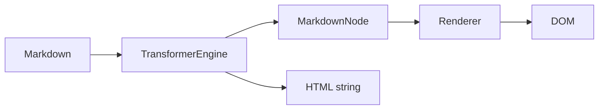

# [[title]]

> [[subtitle]] — 无 DOM 时的解析与渲染核心。

---

## 基本用法

```typescript
import { TransformerEngine } from "penna-markdown/transformer";

const engine = new TransformerEngine({
  isDark: false,
  // syntaxOptions / inlineParsers / blockParsers / renderOptions
});

const ast = engine.parse("# Hello\n\n**world**");
const html = engine.render(ast);
// => "<h1 …>Hello</h1>\n<p><strong>world</strong></p>\n"
```

---

## 构造选项

:::: field-group

::: field inlineParsers
@type Record\<number, BaseInlineParser\>
@optional
priority → 行内 parser。
:::

::: field blockParsers
@type Record\<number, BaseBlockParser\>
@optional
priority → 块级 parser。
:::

::: field syntaxOptions
@type SyntaxOptions
@optional
按 parser `type` / `syntaxKey` 分发配置（如 `atx_heading.slug`）。
:::

::: field renderOptions
@type Record\<string, unknown\>
@optional
渲染期选项（如 `sourceLineMap`）。
:::

::: field isDark
@type boolean
@optional
影响公式 / Mermaid / ECharts 等远程图主题。
:::

::::

---

## 核心 API

| 方法                     | 说明                         |
| ------------------------ | ---------------------------- |
| `parse(markdown)`        | 全文解析 → 根 `MarkdownNode` |
| `parseIncremental(…)`    | 增量解析（编辑器内部使用）   |
| `render(ast)`            | AST → HTML 字符串            |
| `renderBlock(node, ast)` | 单块渲染                     |

---

## AST 要点

```typescript
import { createNode } from "penna-markdown/transformer";

// length：块级 = 行数；行内 = 字符跨度（必须准确，否则增量边界错乱）
createNode("paragraph", 1, undefined, children);
```

> [!WARNING]
> 错误的 `length` 会破坏增量 hash 与滚动同步。扩展语法时务必量准。

---

## 与 Renderer 的关系



Renderer 内部持有 `TransformerEngine`，并负责 DOM 挂载、增量 reconcile、代码高亮与图表。

---

## 相关

- [扩展语法](extend.md) · [渲染器](renderer.md) · [语法索引](syntax.md) · [API](api.md)
